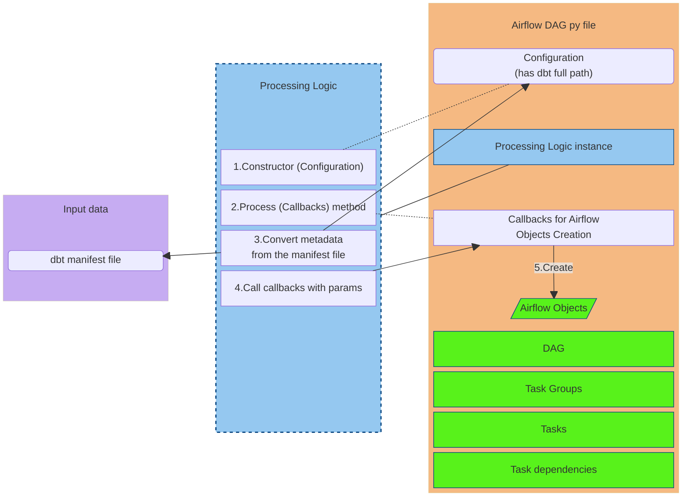

[<- Back to Table of Contents](index.md)

## Core Concept

dbt generates a `manifest.json` file. This file is created in the `target` directory of your dbt project and contains a complete representation of the project. It provides all the necessary metadata (models, sources, tests, dependencies, etc.) needed to create an Airflow DAG for dbt.

The architecture and logic are designed for dynamic generation of Apache Airflow DAGs based on the dbt manifest. They automatically transform dbt project metadata into Airflow workflows.

- The **Configuration** object stores the path to the dbt manifest file.
- The **Processing Logic** functionality is initialized with this Configuration object in the constructor, which provides it access to the manifest path and other settings.
- **Callback functions** are passed as parameters to the `Process` method of the Processing Logic instance. They define simple rules for creating Airflow components based on the provided arguments.

These callback functions create the main types of Airflow components:
- The DAG object itself
- Task groups
- Tasks
- Dependencies between tasks (e.g., `task_a >> task_b`)

The `Processing Logic` functionality transforms metadata from the manifest file into input parameters for these callback functions. The term "functionality" is used because there is no actual Python class named `Processing Logic`, and the internal structure will be detailed further.

The Python DAG file using this library includes the following objects:
- The Configuration object (which is a dictionary)
- Callback functions for creating Airflow components
- An instance of the `Processing Logic` functionality

This can be illustrated with the following simplified diagram:

The `Processing Logic` implementation and auxiliary modules are located in a separate directory.

In general, to create a DAG file based on the dbt manifest, you need to:
- Set up the configuration
- Define callback functions for creating Airflow components
- Create an instance of the class for implementing `Processing Logic` and pass the configuration during creation
- Run the `Process` method and pass the callback functions as input parameters

In the next section, the internal architecture of `Processing Logic` is examined in more detail.

[Basic Internal Architecture of the Processing Logic Class ->](chap2.md)
