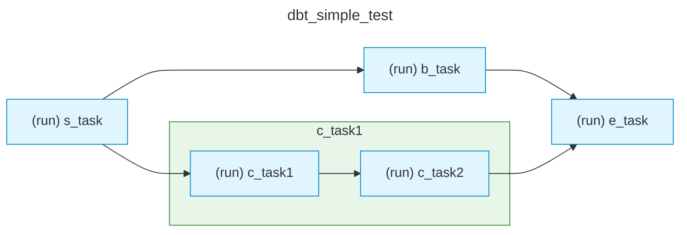
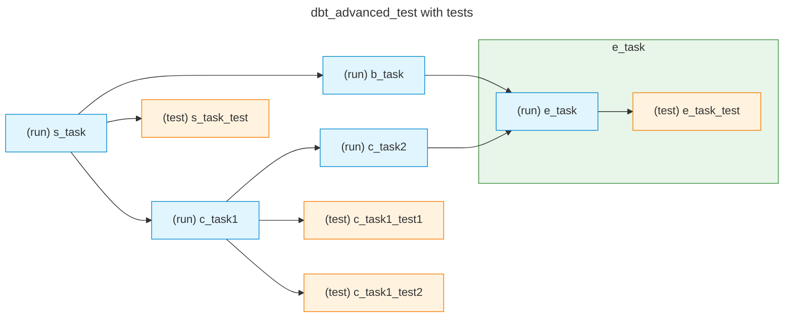

[<- Back to Table of Contents](index.md)

## Unit Tests, createMermaid.py Utility, and Running DAG as a Python Script

Unit tests are designed to verify the library's operation without using external dependencies on Airflow or dbt. Test scenarios are placed in the `tests` directory, which is located at the same level as the library source code in the `src` folder.


Inside each subdirectory (for example, `01_AData`) there are files for testing various functionality of the associated class (in this case - `AData`).
The order of test execution differs from the transformation pipeline building process and is arranged in reverse order:
* `01_AData/` - first, the general data storage class is tested. It checks that with the given data, callback functions by object types (DAG, groups, tasks, sequences) correctly pass data to simulated Airflow objects.
* `02_ATaskGroupProcessor/` - after the general data classes and conversion to simulated Airflow objects have been verified, helper classes are tested for correctness and uniqueness when creating tasks and groups through their methods.
* `03_AGraphPathProcessor/` - verification of the correctness of parsing graph paths into final data. The path processor uses helper classes that were already tested in the previous step.
* `04_AJsonProcessor/` - up to this point, tests did not use any external files and test data was created directly in the tests. 
After we have verified that they are processed correctly, we check the parsing of two synthetic JSON files for correctness and proper conversion into final data.
* `05_AMain/` - final integration test of the `AMain` class. This class combines all the components verified above and is directly used in the Airflow DAG.

### Test Implementation Features

In the library architecture, **all fields are public**. This is a deliberate decision that is actively used in unit tests for quick and convenient filling of objects with test data directly, without using complex factories or setters. This approach allows assigning values to fields without unnecessary wrappers. This is convenient both for the initial check of `AData` and for subsequent classes.

The `AMockOperator.py` module contains test callback functions and global variables for tracking the state of final Airflow components: `dag`, `taskGroup`, `operator`, and `sequences`. It also defines a mock class `AMockOperator`, which stores the same data that is usually passed to `BashOperator`. However, unlike the original `BashOperator` used in the library to call `dbt` commands, the mock class does not run anything, as in the tests we only analyze the received values.

This module is located in the `tests/` directory and is imported into unit tests. 
To prevent tests from affecting each other and to avoid side effects due to preserving global variable values between different tests, **at the very beginning of each test** it is necessary to call the cleanup function `ClearGlobals()`:

```python
import tests.AMockOperator as mo

def test_example():
    mo.ClearGlobals()  # Clear global state before running test logic
    # ... test code ...
```
When testing the `AJsonProcessor` class, the parsing of input files is checked. Two synthetic data files are used:
* **`simpleJsonTest.json`** - simplified scenario. Contains only `model` objects in dbt terminology; `test` objects are absent in it.
* **`advancedJsonTest.json`** - advanced scenario. Includes a full set of data for comprehensive parser verification and allows checking the object type filtering flag.

### Running Tests

Tests are run from the **project root**. If you run tests through the Python interpreter specifying the `pytest` module, the current directory will be added to `sys.path`, and the call will look like this:
```bash
python -m pytest tests/
```
When running `pytest` directly, the current directory is not added to `sys.path`, and it needs to be added manually through the `PYTHONPATH` environment variable:
```bash
PYTHONPATH=. pytest tests/
```

### Graph Schema Generation Utility

This utility is located in `utils/createMermaid.py`.
The `createMermaid.py` script is designed to generate a graph schema in the format of text flowchart diagrams **Mermaid**. As input data, a JSON file of the same format as the dbt `manifest.json` file is used, passed as a parameter.
The utility imports the main class `AMain` from the module `src.AflDbt.AMain` and initializes it with the `dbtData` configuration composed from the input parameters. The `AMain.Process()` method receives specialized callback functions that are called after the final data transformation:
* **`createDagCallback`** - initializes the diagram header and sets the graph type (`flowchart LR`).
* **`createTaskGroupCallback`** - registers diagram groups. For non-default groups, a visual block (`subgraph`) is generated and a green frame is applied. In the task dictionary, this callback function immediately creates a key with the task group name and an empty value. Then the subsequent callback function call for tasks in this group will only add the values of the corresponding tasks there.
* **`createTaskCallback`** - creates auto-numbered diagram nodes within their visual groups. Auto-numbering is continuous, starting from the first node, and is used to form the identifier and its label, for example `T2["(run) child_books"]`, where `T2` is the auto-numbered identifier. Automatically styles nodes depending on the task type:
  * Model run tasks `(run)` are colored in **light blue**.
  * Test run tasks `(test)` are colored in **orange**.
* **`createTaskSequence`** - connects diagram nodes with arrows (`-->`), building dependency chains.

Since **Mermaid** flowchart diagrams are textual, the program output is also textual: depending on the parameters, the utility collects the final text schema and outputs it to the console or writes it to a file.

The script accepts from 1 to 3 arguments:

```bash
python utils/createMermaid.py [-t] <input-file> [output-file]
```

The input arguments mean the following:
* **`-t`** *(optional flag)* - includes dbt tests in the diagram. If the flag is not specified, only models will be presented in the diagram.
* **`<input-file>`** *(required)* - path to the input JSON file for parsing.
* **`[output-file]`** *(optional)* - path to the text file where the generated **Mermaid** diagram will be written. If the parameter is omitted, the result is output directly to `stdout` (console).

Usage examples:

**1. Outputting the diagram to the console without dbt tests for the synthetic example used in unit tests:**
```bash
python utils/createMermaid.py tests/simpleJsonTest.json
```
The output will be the following diagram:


**2. Saving the full diagram with dbt tests to a file:**

```bash
python utils/createMermaid.py -t tests/advancedJsonTest.json output_graph.mmd
```
The text of the output_graph.mmd file will contain the following diagram:

This utility helps visually assess the distribution of tasks across task groups when transferring them to Airflow without the need to install it.

### Running DAG as a Python Script
This testing involves running the DAG as a regular Python script, i.e., executing the command in the project root directory:

```bash
python dags/booksLibraryExample.py
```

For this mechanism, the script must implement a `__main__` function that will perform operations similar to running a DAG in Airflow.
The code of this procedure looks like this:

```python
if __name__ == "__main__":
    from airflow.utils import timezone
    from airflow.utils.state import State
    from airflow.timetables.simple import OnceTimetable

    # 1. Get current time
    now = timezone.utcnow()
    logger.debug(f"running DAG '{_dag.dag_id}' in isolated local mode...")

    # 2.HACK: Temporarily change the schedule from None to Once
    # This will cause BackfillJobRunner to see the start_date 
    _dag.timetable = OnceTimetable()

    # 3. Clear previous run if we have one
    _dag.clear(
        start_date=now,
        end_date=now,
        dag_run_state=State.QUEUED
    )

    # 4. Run local Airflow runner
    _dag.run(
        start_date=now,
        end_date=now,
        ignore_first_depends_on_past=True,
        verbose=True
    )
    logger.debug(f"running DAG '{_dag.dag_id}' ... completed")
```
At the time of `__main__` execution, the library code that creates Airflow objects has already worked. Therefore, in the context of the Python script, there is already a DAG object, task groups, tasks, and dependencies. Our task is only to run this DAG manually using the `local Airflow runner`.
This process is divided into four main steps:

* Getting the current time, which is used for cleanup
* Temporarily changing the schedule (hack)
* Clearing history starting from the current moment if there are objects in the queue state (`QUEUED`)
* Running local execution with a detailed log

The second step is important. In the `booksLibraryExample.py` example, a manual run schedule is used.
It is set when creating the DAG as `schedule=None` and allows running the DAG manually for testing purposes, excluding any automatic run.
But this type of schedule does not work through `_dag.run`: the run will immediately end without executing tasks.
Therefore, a hack is applied: before running, the schedule type is forcibly changed to a one-time automatic run (`@once`) and the current time is substituted as the start time, so that the local scheduler executes it immediately and never runs it again.

Inside Airflow, `timetable` objects are used for schedule calculation, and the `schedule` parameter is left for compatibility and is translated into `timetable` when creating the DAG. Therefore, changing the `schedule="@once"` parameter will not change the schedule to one-time: for this, you need to change the `timetable` directly, which is what is done in the second step.
The third step resets all objects in the queue state to be able to run.
The fourth step manually runs the DAG, placing it in the run queue. 
In the fourth step, the `verbose=True` parameter is important, as it sets detailed output of `local Airflow runner` logs and allows observing the run process in the console.

Running a DAG as a Python script allows checking the correctness of DAG execution without running other Airflow services.

In the next section, we will move on to the practical setup of the local environment.

[Python Installation, Environment Setup, Running Unit Tests, and dbt Project Verification ->](chap12.md)
