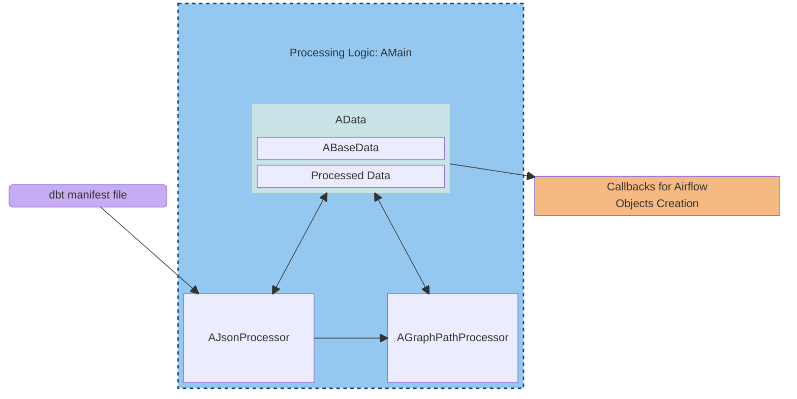
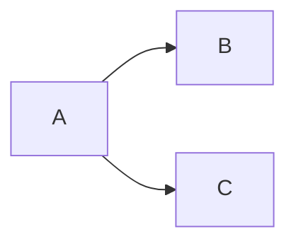
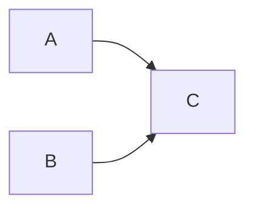

[<- Back to Table of Contents](index.md)

## Basic Internal Architecture of Processing Logic

The basic internal architecture can be illustrated with the following simplified diagram:

The class implementing `Processing Logic` is called `AMain`, which acts as the central coordinator. It consists of the following main classes:

* `AData` - the central data structure that stores data throughout the entire processing lifecycle.
* `AJsonProcessor` - responsible for reading the external dbt manifest and transforming metadata.
* `AGraphPathProcessor` - analyzes graph path structures in `AData` and the data returned by `AJsonProcessor`, prepares internal helper objects and processed data for further processing.

After all processing stages are completed, a method of the `AData` class is called, which creates Airflow objects using the processed data.

The `AData` class consists of two main parts:
* `ABaseData`, which represents the transformed metadata from the JSON manifest.
* Processed data computed in `AGraphPathProcessor` based on `ABaseData`.

The details of the processed data will be discussed later.

The data in the `AData` class is sufficient to generate the final Airflow objects (DAG, task groups, tasks, sequences) using a method of the `AData` class and the provided callback functions.

Let us briefly examine how the JSON manifest is transformed into this final data.

The `AJsonProcessor` class reads metadata from the manifest and transforms it into two results:
* data in the `ABaseData` class
* the result of the `Process` method, which returns a list of graph paths

The concept of a graph path requires a more detailed explanation.
Essentially, a path is a sequence of non-repeating nodes connected by edges present in the graph.
A directed acyclic graph (DAG) can contain multiple paths.

In a simple case with three nodes:

the only path is `A,B,C`.

If branching occurs at node A, we get two paths:

Here the paths are `A,B` and `A,C`.

A similar case arises if the branching is at the final node C:

Here the paths are `A,C` and `B,C`.

The `AJsonProcessor` class returns a list of graph paths as the result of the `Process` method for further analysis. Each path is a sequence of nodes separated by commas.

This list is used in another class in the processing sequence: `AGraphPathProcessor`.

The `AGraphPathProcessor` class takes references to the necessary members of the `AData` class in its constructor and processes one path at a time using the corresponding method.
To process the identified groups, it uses the helper class `ATaskGroupProcessor` and stores the result in the processed data section of the `AData` class.

Finally, the method of the `AData` class accepts callback functions for creating each Airflow object. It calls each callback function to create a specific type and provides arguments for that call using data from the processed data section.

More detailed descriptions of the classes will be discussed further.

[Overview of the ABaseData and AJsonProcessor Classes ->](chap3.md)
