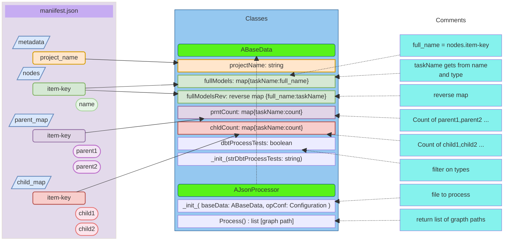
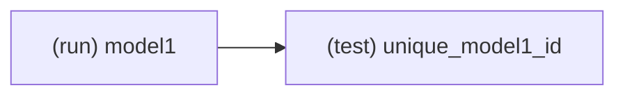

[<- Back to Table of Contents](index.md)

## Overview of the ABaseData and AJsonProcessor Classes

It makes sense to first take a quick look at the structure and functioning of these classes and how data is parsed and transferred, and then examine the class structure in more detail.

Consider the following diagram:

First of all, a dbt manifest file has several top-level keys:
* `metadata`, which is a dictionary of properties
* `nodes`, which is a dictionary of all analyses, models, seeds, snapshots, and tests
* `parent_map`, which is a dictionary that contains the first-order parents of each resource
* `child_map`, which is a dictionary that contains the first-order children of each resource

We use the `project_name` property from the `metadata`.
From `nodes`, we use the `name` property, which is the resource name.
The `unique_id` property in `nodes` is the same as the dictionary key for each node.
The `depends_on` property in `nodes` refers to parents, but using `parent_map` is easier for retrieving first-order parents.
The `unique_id` has the pattern `resource_type.package.resource_name`, where `package` is the `project_name`, `resource_type` is the type of the model, test, etc., and `resource_name` may differ from the actual filename, at least for tests.
Therefore, to execute the `dbt` command, we need to use the value of the `name` property.

The `parent_map` and `child_map` establish first-order relationships between resource `unique_id`s and are values of type list. If an element has no parent or child, the list is empty, or the key may be missing in `parent_map` or `child_map`.
Therefore, we need to use `nodes` as the main resource list and add dependencies from `parent_map` or `child_map` when possible.

Let us examine how `AJsonProcessor` transforms data from the JSON manifest file into the fields of the `ABaseData` class:

First, the `ABaseData` class has a `dbtProcessTests` field with a Boolean value for filtering nodes. 
Typically, a model node has a unique identifier such as `model.myProject.model1`, while a test node might look like `test.myProject.unique_model1_id.16e066b321`, where `myProject` is the project name and `model1` is the model name.
If `dbtProcessTests` is `True`, `AJsonProcessor` collects both models and tests, and if it is `False`, it collects only models.
The `dbtProcessTests` field is initialized when the `ABaseData` class instance is instantiated, and the constructor has only one argument of type string for initializing `dbtProcessTests`, which is converted to a Boolean value.

Having created an instance of the `ABaseData` class and the configuration object, we can now create an instance of the `AJsonProcessor` class.
The `Process` method reads the `manifest.json` file provided in the configuration and populates the fields of the `ABaseData` instance.

The keys and `name` properties of the `nodes` dictionary are passed to the `fullModels` and `fullModelsRev` maps for models only or for both models and tests. 
However, since the `name` property doesn't contain resource type information, this information can be added using a specific prefix: `(run)` for models and `(test)` for tests. This resulting string, such as `(run) model1`, is hereafter called `taskName`. The resulting data in `ABaseData.fullModels` looks like this:

<table>
 <tr><td colspan=2>
<b>manifest.json "nodes" dictionary </b>
</td></tr>
 <tr><td><b>key</b></td><td><b>name</b></td></tr>
 <tr><td>model.myProject.model1</td><td>model1</td></tr>
 <tr><td>test.myProject.unique_model1_id.16e066b321</td> <td>unique_model1_id</td></tr> 
 <tr></tr>
 <tr><td colspan=2>
<b>ABaseData.fullModels</b>
</td></tr>
 <tr> <td><b>key (taskName)</b></td><td><b>value (full_name)</b></td></tr>
 <tr><td>(run) model1</td> <td>model.myProject.model1</td></tr>
 <tr><td>(test) unique_model1_id</td> <td>test.myProject.unique_model1_id.16e066b321</td></tr>
</table>

To populate the `prntCount` and `chldCount` maps of the `ABaseData` class, the `parent_map` and `child_map` dictionaries from the JSON manifest are used. Additionally, the same `taskName` as in `fullModels` is used as the key.
The following shows the data in `prntCount` and `chldCount` for the same example:

<table>
 <tr><td colspan=2>
<b>prntCount dictionary </b>
</td></tr>
 <tr><td><b>key (taskName)</b></td><td><b>value</b></td></tr>
 <tr><td>(run) model1</td> <td>0</td></tr>
 <tr><td>(test) unique_model1_id</td> <td>1</td></tr>
 <tr></tr>
 <tr><td colspan=2>
<b>chldCount dictionary</b>
</td></tr>
  <tr><td><b>key (taskName)</b></td><td><b>value</b></td></tr>
 <tr><td>(run) model1</td> <td>1</td></tr>
 <tr><td>(test) unique_model1_id</td> <td>0</td></tr>
</table>

A test always depends on a model:

Thus, `model1` has one child, and the test has one parent. Accordingly, `model1` has no parent and the test has no children.
The `Process` method returns a list of graph paths, and this will be discussed in the next section.

[AJsonProcessor Class Discussion ->](chap4.md)
