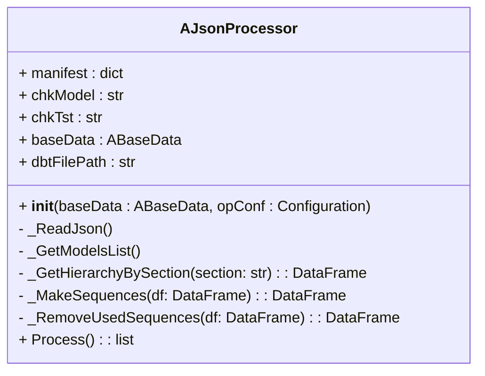
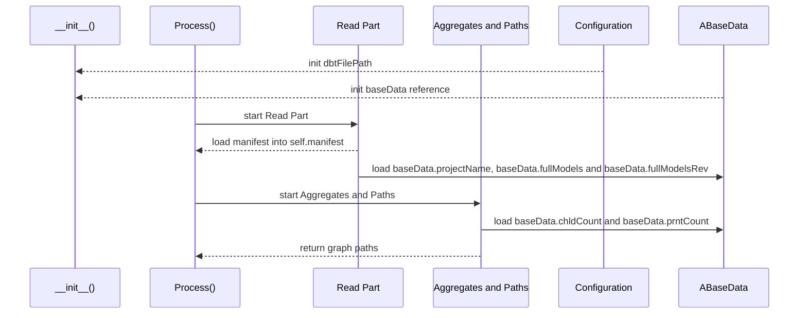
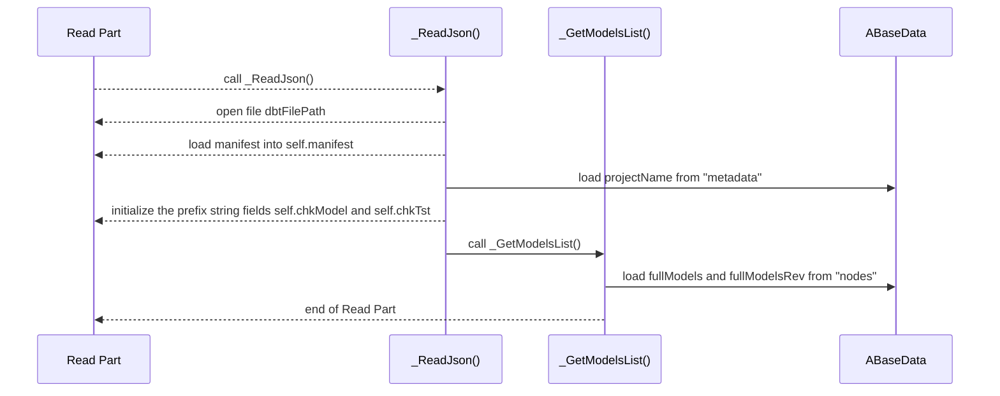
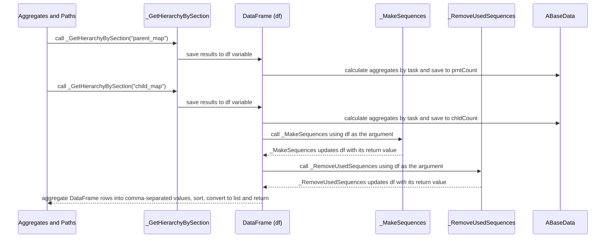
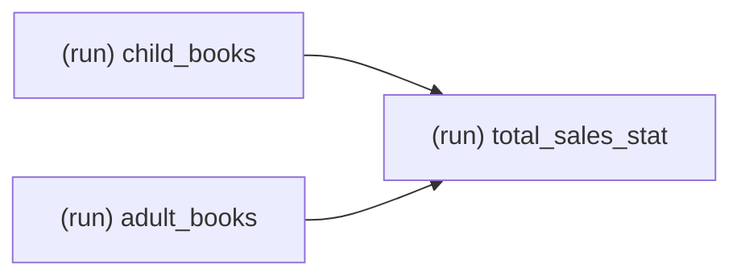
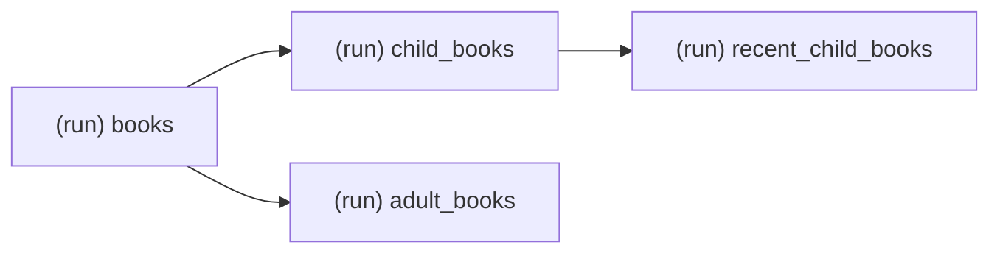

[<- Back to Table of Contents](index.md)

## AJsonProcessor Class Discussion

Previously, we discussed the `AJsonProcessor` class along with the dbt manifest format and the `ABaseData` structure.
Let us take a closer look at the `AJsonProcessor` class itself.

The class diagram is as follows:



For the sequence diagram, we can distinguish two stages: "Read Part" and "Aggregates and Paths":



In the constructor:
* The configuration from the `opConf` argument provides `dbtFilePath` — the location of the `manifest.json` file, specified by the `DBT_MANIFEST_PATH` configuration key.
* The `ABaseData` object is passed by reference from the `baseData` argument.

Next, we call the public `Process()` method, which performs the following sequence of operations:
* Run the "Read Part" stage, which loads the specific dbt manifest file into the `manifest` class field and populates the `projectName` string and the `fullModels` and `fullModelsRev` maps of the `ABaseData` instance.
* Run the "Aggregates and Paths" stage, which loads and performs aggregations for the `chldCount` and `prntCount` maps of the `ABaseData` instance. Then it calculates the graph paths.

The "Read Part" stage performs the following sequence of operations:



String values `self.chkModel` and `self.chkTst` are initialized with the `projectName` and have the form `model.{projectName}.` and `test.{projectName}.`. They are used to filter the `nodes` section based on the `ABaseData.dbtProcessTests` flag. 
The `_GetHierarchyBySection` method also reads the manifest, but it is not included in the "Read Part" stage because it has a more complex purpose:



The same DataFrame variable `df` is used in this part, which allows resources to be freed after the dictionaries in `ABaseData` are populated, and enables reuse of the variable for calculating graph paths.

The `_GetHierarchyBySection` method returns a DataFrame with two columns `level_1` and `level_2`, and gets the section name from the `manifest.json` file as an argument, which allows it to retrieve both parent and child data.

Since a resource can have multiple parents or children, a single value in the `level_1` column (the section key) can correspond to multiple values in the `level_2` column. If no parent or child exists for a key, the NumPy value `NaN` is used for `level_2`.

Suppose that books for children and adults are tracked by two separate departments: adult books and children's books.
We collect data from both departments and then calculate the overall statistics. The data flow can be represented as two parent nodes `(run) child_books` and `(run) adult_books` and one child node `(run) total_sales_stat`.
This relationship is represented in the following diagram:


Since the nodes `(run) child_books` and `(run) adult_books` are top-level nodes and do not have a parent, they have a `NaN` value in the `level_2` column describing the parents.

| level_1 | level_2 |
| --- | --- |
| (run) child_books | NaN |
| (run) adult_books | NaN |
| (run) total_sales_stat | (run) child_books |
| (run) total_sales_stat | (run) adult_books |

The child map looks similar:

| level_1 | level_2 |
| --- | --- |
| (run) child_books | (run) total_sales_stat |
| (run) adult_books | (run) total_sales_stat |
| (run) total_sales_stat | NaN |

Getting aggregated values for `prntCount` and `chldCount` is quite straightforward when using this type of data: we simply need to group the data by the `level_1` column and calculate the number of non-`NaN` values.

Here is the final result for `prntCount`:
| key | value |
| --- | --- |
| (run) child_books | 0 |
| (run) adult_books | 0 |
| (run) total_sales_stat | 2 |

And here is the final result for `chldCount`:
| key | value |
| --- | --- |
| (run) child_books | 1 |
| (run) adult_books | 1 |
| (run) total_sales_stat | 0 |

The same output as for the child map is used to calculate the graph paths. The `_MakeSequences` method takes a DataFrame as an argument and iteratively merges the result with the original map according to the condition `level_N` = `level_1`.
The following simple example illustrates this.

This example is taken from a simple dbt project that will be described in a separate section later.
In this project, books are categorized into adult and children's titles, with recent ones selected from the children's category.
Thus, the `books` source has two child nodes: `child_books` and `adult_books`. The `child_books` node, in turn, has a child node named `recent_child_books`:



The child map for this case is:

| level_1 | level_2 |
| --- | --- |
| (run) books | (run) child_books |
| (run) books | (run) adult_books |
| (run) child_books | (run) recent_child_books |
| (run) adult_books | NaN |
| (run) recent_child_books | NaN |


Now we need to match the values in the `level_2` column with the values in the `level_1` column and add the `level_2` values for the matched rows to a new column `level_3` to continue building the path.

In SQL terms, this is equivalent to a LEFT JOIN query of the following form:
```SQL
SELECT 
  t.level_1,
  t.level_2,
  p.level_2 AS level_3
FROM df AS t
LEFT JOIN df AS p
  ON p.level_1 = t.level_2
```

That results in this table:

| level_1 | level_2 | level_3 |
| --- | --- | --- |
| (run) books | (run) child_books | (run) recent_child_books |
| (run) books | (run) adult_books | NaN |
| (run) child_books | (run) recent_child_books | NaN |
| (run) adult_books | NaN | NaN |
| (run) recent_child_books | NaN | NaN |

We have at least one non-`NaN` value in the `level_3` column, therefore, one more step is performed: 

```SQL
SELECT 
  t.level_1,
  t.level_2,
  t.level_3,
  p.level_2 AS level_4
FROM res_table AS t
LEFT JOIN df AS p
  ON p.level_1 = t.level_3
```

That results in this table:

| level_1 | level_2 | level_3 | level_4 |
| --- | --- | --- | --- |
| (run) books | (run) child_books | (run) recent_child_books | NaN |
| (run) books | (run) adult_books | NaN | NaN |
| (run) child_books | (run) recent_child_books | NaN | NaN |
| (run) adult_books | NaN | NaN | NaN |
| (run) recent_child_books | NaN | NaN | NaN |

All values in the `level_4` column are `NaN`, which stops further iterations. The `_MakeSequences` method returns this DataFrame.
If the data contains a cycle, then the iterations may continue indefinitely, so to stop this process, we can use a counter to track the number of iterations and stop the process if the counter exceeds the original number of rows in the input DataFrame. A directed acyclic graph (DAG) does not have cycles, but adding this safeguard is still advisable.

The `_RemoveUsedSequences` method removes redundant rows to construct a unique set of paths in the graph.
Let us take a closer look at the example above:

<table>
  <tr>
    <th>RowNo</th><th>level_1</th><th>level_2</th><th>level_3</th><th>level_4</th>
  </tr>
  <tr>
    <td>1</td><td>(run) books</td><td><b>(run) child_books</b></td><td style="background-color: #E1D5E7;"><b>(run) recent_child_books</b></td><td style="background-color: #E1D5E7;">NaN</td>
  </tr>
  <tr>
    <td>2</td><td>(run) books</td><td style="background-color: #FFE6CC;">(run) adult_books</td><td style="background-color: #FFE6CC;">NaN</td><td>NaN</td>
  </tr>
  <tr>
    <td>3</td><td><b>(run) child_books</b></td><td style="background-color: #E1D5E7;"><b>(run) recent_child_books</b></td><td style="background-color: #E1D5E7;">NaN</td><td>NaN</td>
  </tr>
  <tr>
    <td>4</td><td style="background-color: #FFE6CC;">(run) adult_books</td><td style="background-color: #FFE6CC;">NaN</td><td>NaN</td><td>NaN</td>
  </tr>
  <tr>
    <td>5</td><td style="background-color: #E1D5E7;">(run) recent_child_books</td><td style="background-color: #E1D5E7;">NaN</td><td>NaN</td><td>NaN</td>
  </tr>
</table>

As you can see, we have matches in subsequences of length 2.
For instance, row 5 is redundant and should be deleted.
To do this, we perform a self-join matching the last two columns (`level_4` and `level_3`) with the first two columns (`level_2` and `level_1`) to remove rows that have matches on `level_2` and `level_1`.
The equivalent SQL statement is:

```SQL
DELETE FROM res_table
WHERE EXISTS ( 
  SELECT *
  FROM res_table AS chk
  WHERE res_table.level_1 = chk.level_3
  AND res_table.level_2 = chk.level_4
)  
```

After this, the statement deletes row 5 and we obtain this result:

<table>
  <tr>
    <th>RowNo</th><th>level_1</th><th>level_2</th><th>level_3</th><th>level_4</th>
  </tr>
  <tr>
    <td>1</td><td>(run) books</td><td><b>(run) child_books</b></td><td><b>(run) recent_child_books</b></td><td>NaN</td>
  </tr>
  <tr>
    <td>2</td><td>(run) books</td><td style="background-color: #FFE6CC;">(run) adult_books</td><td style="background-color: #FFE6CC;">NaN</td><td>NaN</td>
  </tr>
  <tr>
    <td>3</td><td><b>(run) child_books</b></td><td><b>(run) recent_child_books</b></td><td>NaN</td><td>NaN</td>
  </tr>
  <tr>
    <td>4</td><td style="background-color: #FFE6CC;">(run) adult_books</td><td style="background-color: #FFE6CC;">NaN</td><td>NaN</td><td>NaN</td>
  </tr>
</table>

Now, in the next iteration, we perform a self-join matching columns `level_3` and `level_2` with columns `level_2` and `level_1`.
The equivalent SQL statement is:

```SQL
DELETE FROM res_table
WHERE EXISTS ( 
  SELECT *
  FROM res_table AS chk
  WHERE res_table.level_1 = chk.level_2
  AND res_table.level_2 = chk.level_3
)  
```

After this, the statement deletes rows 4 and 3, and we obtain the following result:

<table>
  <tr>
    <th>RowNo</th><th>level_1</th><th>level_2</th><th>level_3</th><th>level_4</th>
  </tr>
  <tr>
    <td>1</td><td>(run) books</td><td>(run) child_books</td><td>(run) recent_child_books</td><td>NaN</td>
  </tr>
  <tr>
    <td>2</td><td>(run) books</td><td>(run) adult_books</td><td>NaN</td><td>NaN</td>
  </tr>
</table>

This is the final step, because the next iteration, which would join `level_2` and `level_1` to `level_2` and `level_1`, is not meaningful.
The `_RemoveUsedSequences` method returns a DataFrame containing these 2 rows.

The two remaining rows represent the two possible paths in the graph. We simply need to concatenate their columns into comma-separated values, excluding `NaN` values. This is exactly what the rest of the `Process` method does.
Finally, after the `Process` method completes, we get a list of two strings, which is the return value of the method:

```Python
[
  "(run) books,(run) child_books,(run) recent_child_books",
  "(run) books,(run) adult_books" 
]
```

The use of this list in the `AGraphPathProcessor` class will be discussed in the next section.

[AGraphPathProcessor Class Overview ->](chap5.md)
