[<- Back to Table of Contents](index.md)

## AGraphPathProcessor Class Overview

Previously, we looked at the `AJsonProcessor` class, which receives a dbt `manifest.json` file and converts it into an `ABaseData` structure and a list of graph paths.
The next step in the data transformation pipeline is the `AGraphPathProcessor` class, which identifies groups and members in a graph path and outputs the results to an `AData` structure:

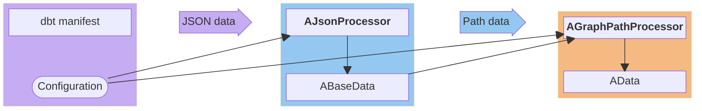

To accomplish this, the class has a `ProcessPath` method that accepts a single path as an input parameter.
The class itself uses only two dictionaries from the `ABaseData` structure: `chldCount` and `prntCount`.
The output consists of three containers stored in the `AData` structure: `taskMap`, `groupsData`, and `taskSequence`.

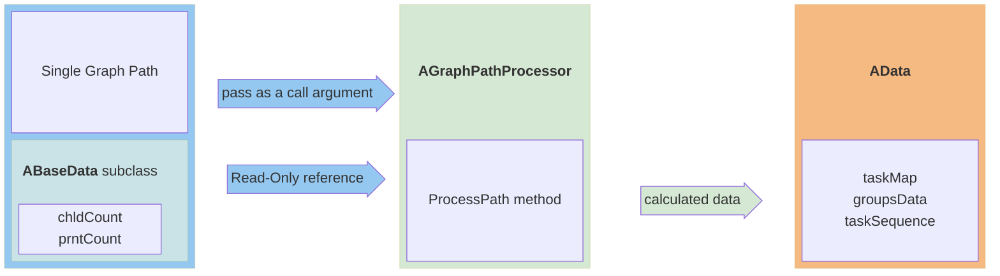

Let us consider the general problem of identifying groups from a path.

Assume that we have the same example as before:

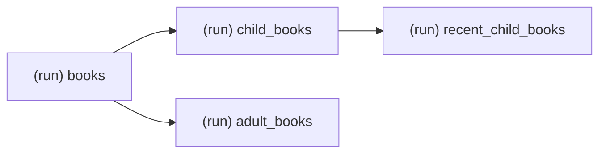

In this case, a group can be defined as a sequence of tasks executed without branching, namely, the tasks `(run) child_books` and `(run) recent_child_books`, which can be combined into a group and named after the first task in the execution chain:

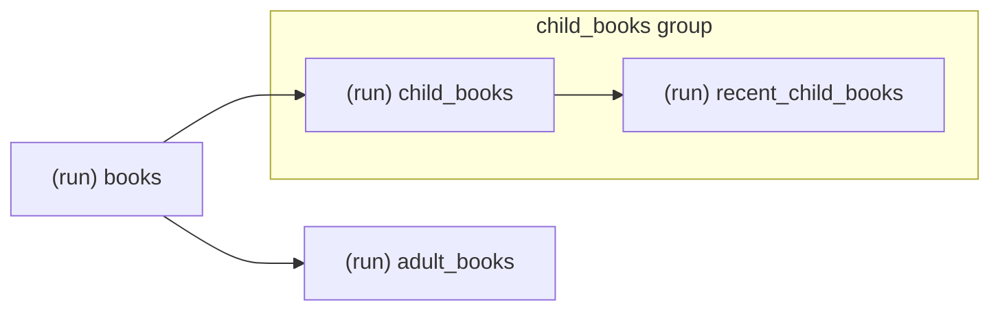

Indeed, in many Airflow examples, a group is defined by a sequence of tasks performed without branching, i.e., sharing a common logical purpose:

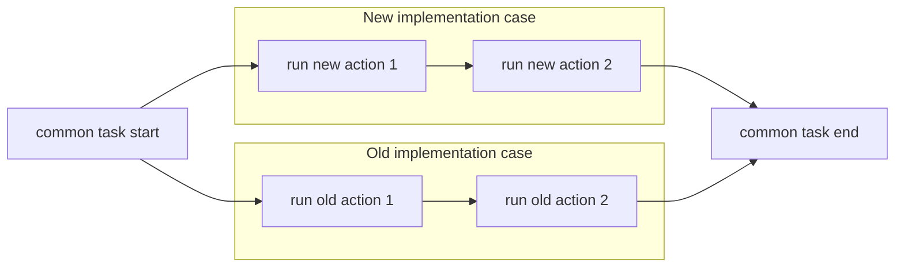

This project uses exactly this logic of subgroup selection, namely, a sequence of tasks executed without branching.
How can groups be identified on a given graph path? To do this, we simply need to add the number of parents to the left of each task and the number of children to the right of each task to our diagram:

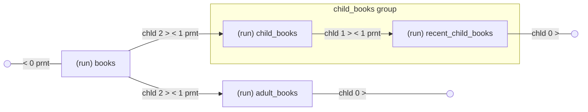

The notation |"chld 2 > < 1 prnt"| means that the node to the left of the connecting line has two children, and the node to the right has one parent.
This diagram clearly shows the condition under which we combine tasks into a group: the task on the left has only one child, and the task on the right has only one parent.

In fact, this DAG contains two paths. Therefore, the `ProcessPath` method will first be called for this path:

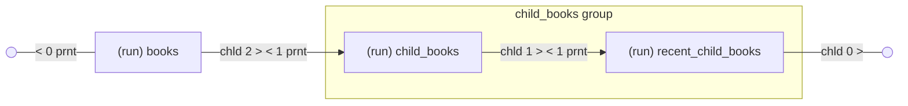

Then, for this path:

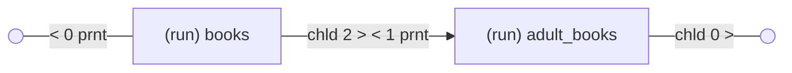

Within each path, each task formally has only one child and one parent.
But we use the number of parents and children from the entire DAG, which allows us to identify real chains with one parent node and one child node.

Thus, the first path contains a subchain with a group, and such a subchain can only exist within a single path. The second path, however, does not contain a subchain with a group.

In the example above, the group ends at the end of the path.
Let us add two more tasks to that example: filter recent children's books to identify unique authors, and then look for the same authors across both children's and adult books.
The diagram will then look like this:

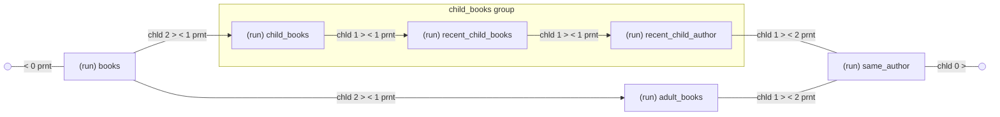

As can be clearly seen, the start of a group can be identified as the first task with one child and the following task with one parent. The end of a group is identified as the last task after which this condition is false or the path ends.

Such an algorithm can be implemented as a two-state finite-state machine. A transition to the identified group state occurs when the specified condition is true, and a transition to the opposite state occurs when the inverse condition is true.

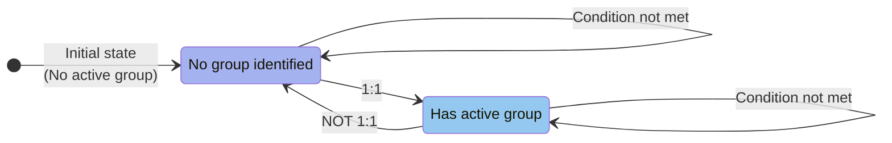
To implement this state machine, we need a current task and a subsequent task. More precisely, we only need to know the current task's number of children. If it has no children, then considering the subsequent task is unnecessary: we can simply take the number of parents of the subsequent task as zero. If a subsequent task exists, then we take its number of parents. 
The current group name, `curGroup`, serves as a variable that stores the state of the state machine between iterations. If the current state is "No group identified", the variable is `None`; otherwise, it is set to the group name. The group name can be formed from the task name by removing the operation prefix, such as `(test) ` or `(run) `.
The `curGroup` variable is defined before the loop over the path elements to store state between iterations.
Since the transition "No group identified" -> "Has active group" is only meaningful when there is no current group, i.e., `curGroup` is `None`, this condition should be added to the transition condition. Similarly, the inverse condition on `curGroup` should be added to the inverse transition condition "Has active group" -> "No group identified".

To ensure that a task, which determines a group based on the data of a subsequent task, is included in the group, a state switch must be made after identification but before the group-task pair is selected. And to ensure that the second, subsequent task is included in the group, if there is no further group, a switch to the opposite state must be made after the group-task pair is selected.

This results in the following diagram for a single iteration:

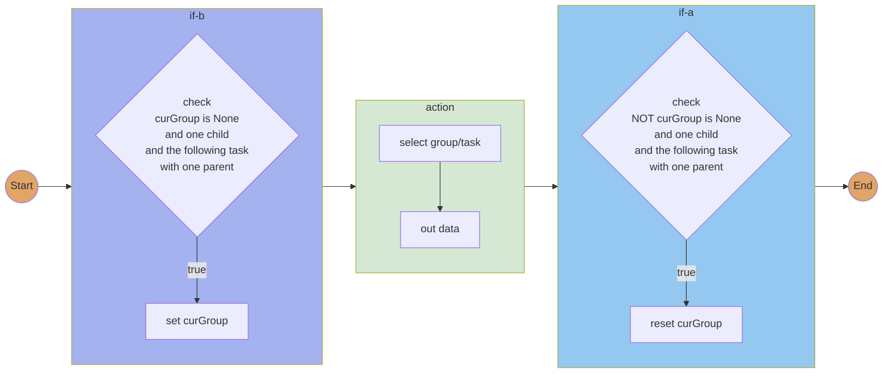

Here, we mark "if-b" as a test for the transition condition "if-before-action" or "No group identified" -> "Has active group".
Similarly, we mark "if-a" as a test for the transition condition "if-after-action" or "Has active group" -> "No group identified".

Let us discuss how the algorithm works for different paths.

Example 1:

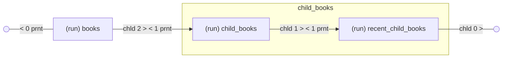

The sequence in the algorithm can be represented by the following table with the operator (`(run)`) omitted:

|Step| task | chld | prnt | curGroup | if-b | curGroup | action | if-a | curGroup | 
|---| --- | --- | --- | --- | --- | --- | --- | --- | --- |
|1| books | 2 |  1 | None |false| None| select None/books| false | None |
|2| child_books | 1 | 1 | None | true | child_books | select child_books/child_books | false |  child_books |
|3| recent_child_books | 0 | 0 | child_books | false | child_books | select child_books/recent_child_books | true |  None |

The table columns are as follows:
- Step - iteration step
- task - current task in the path
- chld - number of children of the current task
- prnt - number of parents of the subsequent task, or zero if there is no subsequent task
- curGroup - current group from the previous step
- if-b - whether the transition condition "No group identified" -> "Has active group" is met
- curGroup - current group after the `if-b` check
- action - group and task selection, has the form of `group/task`
- if-a - whether the transition condition "Has active group" -> "No group identified" is met
- curGroup - current group after the `if-a` check

Note: The `curGroup` column name is repeated to fit the table.

Example 2:

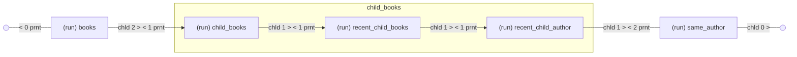

|Step| task | chld | prnt | curGroup | if-b | curGroup | action | if-a | curGroup | 
|---| --- | --- | --- | --- | --- | --- | --- | --- | --- |
|1| books | 2 |  1 | None |false| None| select None/books| false | None |
|2| child_books | 1 | 1 | None | true | child_books | select child_books/child_books | false | child_books |
|3| recent_child_books | 1 | 1 | child_books | false | child_books | select child_books/recent_child_books | false | child_books |
|4| recent_child_author | 1 | 2 | child_books | false | child_books | select child_books/recent_child_author | true | None |
|5| same_author | 0 | 0 | None | false | None | select None/same_author | false |  None |

The algorithm produces a `group/task` sequence. For Example 1, the output is:

|output| 
|---|
| None/(run) books|
| child_books/(run) child_books |
| child_books/(run) recent_child_books |

In the next section, we will examine the `AGraphPathProcessor` class in detail.

[Detailed Overview of the AGraphPathProcessor Class ->](chap6.md)
