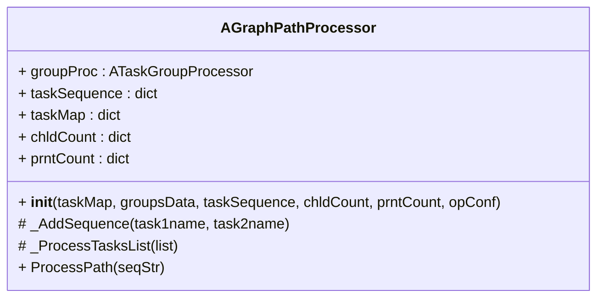
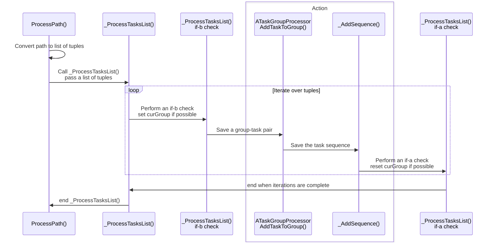

[<- Back to Table of Contents](index.md)

## Detailed Overview of the AGraphPathProcessor Class

Let us examine the class diagram:

We can see that the class has four methods (including a constructor) and five fields.

Fields can be logically divided by usage:

 - Read-only input data
   - `chldCount` - dictionary of children counts per task
   - `prntCount` - dictionary of parent counts for tasks
 - Output data
   - `taskMap` - dictionary of tasks
   - `taskSequence` - dictionary of task sequences
 - Helpers
   - `groupProc` - helper class instance for processing group-task selections

The class constructor, however, accepts slightly different parameters:
 - Read-only input data
   - the same `chldCount` and `prntCount` input dictionaries
   - `opConf` configuration
 - Output data
   - the same `taskMap` and `taskSequence` output dictionaries
   - `groupsData` - a structure for storing group-task data

The diagram below illustrates how parameters are passed to the constructor and then transferred to fields:

```mermaid
block-beta
    columns 13
    %% === INPUT DATA ===
    block:In_data:4
    columns 12
        IN_T["<b>Input  data</b>"]:12
        space:3 ADS["<b>AData</b> data structure"]:9
            space:3 ADM[/"<b>AData</b> members"/]:9
                space:6 ADM_TM["taskMap"]:6
                space:6 ADM_GD["groupsData"]:6
                space:6 ADM_TS["taskSequence"]:6
            space:3 ADB[/"<b>ABaseData</b> subclass"/]:9 
                space:6 ADM_CC["chldCount"]:6
                space:6 ADM_PC["prntCount"]:6
        space:12
        space:3 CNF(["<b>Configuration</b>"]):6 space:3
    end
    %% === SPACE ===
    space:1
    %% === INIT ===
    block:init1:4
        columns 12
        INIT_T[" <b>AGraphPathProcessor</b> "]:12
        space:3 INI_C[" <b><i>__init__</i></b> "]:9
            space:6 INI_TM["taskMap"]:6
            space:6 INI_GD["groupsData"]:6
            space:6 INI_TS["taskSequence"]:6
            space:6 INI_CC["chldCount"]:6
            space:6 INI_PC["prntCount"]:6
            space:6 INI_CNF["opConf"]:6
    end

    %% === SPACE ===
    space:1
    %% === VARS ===
    block:vars:4
        columns 12
        GPV_T[" <b>AGraphPathProcessor</b> "]:12
        space:3 GPV_C[" <b><i>fields</i> </b>"]:9
            space:6 GPV_TM["self.taskMap"]:6
            space:6 GPV_GP["self.groupProc"]:6
            space:6 GPV_TS["self.taskSequence"]:6
            space:6 GPV_CC["self.chldCount"]:6
            space:6 GPV_PC["self.prntCount"]:6
    end

    %% links input to init
    ADM_TM --> INI_TM
    ADM_GD --> INI_GD
    ADM_TS --> INI_TS
    ADM_CC --> INI_CC
    ADM_PC --> INI_PC
    CNF --> INI_CNF

    %% links init to fields
    INI_TM --> GPV_TM
    INI_TM -.-> GPV_GP
    INI_GD -.-> GPV_GP
    INI_CNF -.-> GPV_GP
    INI_TS --> GPV_TS
    INI_CC --> GPV_CC
    INI_PC --> GPV_PC
%% styles
style In_data fill:#e3daeb
style init1 stroke:#094782,fill:#95C8F0
style vars fill:#f5b982;

style ADM fill:#d5e8d4,stroke:#82b366,stroke-width:2px
style ADM_TM fill:#e6f5e6,stroke:#a6d19a,stroke-width:2px
style ADM_GD fill:#e6f5e6,stroke:#a6d19a,stroke-width:2px
style ADM_TS fill:#e6f5e6,stroke:#a6d19a,stroke-width:2px
style INI_TM fill:#e6f5e6,stroke:#a6d19a,stroke-width:2px
style INI_GD fill:#e6f5e6,stroke:#a6d19a,stroke-width:2px
style INI_TS fill:#e6f5e6,stroke:#a6d19a,stroke-width:2px


style GPV_TM fill:#e6f5e6,stroke:#a6d19a,stroke-width:2px
style GPV_TS fill:#e6f5e6,stroke:#a6d19a,stroke-width:2px

style ADB fill:#e1d5e7,stroke:#9673a6,stroke-width:2px
style ADM_CC fill:#f3e5f5,stroke:#ba68c8,stroke-width:2px
style ADM_PC fill:#f3e5f5,stroke:#ba68c8,stroke-width:2px
style INI_CC fill:#f3e5f5,stroke:#ba68c8,stroke-width:2px
style INI_PC fill:#f3e5f5,stroke:#ba68c8,stroke-width:2px


style GPV_CC fill:#f3e5f5,stroke:#ba68c8,stroke-width:2px
style GPV_PC fill:#f3e5f5,stroke:#ba68c8,stroke-width:2px

style CNF fill:#fcb190,stroke:#f0733c,stroke-width:2px
style INI_CNF fill:#fcb190,stroke:#f0733c,stroke-width:2px

style ADS stroke:#094782,fill:#58f21b
style INI_C stroke:#094782,fill:#58f21b
style GPV_C stroke:#094782,fill:#58f21b

classDef n0Fill fill:none,stroke-width:0px;
class IN_T,INIT_T,GPV_T n0Fill

style GPV_GP fill:#faa5df;
```

As you can see, `taskMap`, `groupsData`, and `opConf` are passed to the constructor and then forwarded to the helper class. They are not directly used in the `AGraphPathProcessor` class, with the exception of `taskMap`.

A natural question arises: why pass these parameters separately to the constructor if you can simply pass a reference to `AData`, which already contains everything?
In fact, this is done similarly to the principle of least privilege: we pass only the parameters necessary for the class to function. The configuration is passed as a dictionary reference, since most of it is used in the helper class and related classes.

The sequence of calls to class methods can be illustrated by the following diagram:

When calling the `ProcessPath` method with a path as an argument, the following sequence of actions occurs:

1. In the `ProcessPath` method, the path, which is a comma-separated string of `taskName` items, is converted into a list of tuples, where
- the first element of the tuple is the number of parents
- the second element of the tuple is the task name
- the third element of the tuple is the number of children

2. The `_ProcessTasksList` method is called with the list of tuples as an argument

3. Within the `_ProcessTasksList` method, a loop is performed over the list, during which

- An `if-b` condition is checked for the state machine

- An action is performed, which consists of

    - Calling the `AddTaskToGroup` method of the helper class to save the group-task pair
    - Calling the `_AddSequence` method to save the sequence

- An `if-a` condition is checked for the state machine

- Proceeding to the next iteration

4. Returning from the `_ProcessTasksList` method

Note: Another natural question arises: why not implement the conversion to tuples in the `AJsonProcessor` class? Especially since the `ABaseData` structure could be reduced to just the project name and the test processing flag.
Yes, this would significantly reduce the structure size. However, for debugging and unit-testing purposes, storing this information after parsing is more convenient for identifying potential errors, since all stages and the sequence of an intermediate data conversion are available.

In the next section, we will look at action calls, as they involve another data transformation.

[Final Data Transformation ->](chap7.md)
