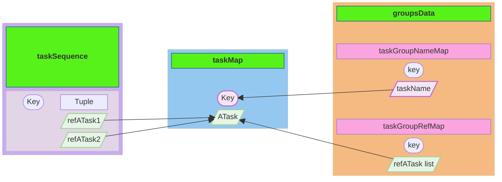
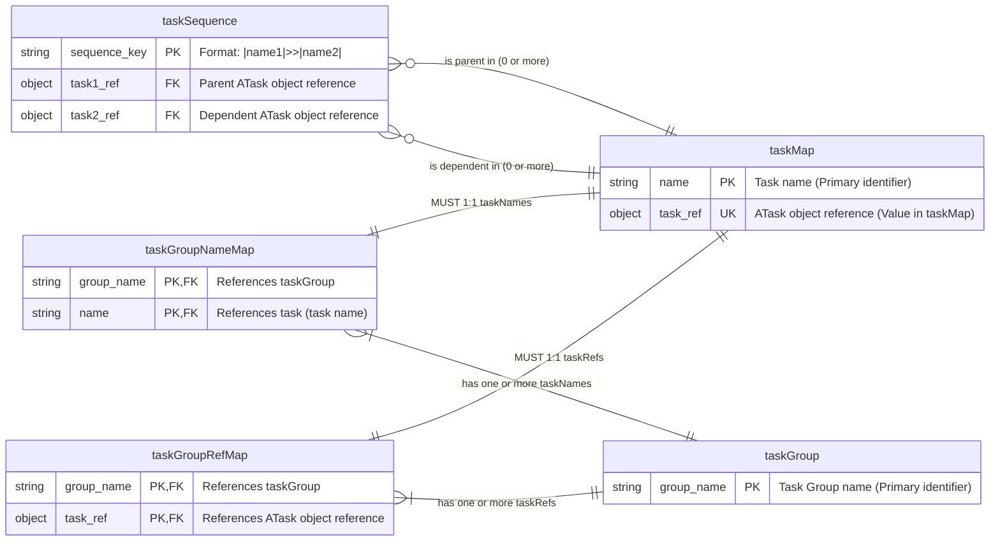
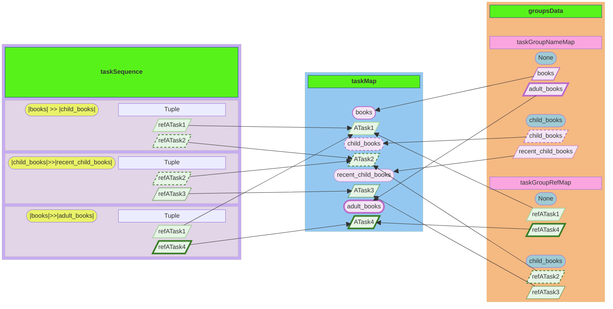
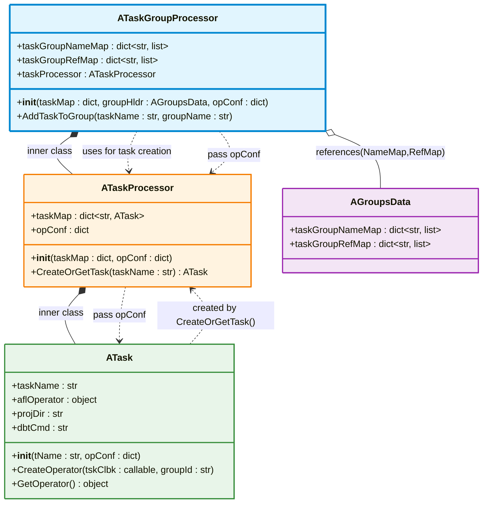
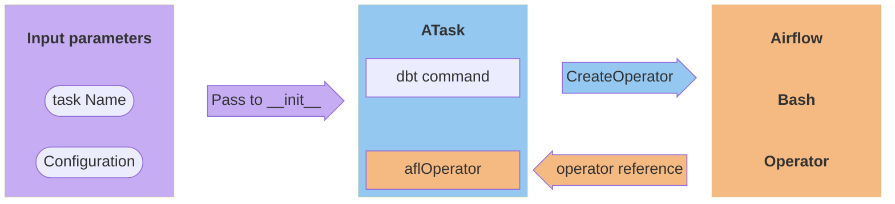
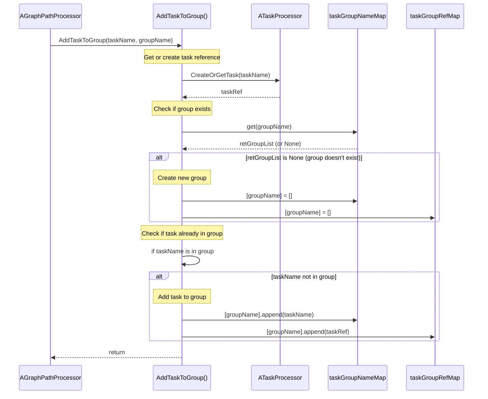

[<- Back to Table of Contents](index.md)

## Final Data Transformation

We previously mentioned three fields of the `AData` structure into which the data is ultimately transformed: `taskMap`, `taskSequence`, and `groupsData`.
Let us take a closer look at them:

Task information is stored in `taskMap`, which is a dictionary where the key is the `taskName` and the value is an instance of the `ATask` class. This class will be discussed later. 
A `taskName` can be used to find its corresponding instance.
These instances are referenced by elements of two other dictionaries: `taskSequence` and `taskGroupRefMap`.

The `taskSequence` dictionary has a pair of task names as a key, represented as "|task1name|>>|task2name|", and a tuple of two references to `ATask` class instances: `refATask1` and `refATask2`, as its value.
The `taskSequence` dictionary is then used to create dependencies between Airflow operators, since these dependencies are created using an overloaded bit shift operation.

The second dictionary, `taskGroupRefMap`, has the group name as a key and a list of references to instances of the `ATask` class as a value. It is intended to specify task groups for a set of operators.

In addition to `taskGroupRefMap`, the `groupsData` structure contains another dictionary, `taskGroupNameMap`. This dictionary contains task names rather than references to `ATask` instances, i.e., it actually refers to the `taskMap` keys. It is intended for debugging and search purposes.

To describe this structure in entity-relationship terms, we need to introduce an additional entity `taskGroup` for the group name, which does not exist in the actual classes, but is needed to resolve relationships for `taskGroupNameMap` and `taskGroupRefMap`:

As you can see, the number of rows in the `taskGroupRefMap` and `taskGroupNameMap` tables will correspond to the number of rows in `taskMap`, based on the 1:1 relationship, but in reality, it will be the total number of entries across all groups in the Python structure. There must be at least one group, since a task must belong to a group. A task cannot belong to two or more groups, but multiple tasks can belong to a single group. If there is only one task, there will be no entries in `taskSequence` since a parent-child relationship requires at least two tasks.

Examining how the structure would look using a practical example of a simple dbt project with the `(run)` prefix omitted in `taskName` items:

The `taskMap` dictionary contains four items, each consisting of a `taskName` key and an `ATask` instance as its value.
These `ATask` instances are referenced by values in the `taskGroupRefMap` and `taskSequence` dictionaries, and the `taskGroupNameMap` dictionary references the `taskMap` keys. In total, `taskGroupRefMap` contains four references to `ATask` instances: two in the `None` group and two in the `child_books` group, which equals the number of elements in `taskMap`. Similarly, `taskGroupNameMap` contains the same keys as the `taskMap` dictionary.

Consider the structure of the helper classes using a class diagram:

Within the `ATaskGroupProcessor` helper class, there is another nested helper class, `ATaskProcessor`, and within that, another nested helper class, `ATask`, mentioned earlier.
The classes are defined as nested because they are not intended to be used separately as library classes.

The diagram shows that the configuration reference is passed sequentially from the `ATaskGroupProcessor` class to the `ATaskProcessor` class and ultimately to the `ATask` class.

It makes sense to start with the `ATask` class when considering the purpose of this entire set of helper classes.
The purpose of the `ATask` class can be outlined roughly as follows:

The class takes a task name and configuration as input and generates a `dbt` call string for a model or test.
This string is then used in the `BashOperator` as a command.
The class creates a `BashOperator` by calling the `CreateOperator` method, which accepts a callback and task group ID as parameters. It stores a reference to the created Airflow operator object (which was passed the command to execute) in the `aflOperator` field. This reference to the Airflow operator object is returned by the `GetOperator` method.
Using the `CreateOperator`/`GetOperator` methods of the `ATask` class will be discussed in the next section.

The `ATask` class instance itself is created without being associated with a group or sequence, and only reflects the execution of a command.
However, it is not created through standard initialization, but by calling a method of the class factory: the helper class `ATaskProcessor`.

The `ATaskProcessor` class takes two parameters in its constructor: `taskMap` for a dictionary of `ATask` instances and `opConf`, a reference stored in a class field, to be passed to the `ATask` constructor when instantiating it.

The `CreateOrGetTask` method of the `ATaskProcessor` class ensures that tasks in the `taskMap` container are unique. This means that if we attempt to create a task with the same name again, the method does not write anything to the `taskMap` container and returns the already created task by name. This check is necessary because if a DAG has branching, different paths in the graph may contain the same tasks and even task groups, but within the DAG itself, tasks are unique.

Now that the underlying helper classes have been described, we can examine the logic of the `AddTaskToGroup` method of the `ATaskGroupProcessor` class:

As you can see, the method delegates task creation to the `ATaskProcessor` factory and first creates the task passed in as an argument or obtains a reference to an existing one. Then, the group's existence is checked; if it doesn't exist, it is created.
For this check, one of the dictionaries, `taskGroupNameMap`, is sufficient. It is also used to verify the presence of a task in the list by the group name key.

New keys for the group name, or `None` for the default group, are created synchronously in both dictionaries, `taskGroupNameMap` and `taskGroupRefMap`. Elements are also added to both dictionaries simultaneously: the task name in `taskGroupNameMap` and a reference to the `ATask` class instance in `taskGroupRefMap`.

The `taskGroupNameMap` dictionary here serves the additional function of checking the existence of a task in a group, since a similar check using `taskGroupRefMap` would require retrieving the task name by accessing a class field, which would complicate the code.

Now we can examine the `_AddSequence` method of the `AGraphPathProcessor` class, which was not described in the previous section.
Since `AGraphPathProcessor` contains a reference to the `taskMap` dictionary, we can write data to the `taskSequence` dependency dictionary. The key is a string composed of the parent and dependent task names, and the value is a tuple of two `ATask` instance references. The references to the `ATask` instances are obtained using the task names as keys in the `taskMap` dictionary.

The `_AddSequence` method accepts the names of two tasks as arguments: the parent `task1name` and the dependent `task2name`.
Inside the `_ProcessTasksList` method, the name of the previous task is stored, which is passed to `task1name`, and the current task is passed to `task2name`. Then, at the end of each iteration, the previous task is assigned the value of the current task, allowing the dependency to be built. 
The previous task is initialized as `None`. Therefore, the first iteration is skipped by the `_AddSequence` method, which requires both arguments to be non-`None`, since dependencies are built only between real tasks.

Similarly, uniqueness is maintained in the `taskSequence` dictionary; if the same dependency already exists for a given key, nothing is added.

In the next section, we will review the use of this final data in callback invocations.

[Airflow Objects Generation ->](chap8.md)
