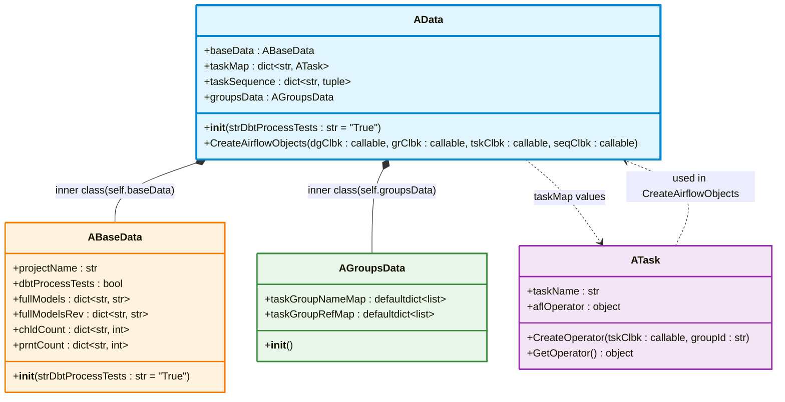
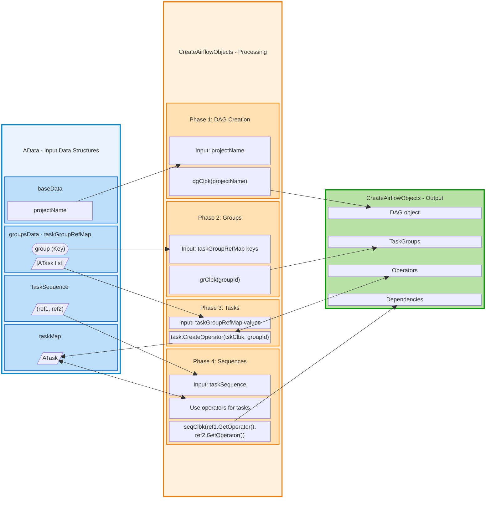
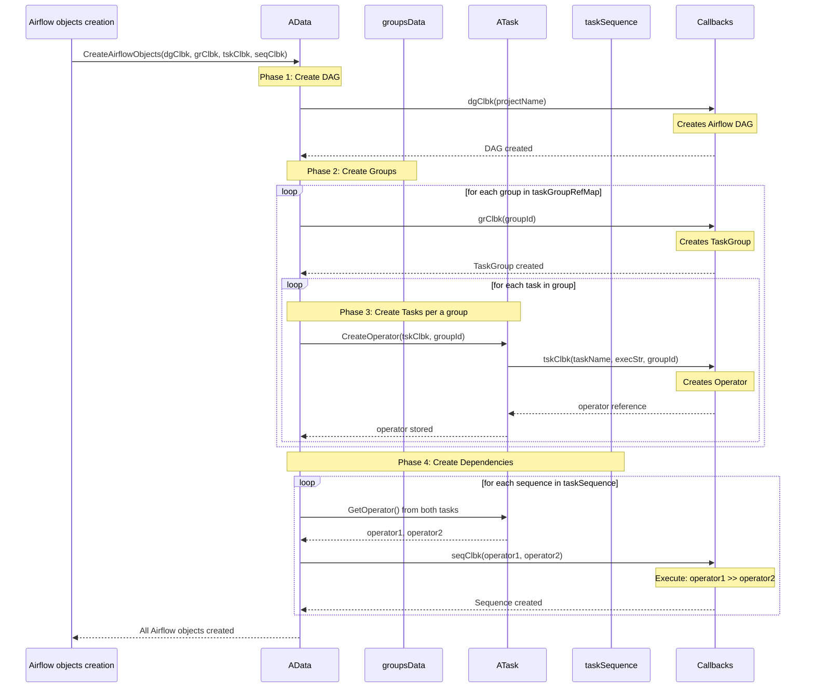
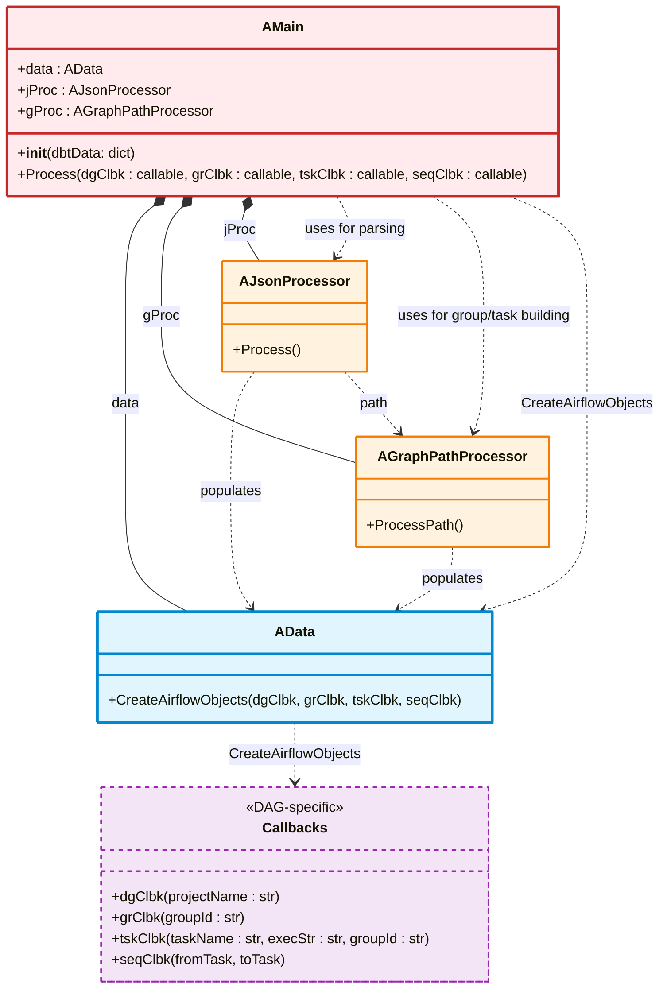

[<- Back to Table of Contents](index.md)

## Airflow Objects Generation

After we have completed the final data transformation, we can now use it to create Airflow objects.
But first, let us examine the `AData` class in its entirety in relation to the `ATask` class.

The `AData` class can be represented by the following class diagram:



The `AData` class has two inner classes: `ABaseData` and `AGroupsData`.

The `ABaseData` class instance, discussed earlier, is stored in the `baseData` variable, while the `AGroupsData` class instance is stored in the `groupsData` variable.
After the final transformation, all the data we need is located in the following fields of the `AData` class:

* project name in `baseData.projectName`
* tasks, organized by group, in `groupsData.taskGroupRefMap`
* sequences in `taskSequence`
* task dictionary in `taskMap`

The last three fields, which are dictionary containers, use a reference to an instance of the `ATask` class as their value.

The `CreateAirflowObjects` method of the `AData` class is used to create Airflow objects.
It takes four callbacks as arguments:
* `dgClbk`: DAG creation callback
* `grClbk`: Task Group creation callback
* `tskClbk`: Task creation callback
* `seqClbk`: Task sequence creation callback

The process of creating Airflow objects can be graphically represented with the following schematic diagram:



Based on the number of callbacks, the process can be divided into four phases:
* creation of the DAG object itself
* creation of task groups
* creation of tasks
* creation of dependencies

Obviously, the phases are interdependent. This is why the DAG is created first, then the task group is created. If we want to add a task to the group, it must first be created so that it can be specified as an argument during creation. The final phase is the creation of dependencies, since the tasks must be created first.

The user implements callbacks in their DAG code and passes references to methods. Using callbacks allows for flexible functionality, as this library uses only the following callback signatures:

* `dgClbk`: has only one argument, projectName. The function returns nothing.
* `grClbk`: has only one argument, groupId. In Airflow, the name of the task group is its identifier. The function returns nothing.
* `tskClbk`: has three arguments: taskName for the task name, execStr for the execution string, and groupId for the task group to which the task belongs. The function must return a reference to the created operator object.
* `seqClbk`: has two arguments: a reference to the Airflow task for the parent and a reference of the same type for the dependent task. The function returns nothing.

Creating a DAG requires more arguments, such as a schedule, start date, and possibly additional arguments beyond the project name. This is implemented in the custom code of this callback. Based on the `dbtProcessTests` flag, the project name is passed in its original form or suffixed with "with Tests" if the flag specifies the use of both models and tests.

When creating a task group, the groupId is also sufficient.
However, creating the task itself is a bit more involved: the callback call is delegated to the `CreateOperator` method of the `ATask` class, which invokes the callback, passing in the arguments. The callback for the task returns the created Airflow object, and a reference to it is stored in the `aflOperator` field of the `ATask` class. This is done to implement dependencies between Airflow objects: the `taskSequence` dictionary contains tuples with references to `ATask` instances. The `ATask` class stores references to Airflow objects during phase 3, so it can invoke the callback for sequences with arguments in the form of references to Airflow objects and define dependencies between them.

We can visualize this logic in a sequence diagram:



In the first phase, an Airflow DAG is created.
The second phase is a loop over the keys of the `taskGroupRefMap`: this is how we select a group. First, we invoke a callback to create an Airflow task group object. For the `None` group, a task group should not be created in the callback.
After the group is created, a nested loop for the third phase begins: iterating over the `ATask` instances of this group. Here, we create tasks, specifying which group they belong to, and store a reference to them.
In the final, fourth phase, we iterate over the `taskSequence` values, obtaining references to the tasks from each element of the pair that makes up the tuple. It is this pair of task references that is passed to the callback to create dependencies after the tasks themselves have been created.

### AMain Class

Since the entire logic of the solution has already been described in sufficient detail, the description of the `AMain` class can be limited to a class diagram:



The `AMain` class acts as the central coordinator of the previously described workflow phases. It contains:
* an `AData` class instance for storing data as it's transformed
* an `AJsonProcessor` class instance for reading the project's dbt file
* an `AGraphPathProcessor` class instance for parsing the read paths

The `AMain` class constructor accepts a configuration reference as its only parameter.
The `Process` method accepts four callbacks for creating Airflow objects.

Internally, it reads the dbt project using the `AJsonProcessor` class. After processing, the output list of graph paths is passed in a loop to the `AGraphPathProcessor` class, which completes the final transformation. After that, the Airflow object creation method is called on `AData`.
Thus, the Python file for DAG, excluding imports, becomes quite simple, as illustrated by the following example:

```python
# ============================================================================
# Global variables to hold Airflow objects created by callbacks
# ============================================================================
_dag = None
_groups = {}

# ============================================================================
# CALLBACK FUNCTIONS
# ============================================================================

# *** DAG creation ***
def CreateDagCallback(projectName):
    global _dag

    _dag = DAG(
        dag_id=f"dbt_{projectName}",
        start_date=datetime(2026,1,1),
        schedule= None,
        catchup=False,
        description=f"Auto-generated DAG from dbt project: {projectName}"
    )

# *** Task Group creation ***
def CreateTaskGroupCallback(groupId):
    global _dag
    global _groups

    # add only a group that is not the default group
    if groupId is not None:
        grp = TaskGroup(
            group_id=groupId,
            dag=_dag,
            tooltip=f"Task group: {groupId}"
        )
        _groups[groupId] = grp

# *** Task creation ***
def CreateTaskCallback(taskName, execStr, groupId):
    global _dag
    global _groups

    # Clean task name for Airflow (remove special characters)
    task_id = taskName.replace(" ", "_").replace("(", "").replace(")", "")

    # Get the TaskGroup for this task, if one exists.
    grp = None
    if groupId is not None:
        grp = _groups.get(groupId)

    task = BashOperator(
        task_id=task_id,
        bash_command=execStr,
        dag=_dag,
        task_group=grp,
    )

    return task
    
# *** Sequence creation ***
def CreateSequenceCallback(from_task, to_task):
    from_task >> to_task

# ============================================================================
# MAIN DAG DEFINITION
# ============================================================================

# *** Configuration ***
dbtData = {
 "DBT_PROJECT_DIR":"/my/project/dir",
 "DBT_COMMAND":"/place/of/dbt",
 "DBT_MANIFEST_PATH":"/my/project/dir/target/manifest.json",
 "SKIP_DBT_TEST":"True"
}

# *** AMain instance ***
mainProcessor = AMain(dbtData)

# *** Run process ***
mainProcessor.Process(
  dgClbk=CreateDagCallback,
  grClbk=CreateTaskGroupCallback,
  tskClbk=CreateTaskCallback,
  seqClbk=CreateSequenceCallback 
)
```

Then we will look at an example dbt project used to illustrate the operation of this simple library.
Some caveats of creating a DAG file will be discussed further in a separate section.

[A Simple dbt Project to Test the Library's Functionality ->](chap9.md)
