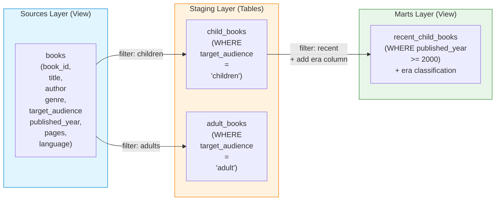

[<- Back to Table of Contents](index.md)

## A simple dbt project to test the library's functionality

For an initial check of the library's functionality, unit tests are sufficient, and in this case, a dbt project is not even necessary. It is enough to test the library module by module, providing synthetic data as input for which the correct test result is known.

However, to fully test the library's operation in Airflow, a dbt project is required, which is what the library is designed to work with.

Here we'll consider a very simple example of a dbt project consisting of just four models.
The project is a book library. For analysis, we first divide the books into two categories: adult books and children's books. 
Then, for children's books, we generate a report on recent releases.
Based on the model layers, the models are divided into three categories:

* the source layer, which includes the `books` model
* the intermediate staging layer, which includes the `child_books` and `adult_books` models
* the data mart layer, which includes the `recent_child_books` model

The source `books` model and the `recent_child_books` model are views.
Moreover, the `books` model is essentially a `SELECT` statement that outputs some fixed test data.
The `child_books` and `adult_books` models are tables for storing data in the intermediate staging layer.

The project's dbt models can be represented by the following diagram:



The project uses SQLite as a database, so you'll need to install `dbt-core` and `dbt-sqlite` (_installation details are covered in the corresponding section_).
SQLite is well-suited as a test database engine because it doesn't require setting up a database server, as is the case with PostgreSQL or other databases.

The file tree structure for this project is as follows:


The SQLite database file is located in the root directory, which is defined in the `profiles.yml` file:

```yaml
books_library:
  target: dev
  outputs:
    dev:
      type: sqlite
      threads: 1
      database: 'books_library'
      schema: 'main'
      schema_directory: '.'
      schemas_and_paths:
        main: 'books_library.db'
```

After executing the `dbt compile` command, a `target` folder is created, which will contain the `manifest.json` file used by the library:


If you have VS Code and the dbt Power User extension installed, you can see the same model dependency diagram in the Lineage tab as in the diagram above:


To test the models, run `dbt run` and verify that all models have run successfully based on the messages displayed:

```log
$ dbt run
hh:mm:ss  Running with dbt=1.11.11
hh:mm:ss  Registered adapter: sqlite=1.10.0
hh:mm:ss  Found 4 models, 7 data tests, 416 macros
hh:mm:ss  
hh:mm:ss  Concurrency: 1 threads (target='dev')
hh:mm:ss  
hh:mm:ss  1 of 4 START sql view model main.books ......................................... [RUN]
hh:mm:ss  1 of 4 OK created sql view model main.books .................................... [OK in 0.09s]
hh:mm:ss  2 of 4 START sql table model main.adult_books .................................. [RUN]
hh:mm:ss  2 of 4 OK created sql table model main.adult_books ............................. [OK in 0.07s]
hh:mm:ss  3 of 4 START sql table model main.child_books .................................. [RUN]
hh:mm:ss  3 of 4 OK created sql table model main.child_books ............................. [OK in 0.05s]
hh:mm:ss  4 of 4 START sql view model main.recent_child_books ............................ [RUN]
hh:mm:ss  4 of 4 OK created sql view model main.recent_child_books ....................... [OK in 0.07s]
hh:mm:ss  
hh:mm:ss  Finished running 2 table models, 2 view models in 0 hours 0 minutes and 0.44 seconds (0.44s).
hh:mm:ss  
hh:mm:ss  Completed successfully
hh:mm:ss  
hh:mm:ss  Done. PASS=4 WARN=0 ERROR=0 SKIP=0 NO-OP=0 TOTAL=4
```

where `hh:mm:ss` represents the task start time in hours, minutes, and seconds.

Now let's check that all the data is in place. To do this, we need a utility for viewing SQLite databases.
For example, [DB Browser for SQLite](https://github.com/sqlitebrowser/sqlitebrowser) will do.

We can look at the database schema to make sure that it has two tables: `adult_books` and `child_books`, and two views: `books` and `recent_child_books`:


There are 17 rows in the `books` view:


The final view `recent_child_books` returns two rows:


The intermediate tables `adult_books` and `child_books` have 7 and 8 rows, respectively.

After populating the data, you can run tests that verify data integrity.
In this project, only 7 tests are included, although more could be added.
Four tests check for NOT NULL values in the `book_id` key column across four models:

| Model | Test |
| --- | --- |
| `books` | `not_null_books_book_id` |
| `adult_books` | `not_null_adult_books_book_id` |
| `child_books` | `not_null_child_books_book_id` |
| `recent_child_books` | `not_null_recent_child_books_book_id` |

Three additional tests verify the integrity of the data in the `books` source:

| Test | Purpose |
| --- | --- |
| `not_null_books_target_audience` | checks for `NOT NULL` values in the `target_audience` column |
| `accepted_values_books_target_audience__children__adult` | checks valid values for the `target_audience` column |
| `unique_books_book_id` | checks the uniqueness of values in the `book_id` key column | 
 
The tests are run using the `dbt test` command and the result looks like this:

```log
$ dbt test
hh:mm:ss  Running with dbt=1.11.11
hh:mm:ss  Registered adapter: sqlite=1.10.0
hh:mm:ss  Found 4 models, 7 data tests, 416 macros
hh:mm:ss  
hh:mm:ss  Concurrency: 1 threads (target='dev')
hh:mm:ss  
hh:mm:ss  1 of 7 START test accepted_values_books_target_audience__children__adult ....... [RUN]
hh:mm:ss  1 of 7 PASS accepted_values_books_target_audience__children__adult ............. [PASS in 0.12s]
hh:mm:ss  2 of 7 START test not_null_adult_books_book_id ................................. [RUN]
hh:mm:ss  2 of 7 PASS not_null_adult_books_book_id ....................................... [PASS in 0.08s]
hh:mm:ss  3 of 7 START test not_null_books_book_id ....................................... [RUN]
hh:mm:ss  3 of 7 PASS not_null_books_book_id ............................................. [PASS in 0.03s]
hh:mm:ss  4 of 7 START test not_null_books_target_audience ............................... [RUN]
hh:mm:ss  4 of 7 PASS not_null_books_target_audience ..................................... [PASS in 0.06s]
hh:mm:ss  5 of 7 START test not_null_child_books_book_id ................................. [RUN]
hh:mm:ss  5 of 7 PASS not_null_child_books_book_id ....................................... [PASS in 0.05s]
hh:mm:ss  6 of 7 START test not_null_recent_child_books_book_id .......................... [RUN]
hh:mm:ss  6 of 7 PASS not_null_recent_child_books_book_id ................................ [PASS in 0.02s]
hh:mm:ss  7 of 7 START test unique_books_book_id ......................................... [RUN]
hh:mm:ss  7 of 7 PASS unique_books_book_id ............................................... [PASS in 0.06s]
hh:mm:ss  
hh:mm:ss  Finished running 7 data tests in 0 hours 0 minutes and 0.67 seconds (0.67s).
hh:mm:ss  
hh:mm:ss  Completed successfully
hh:mm:ss  
hh:mm:ss  Done. PASS=7 WARN=0 ERROR=0 SKIP=0 NO-OP=0 TOTAL=7
```

This concludes the overview of the `books_library` dbt project. It is located at the same directory level as the Airflow `dags` folder in the repository. However, if you look at the `profiles.yml` file in the repository, you'll see that it differs from the one described here regarding the database path.
We will cover this in the next section on caveats.

[Caveats: Imports and Paths ->](chap10.md)
