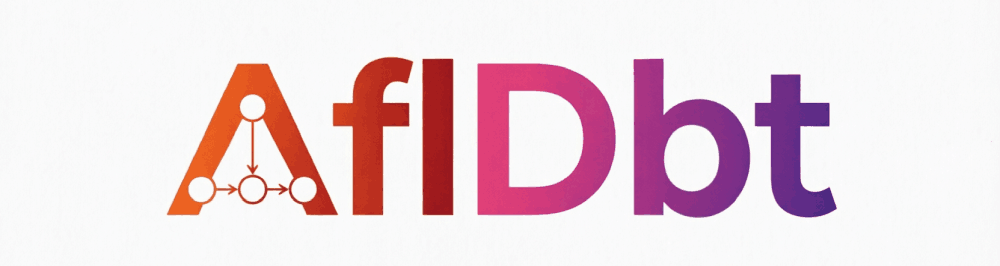

# AflDbt

**AflDbt** - это легковесная Python-библиотека для бесшовной интеграции Apache Airflow и dbt, которая автоматически генерирует Airflow DAG на основе файла `manifest.json`. Инструмент динамически преобразует метаданные dbt-проекта в рабочие процессы, автоматически распределяя модели и тесты по задачам (Tasks) и группам задач (Task Groups) с полным сохранением графа зависимостей.

Благодаря гибкой архитектуре на основе функций обратного вызова (callbacks) и встроенным утилитам для визуализации графов задач (например, в формате Mermaid), AflDbt позволяет инженерам данных быстро создавать, отлаживать и поддерживать пайплайны обработки данных, оставаясь при этом минималистичной альтернативой более тяжеловесным решениям.

## Документация

Полное руководство по архитектуре, внутреннему устройству и использованию библиотеки доступно в документации.

**[Документация AflDbt](#документация-afldbt)**


## Установка и настройка

Процесс развертывания среды для работы с библиотекой разделен на два основных этапа. Подробные пошаговые инструкции, включая настройку виртуальных окружений и валидацию, вы найдете в соответствующих разделах документации:

1. **[Установка Python, настройка окружения, запуск юнит-тестов и проверка dbt-проекта](#установка-python-настройка-окружения-запуск-юнит-тестов-и-проверка-dbt-проекта)**
2. **[Установка Apache Airflow и итоговая проверка тестового DAG-файла в разных режимах](#установка-apache-airflow-и-итоговая-проверка-тестового-dag-файла-в-разных-режимах)**

## Быстрый старт

1. Скомпилируйте ваш dbt-проект, чтобы получить файл `manifest.json`:
   ```bash
   dbt compile
   ```
2. Укажите путь к dbt-проекту и исполняемому файлу `dbt` в конфигурации `AflDbt`, размещенной в DAG-файле.
3. Определите функции обратного вызова (callbacks) для создания объектов Airflow.
4. Протестируйте DAG в Airflow.

*(Подробные примеры кода смотрите в [Документация AflDbt](#документация-afldbt))*

## История версий

* 0.1
    * Первоначальный релиз

## Лицензия

Этот проект распространяется под лицензией MIT. Подробности см. в файле [LICENSE](LICENSE).

## Благодарности

* Источники: [Building a Scalable Analytics Architecture With Airflow and dbt](https://www.astronomer.io/blog/airflow-dbt-1/)

---

# Документация AflDbt

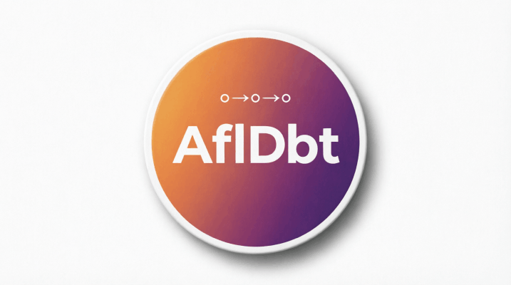

Добро пожаловать в официальную документацию **AflDbt** — легковесной Python-библиотеки, предназначенной для бесшовной интеграции Apache Airflow и dbt. В этом руководстве представлен подробный обзор ключевых концепций, внутренней архитектуры библиотеки и практических инструкций по ее настройке.


## Оглавление
1. [Основной принцип работы](#основной-принцип-работы)
2. [Базовая внутренняя архитектура Processing Logic](#базовая-внутренняя-архитектура-processing-logic)
3. [Обзор классов ABaseData и AJsonProcessor](#обзор-классов-abasedata-и-ajsonprocessor)
4. [Обзор класса AJsonProcessor](#обзор-класса-ajsonprocessor)
5. [Обзор класса AGraphPathProcessor](#обзор-класса-agraphpathprocessor)
6. [Подробный обзор класса AGraphPathProcessor](#подробный-обзор-класса-agraphpathprocessor)
7. [Финальное преобразование данных](#финальное-преобразование-данных)
8. [Генерация объектов Airflow](#генерация-объектов-airflow)
9. [Простой dbt-проект для тестирования функциональности библиотеки](#простой-dbt-проект-для-тестирования-функциональности-библиотеки)
10. [Технические нюансы: импорты и пути](#технические-нюансы-импорты-и-пути)
11. [Юнит-тесты, утилита createMermaid.py и запуск DAG как Python-скрипта](#юнит-тесты-утилита-createmermaidpy-и-запуск-dag-как-python-скрипта)
12. [Установка Python, настройка окружения, запуск юнит-тестов и проверка dbt-проекта](#установка-python-настройка-окружения-запуск-юнит-тестов-и-проверка-dbt-проекта)
13. [Установка Apache Airflow и итоговая проверка тестового DAG-файла в разных режимах](#установка-apache-airflow-и-итоговая-проверка-тестового-dag-файла-в-разных-режимах)
14. [Потенциальные направления развития](#потенциальные-направления-развития)

---

## Основной принцип работы

dbt генерирует файл `manifest.json`. Этот файл создаётся в каталоге `target` вашего dbt-проекта и содержит полное представление проекта. Он предоставляет все необходимые метаданные (модели, источники, тесты, зависимости и т.д.), которые нужны для создания Airflow DAG для dbt.

Архитектура и логика библиотеки разработаны для динамической генерации Apache Airflow DAG на основе манифеста dbt. Они автоматически преобразуют метаданные dbt-проекта в рабочие процессы Airflow.

- Объект **Configuration** хранит путь к файлу манифеста dbt.
- Функциональность **Processing Logic** инициализируется с помощью этого объекта Configuration в конструкторе, что предоставляет ей доступ к пути манифеста и другим настройкам.
- **Функции обратного вызова** передаются в качестве параметров методу `Process` экземпляру `Processing Logic`. Они определяют простые правила создания компонентов Airflow на основе предоставленных аргументов.

Эти функции обратного вызова создают основные типы компонентов Airflow:
- Сам объект DAG
- Группы задач
- Задачи
- Зависимости между задачами (например, `task_a >> task_b`)

Функциональность `Processing Logic` преобразует метаданные из файла манифеста во входные параметры для этих функций обратного вызова. Термин "функциональность" используется потому, что нет реального класса Python с именем `Processing Logic`, и внутреннее устройство подробно будет рассмотрено далее.

DAG-файл Python, использующий библиотеку Afldbt, включает следующие объекты:
- Объект Configuration (который является словарём)
- Функции обратного вызова для создания компонентов Airflow
- Экземпляр функциональности `Processing Logic`

Это можно проиллюстрировать с помощью следующей упрощённой схемы:
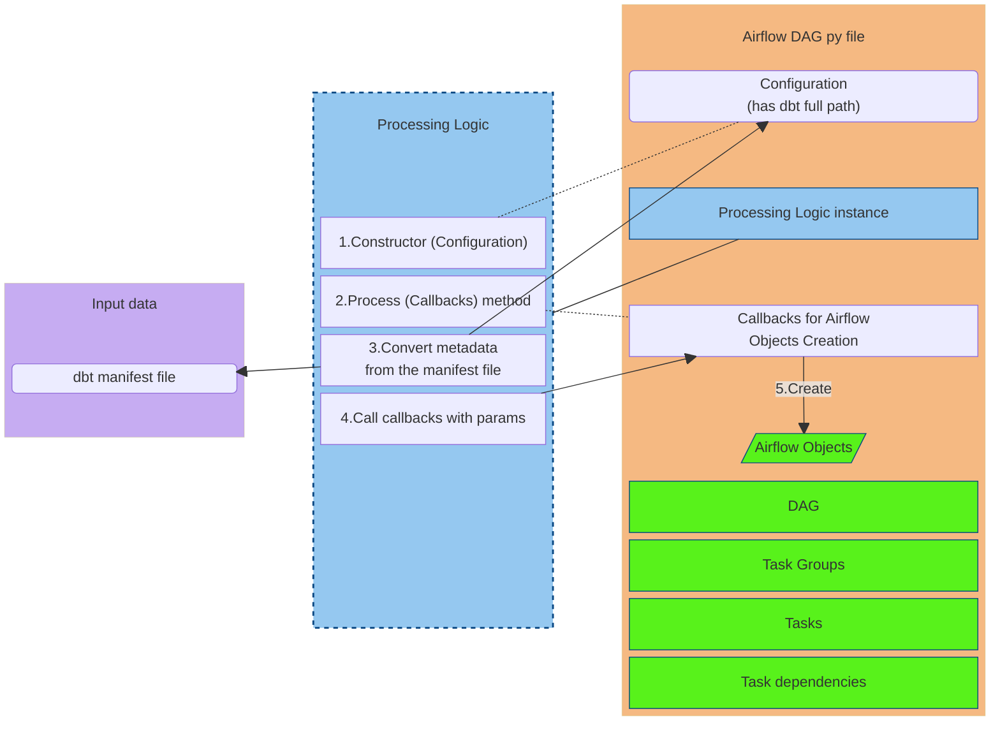

Реализация `Processing Logic` и вспомогательные модули находятся в отдельном каталоге.

В целом, для создания файла DAG на основе манифеста dbt необходимо:
- Установить конфигурацию
- Определить функции обратного вызова для создания компонентов Airflow
- Создать экземпляр класса для реализации `Processing Logic` и передать конфигурацию при создании
- Запустить метод `Process` и передать функции обратного вызова в качестве входных параметров

В следующем разделе внутренняя архитектура `Processing Logic` рассмотрена более подробно.

---

[<-Назад к оглавлению](#оглавление)

## Базовая внутренняя архитектура Processing Logic

Базовую внутреннюю архитектуру можно проиллюстрировать следующей упрощённой схемой:

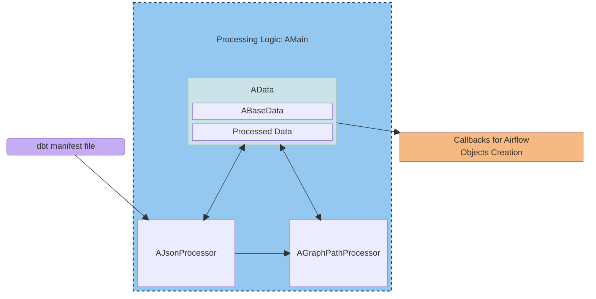
Класс, реализующий `Processing Logic`, называется `AMain`, который выступает в роли центрального координатора. Он состоит из следующих основных классов:

* `AData` — центральная структура данных, хранящая данные на протяжении всего жизненного цикла обработки.
* `AJsonProcessor` — отвечает за чтение внешнего манифеста dbt и преобразование метаданных.
* `AGraphPathProcessor` — анализирует структуры графовых путей в `AData` и данные, возвращённые `AJsonProcessor`, подготавливает внутренние вспомогательные объекты и обработанные данные для дальнейшей обработки.

После завершения всех этапов обработки вызывается метод класса `AData`, который создаёт объекты Airflow с использованием обработанных данных.

Класс `AData` состоит из двух основных частей:
* `ABaseData`, которая представляет собой преобразованные метаданные из JSON-манифеста.
* Обработанные данные, вычисляемые в `AGraphPathProcessor` на основе `ABaseData`.

Детали обработанных данных будут рассмотрены позже.

Данных в классе `AData` достаточно для генерации финальных объектов Airflow (DAG, групп задач, задач, последовательностей) с использованием метода класса `AData` и предоставленных функций обратного вызова.

Давайте кратко рассмотрим, как JSON-манифест преобразуется в эти итоговые данные.

Класс `AJsonProcessor` считывает метаданные из манифеста и преобразует их в два результата:
* данные в классе `ABaseData`
* результат выполнения метода `Process`, который возвращает список графовых путей


Понятие графового пути требует более подробного объяснения.
По сути, путь — это последовательность неповторяющихся узлов, соединённых рёбрами, присутствующими в графе.
Направленный ациклический граф (DAG) может содержать множество путей.

В простом случае с тремя узлами:

единственный путь — это `A,B,C`.

Если в узле A происходит ветвление, то мы получаем два пути:
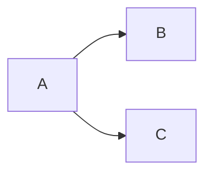

Здесь пути — это `A,B` и `A,C`.

Аналогичный случай возникает, если ветвление находится в конечном узле C:
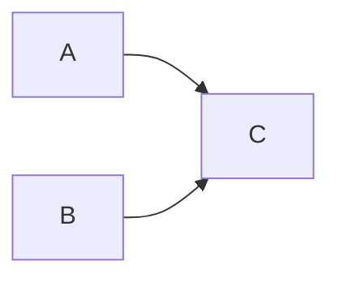

Здесь пути — это `A,C` и `B,C`.

Класс `AJsonProcessor` в качестве результата метода `Process` возвращает список графовых путей для дальнейшего анализа. Каждый путь представляет собой последовательность узлов, разделённых запятыми.

Этот список используется в другом классе последовательности обработки: `AGraphPathProcessor`.

Класс `AGraphPathProcessor` принимает в своём конструкторе ссылки на необходимые члены класса `AData` и обрабатывает один путь за раз с помощью соответствующего метода.
Для обработки выявленных групп он использует вспомогательный класс `ATaskGroupProcessor` и сохраняет результат в разделе обработанных данных класса `AData`.

Наконец, метод класса `AData` принимает функции обратного вызова для создания каждого объекта Airflow. Он вызывает каждую функцию обратного вызова для создания определённого типа и предоставляет аргументы для этого вызова, используя данные из раздела обработанных данных.

Более подробные описания классов будут рассмотрены далее.

---

[<-Назад к оглавлению](#оглавление)

## Обзор классов ABaseData и AJsonProcessor

Имеет смысл сначала кратко ознакомиться со структурой и функционированием этих классов, а также с тем, как данные разбираются и передаются, прежде чем переходить к более детальному рассмотрению структуры классов.

Рассмотрим следующую схему:

```mermaid
block-beta
    columns 8
%% ====== INPUT DATA ==========
    block:dbtfile:2
        columns 4
        DBT_T["manifest.json"]:4
        space:4
            DBT_META[/"metadata"/]:2 space:2
                space:1 DBT_PRJ("project_name"):2 space:1
            DBT_ND[/"nodes"/]:2 space:2
                space:1 DBT_ND_IK("item-key"):2 space:1
                    space:2 DBT_ND_NM(["name"]):2 
            DBT_PM[/"parent_map"/]:2 space:2
                space:1 DBT_PM_IK("item-key"):2 space:1
                    space:2 DBT_PM_I1(["parent1"]):2
                    space:2 DBT_PM_I2(["parent2"]):2
            DBT_CM[/"child_map"/]:2 space:2
                space:1 DBT_CM_IK("item-key"):2 space:1
                    space:2 DBT_CM_I1(["child1"]):2
                    space:2 DBT_CM_I2(["child2"]):2

    end
    space:1
%% ====== CLASSES ==========
    block:CLSS:3
        columns 1
        CLSS_T["Classes"]
        space:1

        ABD_T("ABaseData")

        ABD_PN["projectName: string"]
        ABD_FM["fullModels: map{taskName:full_name}"]
        ABD_FMR["fullModelsRev: reverse map {full_name:taskName}"]
        ABD_PC["prntCount: map{taskName:count}"]
        ABD_CC["chldCount: map{taskName:count}"]
        ABD_PT["dbtProcessTests: boolean"]
        ABD_INI["_init_(strDbtProcessTests: string)"]

        space:1

        JP_T("AJsonProcessor")
        JP_INI["_init_( baseData: ABaseData, opConf: Configuration )"]
        JP_PRC["Process()  : list [graph path]"]
    end
  space:1
%% ====== Comments ==========
    block:COMM:1
        columns 1
        COMM_T["Comments"]
        COMM_FN["full_name = nodes.item-key"]
        COMM_TN["taskName gets from name \nand type"]
        COMM_FNR["reverse map"]
        COMM_PC["Count of parent1,parent2 ..."]
        COMM_CC["Count of child1,child2 ..."]
        COMM_PT["filter on types"]
        COMM_JP_CFG["file to process"]
        COMM_JP_CFG_RET["return list of graph paths"]
    end
%% ====== links ==========

%% project name
DBT_PRJ -->ABD_PN

%% full map
DBT_ND_IK --> ABD_FM
DBT_ND_IK --> ABD_FMR

%% parents
DBT_PM_IK --> ABD_PC

%% childs
DBT_CM_IK --> ABD_CC

%% AJsonProcessor -> ABaseData
JP_T -.-> ABD_T

%% commants
COMM_FN -.-> ABD_FM 
COMM_TN -.-> ABD_FM
COMM_FNR -.-> ABD_FMR
COMM_PC -.-> ABD_PC
COMM_CC -.-> ABD_CC
COMM_PT -.-> ABD_PT
COMM_JP_CFG -.-> JP_INI
COMM_JP_CFG_RET -.-> JP_PRC
%% ====== styles ==========

%% Level 1: Title - no border
style DBT_T fill:#c6acf2,stroke:none,stroke-width:0px,color:#333

%% Level 2: Sections - blue (shared)
classDef lev2 fill:#dae8fc,stroke:#6c8ebf,stroke-width:2px;
class DBT_META,DBT_ND,DBT_PM,DBT_CM lev2
    style DBT_CM fill:#dae8fc,stroke:#6c8ebf,stroke-width:2px

%% metadata branch - orange family
style DBT_PRJ fill:#ffe6cc,stroke:#d79b00,stroke-width:2px
style ABD_PN fill:#ffe6cc,stroke:#d79b00,stroke-width:2px

%% nodes branch - green family
style DBT_ND_IK fill:#d5e8d4,stroke:#82b366,stroke-width:2px
style DBT_ND_NM fill:#e6f5e6,stroke:#a6d19a,stroke-width:2px
style ABD_FM fill:#d5e8d4,stroke:#82b366,stroke-width:2px
style ABD_FMR fill:#d5e8d4,stroke:#82b366,stroke-width:2px

%% parent_map branch - purple family
style DBT_PM_IK fill:#e1d5e7,stroke:#9673a6,stroke-width:2px
style DBT_PM_I1 fill:#f3e5f5,stroke:#ba68c8,stroke-width:2px
style DBT_PM_I2 fill:#f3e5f5,stroke:#ba68c8,stroke-width:2px
style ABD_PC fill:#e1d5e7,stroke:#9673a6,stroke-width:2px

%% child_map branch - pink/rose family
style DBT_CM_IK fill:#f8cecc,stroke:#b85450,stroke-width:2px
style DBT_CM_I1 fill:#fce4ec,stroke:#e57373,stroke-width:2px
style DBT_CM_I2 fill:#fce4ec,stroke:#e57373,stroke-width:2px
style ABD_CC fill:#f8cecc,stroke:#b85450,stroke-width:2px

classDef blckDash stroke:#000000 ,stroke-width:2px,stroke-dasharray: 5 5;
classDef n0Fill fill:none,stroke-width:0px;
classDef dblBrd stroke:#000000 ,stroke-width:2px,border: 6px 
classDef prcLgc stroke:#094782,fill:#95C8F0
classDef aflObj stroke:#094782,fill:#58f21b
class CLSS_T,COMM,COMM_T n0Fill
class CLSS prcLgc 
class JP_T,ABD_T aflObj
class COMM blckDash 
style dbtfile fill:#e3daeb
classDef commFill fill:#85f2ed
class COMM_FN,COMM_TN,COMM_FNR,COMM_PC,COMM_CC,COMM_PT,COMM_JP_CFG,COMM_JP_CFG_RET commFill
```

Прежде всего, файл манифеста dbt имеет несколько ключей верхнего уровня:
* `metadata` — словарь свойств
* `nodes` — словарь всех анализов, моделей, seeds, снимков и тестов
* `parent_map` — словарь, содержащий родителей первого порядка для каждого ресурса
* `child_map` — словарь, содержащий детей первого порядка для каждого ресурса

Мы используем свойство `project_name` из `metadata`.
Из `nodes` мы используем свойство `name`, которое является именем ресурса.
Свойство `unique_id` в `nodes` совпадает с ключом словаря для каждого узла.
Свойство `depends_on` в `nodes` ссылается на родителей, но использование `parent_map` удобнее для получения родителей первого порядка.
`unique_id` имеет шаблон `resource_type.package.resource_name`, где `package` — это `project_name`, `resource_type` — тип модели, теста и т.д., а `resource_name` может отличаться от реального имени файла, по крайней мере для тестов.
Следовательно, для выполнения команды `dbt` необходимо использовать значение свойства `name`.

`parent_map` и `child_map` устанавливают связи первого порядка между `unique_id` ресурсов и являются значениями типа список. Если у элемента нет родителя или ребёнка, список пуст, либо ключ может отсутствовать в `parent_map` или `child_map`.
Поэтому нам нужно использовать `nodes` в качестве основного списка ресурсов и добавлять зависимости из `parent_map` или `child_map`, когда это возможно.

Рассмотрим, как `AJsonProcessor` преобразует данные из файла JSON-манифеста в поля класса `ABaseData`:

Во-первых, класс `ABaseData` имеет поле `dbtProcessTests` с логическим значением для фильтрации узлов.
Обычно узел модели имеет уникальный идентификатор вида `model.myProject.model1`, в то время как узел теста может выглядеть как `test.myProject.unique_model1_id.16e066b321`, где `myProject` — имя проекта, а `model1` — имя модели.
Если `dbtProcessTests` имеет значение `True`, `AJsonProcessor` собирает и модели, и тесты, а если `False` — только модели.
Поле `dbtProcessTests` инициализируется при создании экземпляра класса `ABaseData`, и конструктор принимает только один аргумент типа string для инициализации `dbtProcessTests`, который преобразуется в логическое значение.

Создав экземпляр класса `ABaseData` и объект конфигурации, мы можем создать экземпляр класса `AJsonProcessor`.
Метод `Process` читает файл `manifest.json`, указанный в конфигурации, и заполняет поля класса `ABaseData`.
Ключи и свойства `name` словаря `nodes` передаются в словари `fullModels` и `fullModelsRev` только для моделей или как для моделей, так и для тестов.
Однако, поскольку свойство `name` не содержит информации о типе ресурса, эта информация может быть добавлена с использованием определённого префикса: `(run)` для моделей и `(test)` для тестов. Полученная строка вида `(run) model1` в дальнейшем будет называться `taskName`. Результирующие данные в `ABaseData.fullModels` выглядят следующим образом:

<table>
 <tr><td colspan=2><p align="center"><b>manifest.json "nodes" dictionary </b></p></td></tr>
 <tr><td><b>key</b></td><td><b>name</b></td></tr>
 <tr><td>model.myProject.model1</td><td>model1</td></tr>
 <tr><td>test.myProject.unique_model1_id.16e066b321</td> <td>unique_model1_id</td></tr> 
 <tr></tr>
 <tr><td colspan=2><p align="center"><b>ABaseData.fullModels</b></p></td></tr>
 <tr> <td><b>key (taskName)</b></td><td><b>value (full_name)</b></td></tr>
 <tr><td>(run) model1</td> <td>model.myProject.model1</td></tr>
 <tr><td>(test) unique_model1_id</td> <td>test.myProject.unique_model1_id.16e066b321</td></tr>
</table>

Для заполнения словарей `prntCount` и `chldCount` класса `ABaseData` используются словари `parent_map` и `child_map` из JSON-манифеста. Кроме того, в качестве ключа используется тот же `taskName`, что и в `fullModels`.
Ниже показаны данные в `prntCount` и `chldCount` для того же примера:

<table>
 <tr><td colspan=2><p align="center"><b>prntCount dictionary </b></p></td></tr>
 <tr><td><b>key (taskName)</b></td><td><b>value</b></td></tr>
 <tr><td>(run) model1</td> <td>0</td></tr>
 <tr><td>(test) unique_model1_id</td> <td>1</td></tr>
 <tr></tr>
 <tr><td colspan=2><p align="center"><b>chldCount dictionary</b></p></td></tr>
  <tr><td><b>key (taskName)</b></td><td><b>value</b></td></tr>
 <tr><td>(run) model1</td> <td>1</td></tr>
 <tr><td>(test) unique_model1_id</td> <td>0</td></tr>
</table>

Тест всегда зависит от модели:
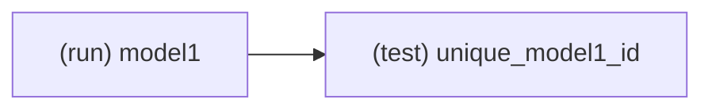

Таким образом, `model1` имеет одного ребёнка, а тест имеет одного родителя. Соответственно, `model1` не имеет родителя, а тест не имеет детей.
Метод `Process` возвращает список графовых путей, что будет рассмотрено в следующем разделе.

---

[<-Назад к оглавлению](#оглавление)

## Обзор класса AJsonProcessor

Ранее мы рассматривали класс `AJsonProcessor` в контексте формата манифеста dbt и структуры `ABaseData`. Теперь рассмотрим сам класс `AJsonProcessor` более подробно.

Диаграмма классов выглядит следующим образом:

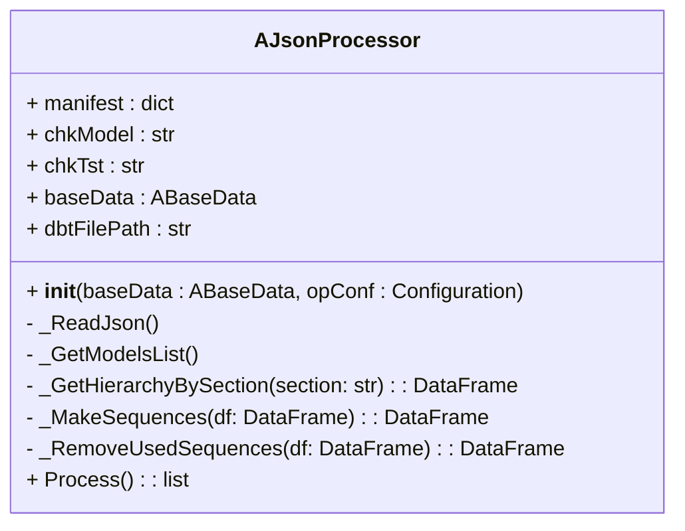

На диаграмме последовательности можно выделить два этапа: "Чтение данных" (Read Part) и "Агрегация и пути" (Aggregates and Paths):

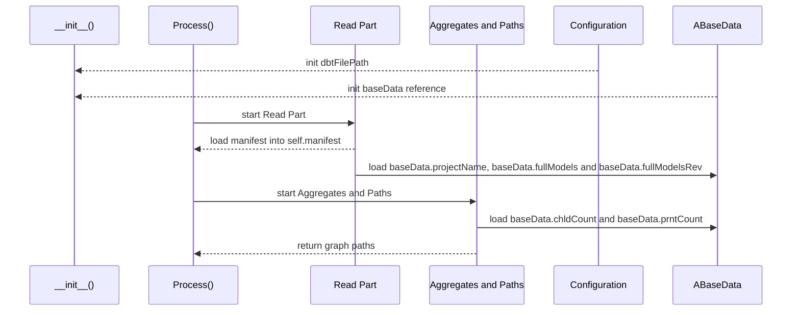

В конструкторе:
* Конфигурация из аргумента `opConf` предоставляет значение `dbtFilePath` — путь к файлу `manifest.json`, указываемый с помощью ключа конфигурации `DBT_MANIFEST_PATH`.
* Объект `ABaseData` передаётся по ссылке через аргумент `baseData`.

Далее вызывается публичный метод `Process()`, который выполняет следующую последовательность операций:
* Запуск этапа "Чтение данных" (Read Part), который загружает указанный файл манифеста dbt в поле класса `manifest`, записывает имя проекта в строковое поле `projectName` и заполняет словари `fullModels` и `fullModelsRev` экземпляра `ABaseData`.
* Запуск этапа "Агрегация и пути" (Aggregates and Paths), который загружает данные и выполняет агрегацию для словарей `chldCount` и `prntCount` экземпляра `ABaseData`, после чего вычисляет графовые пути.

Этап "Чтение данных" (Read Part) выполняет следующую последовательность операций:

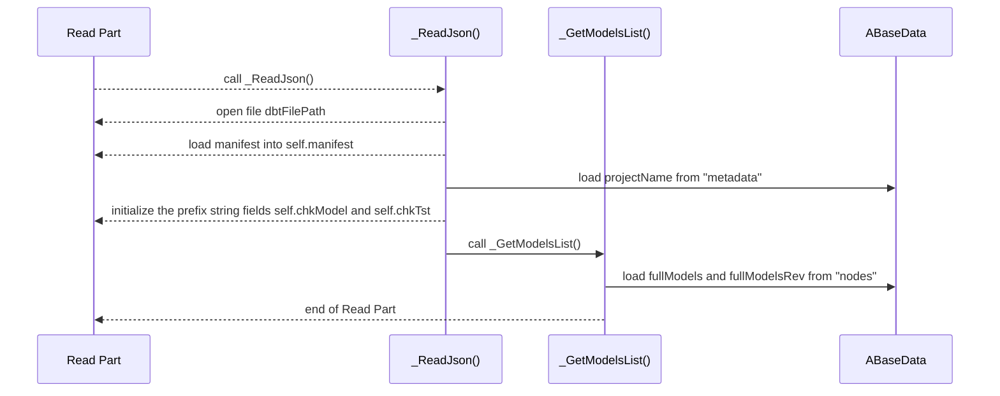

Строковые значения `self.chkModel` и `self.chkTst` инициализируются значением `projectName` и имеют вид `model.{projectName}.` и `test.{projectName}.`. Они используются для фильтрации раздела `nodes` на основе флага `ABaseData.dbtProcessTests`.

Метод `_GetHierarchyBySection` также читает манифест, но не включён в этап "Чтение данных" (Read Part), так как имеет более сложное назначение:

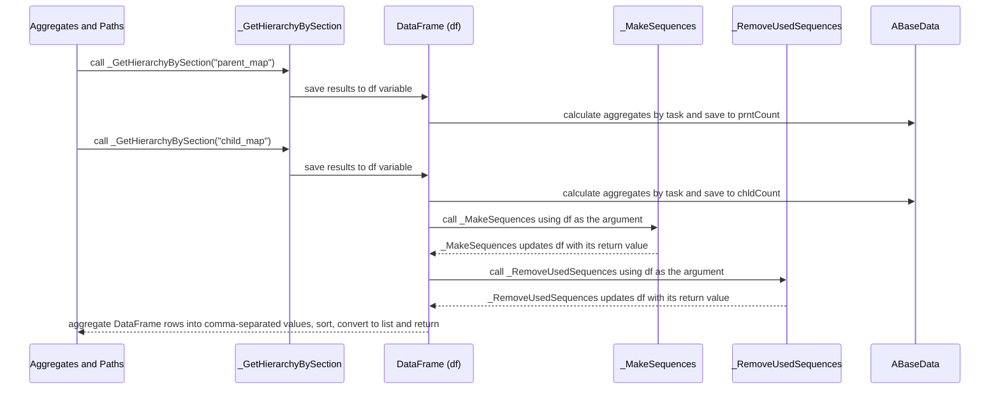

На этом этапе используется одна и та же переменная DataFrame `df`, что позволяет освободить ресурсы после заполнения словарей в `ABaseData` и повторно использовать эту переменную для вычисления графовых путей.

Метод `_GetHierarchyBySection` возвращает DataFrame с двумя столбцами `level_1` и `level_2` и получает имя раздела из файла `manifest.json` в качестве аргумента, что позволяет использовать его для получения данных как о родителях, так и о детях.

Поскольку ресурс может иметь несколько родителей или детей, одному значению в столбце `level_1` (ключу раздела) может соответствовать несколько значений в столбце `level_2`. Если у ключа нет родителя или ребёнка, для `level_2` используется значение `NaN` из библиотеки NumPy.

Предположим, что книги для детей и взрослых отслеживаются двумя отдельными отделами: отделом взрослой литературы и отделом детской литературы.

Мы собираем данные из обоих отделов, а затем вычисляем общую статистику. Поток данных можно представить в виде двух родительских узлов `(run) child_books` и `(run) adult_books` и одного дочернего узла `(run) total_sales_stat`.

Так это представлено на диаграмме:

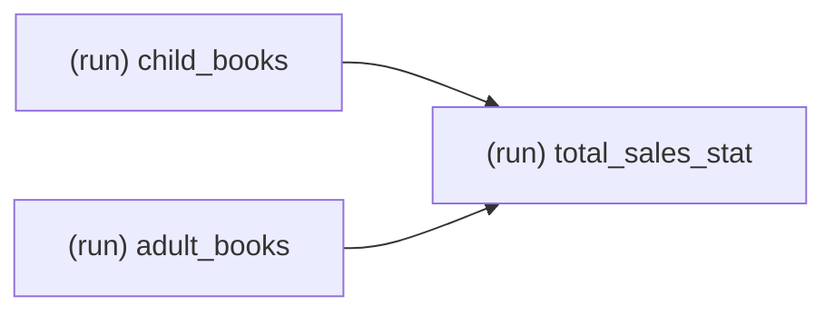

Поскольку узлы `(run) child_books` и `(run) adult_books` являются узлами верхнего уровня и не имеют родителей, в столбце `level_2`, описывающем родителей, для них указано значение `NaN`.

| level_1 | level_2 |
| --- | --- |
| (run) child_books | NaN |
| (run) adult_books | NaN |
| (run) total_sales_stat | (run) child_books |
| (run) total_sales_stat | (run) adult_books |

Фрейм дочерних связей (child map) выглядит аналогично:

| level_1 | level_2 |
| --- | --- |
| (run) child_books | (run) total_sales_stat |
| (run) adult_books | (run) total_sales_stat |
| (run) total_sales_stat | NaN |

Получение агрегированных значений для `prntCount` и `chldCount` при использовании такого типа данных выполняется довольно просто: нам нужно лишь сгруппировать данные по столбцу `level_1` и подсчитать количество значений, отличных от `NaN`.

Вот итоговый результат для `prntCount`:

| key | value |
| --- | --- |
| (run) child_books | 0 |
| (run) adult_books | 0 |
| (run) total_sales_stat | 2 |

А вот итоговый результат для `chldCount`:

| key | value |
| --- | --- |
| (run) child_books | 1 |
| (run) adult_books | 1 |
| (run) total_sales_stat | 0 |

Тот же результат, что и для фрейма дочерних связей, используется для вычисления графовых путей. Метод `_MakeSequences` принимает DataFrame в качестве аргумента и итеративно объединяет результат с исходным фреймом в соответствии с условием `level_N` = `level_1`.

Это иллюстрируется следующим простым примером.

Этот пример взят из простого dbt-проекта, который будет описан в отдельном разделе далее.
В этом проекте книги делятся на литературу для взрослых и для детей, при этом из детской категории выделяются недавно выпущенные книги.
Таким образом, источник `books` имеет два дочерних узла: `child_books` и `adult_books`. Узел `child_books`, в свою очередь, имеет дочерний узел с именем `recent_child_books`:

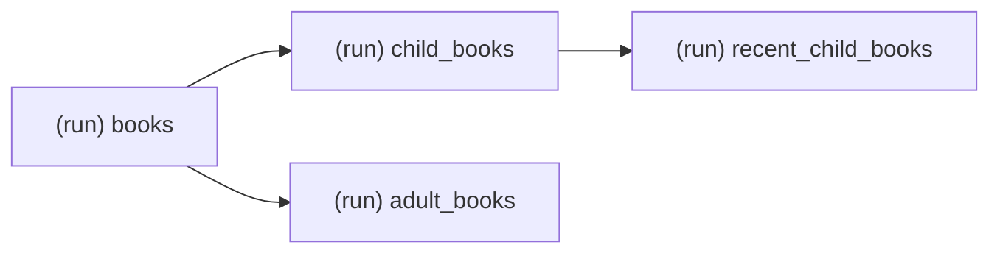

Фрейм дочерних связей для этого случая выглядит так:

| level_1 | level_2 |
| --- | --- |
| (run) books | (run) child_books |
| (run) books | (run) adult_books |
| (run) child_books | (run) recent_child_books |
| (run) adult_books | NaN |
| (run) recent_child_books | NaN |

Теперь нам нужно сопоставить значения в столбце `level_2` со значениями в столбце `level_1` и добавить значения `level_2` для совпавших строк в новый столбец `level_3`, чтобы продолжить построение пути.

В терминах SQL это эквивалентно запросу LEFT JOIN следующего вида:

```SQL
SELECT 
  t.level_1,
  t.level_2,
  p.level_2 AS level_3
FROM df AS t
LEFT JOIN df AS p
  ON p.level_1 = t.level_2
```

В результате получается следующая таблица:

| level_1 | level_2 | level_3 |
| --- | --- | --- |
| (run) books | (run) child_books | (run) recent_child_books |
| (run) books | (run) adult_books | NaN |
| (run) child_books | (run) recent_child_books | NaN |
| (run) adult_books | NaN | NaN |
| (run) recent_child_books | NaN | NaN |

В столбце `level_3` есть хотя бы одно значение, отличное от `NaN`, поэтому выполняется ещё один шаг:

```SQL
SELECT 
  t.level_1,
  t.level_2,
  t.level_3,
  p.level_2 AS level_4
FROM res_table AS t
LEFT JOIN df AS p
  ON p.level_1 = t.level_3
```

В результате получается следующая таблица:

| level_1 | level_2 | level_3 | level_4 |
| --- | --- | --- | --- |
| (run) books | (run) child_books | (run) recent_child_books | NaN |
| (run) books | (run) adult_books | NaN | NaN |
| (run) child_books | (run) recent_child_books | NaN | NaN |
| (run) adult_books | NaN | NaN | NaN |
| (run) recent_child_books | NaN | NaN | NaN |

Все значения в столбце `level_4` равны `NaN`, что останавливает дальнейшие итерации. Метод `_MakeSequences` возвращает этот DataFrame.

Если данные содержат цикл, итерации могут продолжаться бесконечно, поэтому для остановки этого процесса можно использовать счётчик, который отслеживает количество итераций и останавливает процесс, если счётчик превышает исходное количество строк во входном DataFrame. Направленный ациклический граф (DAG) не содержит циклов, но добавление этого защитного механизма всё равно целесообразно.

Метод `_RemoveUsedSequences` удаляет избыточные строки для формирования уникального набора путей в графе.
Рассмотрим подробнее приведённый выше пример:

<table>
  <tr>
    <th>RowNo</th><th>level_1</th><th>level_2</th><th>level_3</th><th>level_4</th>
  </tr>
  <tr>
    <td>1</td><td>(run) books</td><td><b>(run) child_books</b></td><td style="background-color: #E1D5E7;"><b>(run) recent_child_books</b></td><td style="background-color: #E1D5E7;">NaN</td>
  </tr>
  <tr>
    <td>2</td><td>(run) books</td><td style="background-color: #FFE6CC;">(run) adult_books</td><td style="background-color: #FFE6CC;">NaN</td><td>NaN</td>
  </tr>
  <tr>
    <td>3</td><td><b>(run) child_books</b></td><td style="background-color: #E1D5E7;"><b>(run) recent_child_books</b></td><td style="background-color: #E1D5E7;">NaN</td><td>NaN</td>
  </tr>
  <tr>
    <td>4</td><td style="background-color: #FFE6CC;">(run) adult_books</td><td style="background-color: #FFE6CC;">NaN</td><td>NaN</td><td>NaN</td>
  </tr>
  <tr>
    <td>5</td><td style="background-color: #E1D5E7;">(run) recent_child_books</td><td style="background-color: #E1D5E7;">NaN</td><td>NaN</td><td>NaN</td>
  </tr>
</table>

Как видно, у нас есть совпадения в подпоследовательностях длины 2.
Например, строка 5 является избыточной и должна быть удалена.
Для этого мы выполняем самосоединение, сопоставляя последние два столбца (`level_4` и `level_3`) с первыми двумя столбцами (`level_2` и `level_1`), чтобы удалить строки, имеющие совпадения по `level_2` и `level_1`.
Эквивалентный SQL-запрос выглядит так:

```SQL
DELETE FROM res_table
WHERE EXISTS ( 
  SELECT *
  FROM res_table AS chk
  WHERE res_table.level_1 = chk.level_3
  AND res_table.level_2 = chk.level_4
)  
```

После этого запрос строка 5 удаляется, и мы получаем следующий результат:

<table>
  <tr>
    <th>RowNo</th><th>level_1</th><th>level_2</th><th>level_3</th><th>level_4</th>
  </tr>
  <tr>
    <td>1</td><td>(run) books</td><td><b>(run) child_books</b></td><td><b>(run) recent_child_books</b></td><td>NaN</td>
  </tr>
  <tr>
    <td>2</td><td>(run) books</td><td style="background-color: #FFE6CC;">(run) adult_books</td><td style="background-color: #FFE6CC;">NaN</td><td>NaN</td>
  </tr>
  <tr>
    <td>3</td><td><b>(run) child_books</b></td><td><b>(run) recent_child_books</b></td><td>NaN</td><td>NaN</td>
  </tr>
  <tr>
    <td>4</td><td style="background-color: #FFE6CC;">(run) adult_books</td><td style="background-color: #FFE6CC;">NaN</td><td>NaN</td><td>NaN</td>
  </tr>
</table>

Теперь, на следующей итерации, мы выполняем самосоединение, сопоставляя столбцы `level_3` и `level_2` со столбцами `level_2` и `level_1`.
Эквивалентный SQL-запрос выглядит так:

```SQL
DELETE FROM res_table
WHERE EXISTS ( 
  SELECT *
  FROM res_table AS chk
  WHERE res_table.level_1 = chk.level_2
  AND res_table.level_2 = chk.level_3
)  
```

После этого запрос удаляет строки 4 и 3, и мы получаем следующий результат:

<table>
  <tr>
    <th>RowNo</th><th>level_1</th><th>level_2</th><th>level_3</th><th>level_4</th>
  </tr>
  <tr>
    <td>1</td><td>(run) books</td><td>(run) child_books</td><td>(run) recent_child_books</td><td>NaN</td>
  </tr>
  <tr>
    <td>2</td><td>(run) books</td><td>(run) adult_books</td><td>NaN</td><td>NaN</td>
  </tr>
</table>

Это последний шаг, поскольку следующая итерация, которая соединяла бы `level_2` и `level_1` с `level_2` и `level_1`, не имеет смысла.
Метод `_RemoveUsedSequences` возвращает DataFrame, содержащий эти 2 строки.

Две оставшиеся строки представляют два возможных пути в графе. Нам остаётся лишь объединить их столбцы в значения, разделённые запятыми, исключив значения `NaN`. Именно это и делает остальная часть метода `Process`.
В итоге после завершения метода `Process` мы получаем список из двух строк, который является возвращаемым значением метода:

```Python
[
  "(run) books,(run) child_books,(run) recent_child_books",
  "(run) books,(run) adult_books" 
]
```

Использование этого списка в классе `AGraphPathProcessor` будет рассмотрено в следующем разделе.

---

[<-Назад к оглавлению](#оглавление)

## Обзор класса AGraphPathProcessor

Ранее мы рассматривали класс `AJsonProcessor`, который получает файл dbt `manifest.json` и преобразует его в структуру `ABaseData` и список графовых путей.
Следующим этапом в конвейере преобразования данных является класс `AGraphPathProcessor`, который определяет группы и их участников в графовом пути и выводит результаты в структуру `AData`:

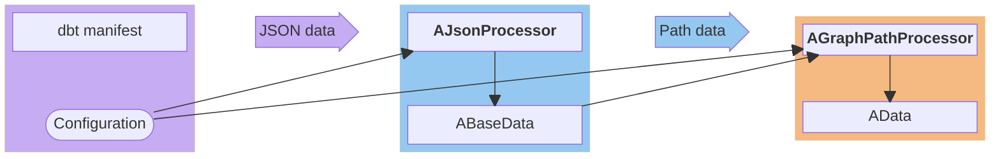

Для выполнения этой задачи класс имеет метод `ProcessPath`, который принимает единственный путь в качестве входного параметра.
Сам класс использует только два словаря из структуры `ABaseData`: `chldCount` и `prntCount`.
Результат состоит из трёх контейнеров, хранящихся в структуре `AData`: `taskMap`, `groupsData` и `taskSequence`.

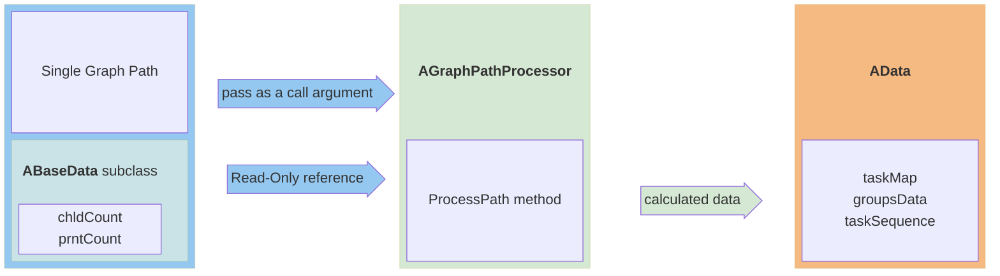

Рассмотрим общую задачу определения групп на основе пути.


Предположим, что у нас есть тот же пример, что и ранее:


В этом случае группа может быть определена как последовательность задач, выполняемых без ветвления, а именно задачи `(run) child_books` и `(run) recent_child_books`, которые могут быть объединены в группу и названы по имени первой задачи в цепочке выполнения:

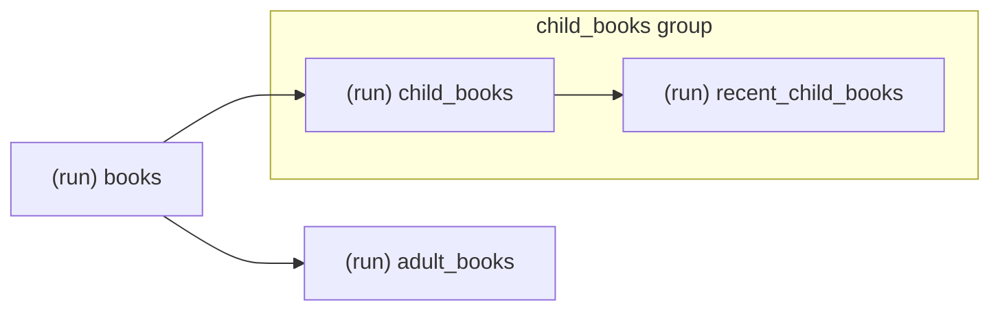

Действительно, во многих примерах Airflow группа определяется как последовательность задач, выполняемых без ветвления, то есть объединённых общей логической целью:

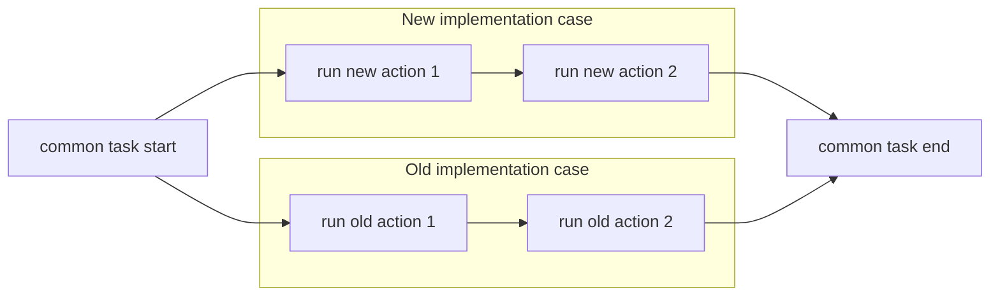

В данном проекте используется именно такая логика выбора подгрупп, а именно последовательность задач, выполняемых без ветвления.

Как можно определить группы на заданном графовом пути? Для этого нам нужно просто добавить количество родителей слева от каждой задачи и количество детей справа от каждой задачи на нашу диаграмму:

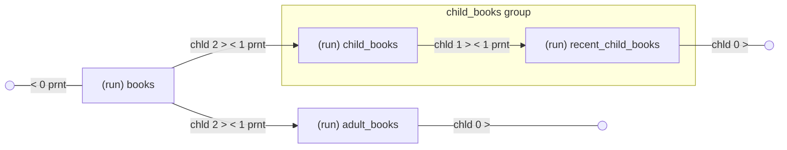

Обозначение |"chld 2 > < 1 prnt"| означает, что узел слева от соединительной линии имеет двух детей, а узел справа имеет одного родителя.

Эта диаграмма наглядно показывает условие, при котором мы объединяем задачи в группу: задача слева имеет только одного ребёнка, а задача справа имеет только одного родителя.

Фактически этот DAG содержит два пути. Поэтому метод `ProcessPath` будет сначала вызван для этого пути:

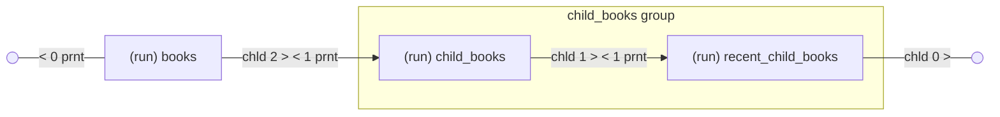

Затем для этого пути:

```mermaid
flowchart LR
    IF@{ shape: sm-circ, label: "" }
    E2@{ shape: sm-circ, label: "" } 
    A["(run) books"]
    C["(run) adult_books"]
    A-->|" chld 2 >  < 1 prnt "| C
    IF--- |" < 0 prnt "| A
    C---|" chld 0 > "| E2
```

В пределах каждого пути каждая задача формально имеет только одного ребёнка и одного родителя.
Но мы используем количество родителей и детей из всего DAG, что позволяет нам определять реальные цепочки с одним родительским узлом и одним дочерним узлом.

Таким образом, первый путь содержит подцепочку с группой, причём такая подцепочка может существовать только в пределах одного пути. Второй путь, однако, не содержит подцепочки с группой.

В приведённом выше примере группа заканчивается в конце пути.
Добавим к этому примеру ещё две задачи: отфильтровать недавно выпущенные детские книги, чтобы определить уникальных авторов, а затем найти тех же авторов среди детских и взрослых книг.
Диаграмма будет выглядеть следующим образом:

```mermaid
flowchart LR
    IF@{ shape: sm-circ, label: "" }
    E1@{ shape: sm-circ, label: "" }
    A["(run) books"]
    C["(run) adult_books"]
    subgraph child_books group
        B["(run) child_books"]
        D["(run) recent_child_books"]
        I["(run) recent_child_author"]
    end
    F["(run) same_author"]
    A-->|" chld 2 >  < 1 prnt "| B
    A-->|" chld 2 >  < 1 prnt "| C
    B--> |"chld 1 >  < 1 prnt"| D
    IF--- |" < 0 prnt "| A
    D--> |"chld 1 >  < 1 prnt"| I
    I--- |" chld 1 >  < 2 prnt "| F
    C---|" chld 1 >  < 2 prnt "| F
    F--- |" chld 0 > "| E1
```

Как видно, начало группы можно определить как первую задачу с одним ребёнком и следующую за ней задачу с одним родителем. Конец группы определяется как последняя задача, после которой это условие становится ложным или путь заканчивается.

Такой алгоритм может быть реализован в виде конечной машины состояний с двумя состояниями. Переход в состояние «идентифицированная группа» происходит, когда указанное условие истинно, а переход в противоположное состояние — когда истинно обратное условие.

```mermaid
stateDiagram
  direction LR
    [*] --> NoActiveGroup : Initial state<br/>(No active group)
    NoActiveGroup: No group identified 
    ActiveGroup: Has active group 

    NoActiveGroup --> NoActiveGroup : Condition not met 

    NoActiveGroup --> ActiveGroup: 1:1
    ActiveGroup --> NoActiveGroup : NOT 1:1

    ActiveGroup --> ActiveGroup : Condition not met   

    style NoActiveGroup fill:#a5b2f0;
    style ActiveGroup fill:#95C8F0;  
```

Для реализации этой машины состояний нам нужны текущая задача и последующая задача. Точнее говоря, нам достаточно знать только количество детей у текущей задачи. Если у неё нет детей, то рассматривать последующую задачу не имеет смысла: мы можем просто принять количество родителей последующей задачи равным нулю. Если последующая задача существует, то мы берём её количество родителей.

Имя текущей группы, `curGroup`, служит переменной, которая хранит состояние машины состояний между итерациями. Если текущее состояние — «группа не определена», то переменная равна `None`; в противном случае ей присваивается имя группы. Имя группы может быть сформировано из имени задачи путём удаления префикса операции, такого как `(test) ` или `(run) `.

Переменная `curGroup` определяется перед циклом по элементам пути, чтобы сохранять состояние между итерациями.

Поскольку переход «группа не определена» -> «есть активная группа» имеет смысл только при отсутствии текущей группы, то есть когда `curGroup` равно `None`, это условие должно быть добавлено к условию перехода. Аналогично, обратное условие на `curGroup` должно быть добавлено к условию обратного перехода «есть активная группа» -> «группа не определена».

Чтобы задача, которая определяет группу на основе данных последующей задачи, была включена в группу, переключение состояния должно происходить после определения, но до выбора пары «группа/задача». А чтобы вторая, последующая задача была включена в группу, если дальнейшей группы нет, переключение в противоположное состояние должно происходить после выбора пары «группа/задача».

В результате для одной итерации получается следующая диаграмма:

```mermaid
flowchart LR
    S@{ shape: circle, label: "Start" }

    subgraph IF_B["if-b"]
        direction TB
        IF_B_T{"check<br/>curGroup is None<br/>and one child<br/>and the following task<br/>with one parent"}
        CG_S["set curGroup"]
    end

    subgraph SEL["action"]
        direction TB
        SEL_T["select group/task"]
        OUT["out data"]
    end

    subgraph IF_A["if-a"]
        direction TB
        IF_A_T{"check<br/>NOT curGroup is None<br/>and one child<br/>and the following task<br/>with one parent"}
        CG_R["reset curGroup"]
    end

    E@{ shape: circle, label: "End" }

    S --> IF_B
    IF_B --> SEL
    SEL --> IF_A
    IF_A --> E
    SEL_T --> OUT
    IF_B_T --> |  true | CG_S
    IF_A_T --> |  true | CG_R

style IF_A fill:#95C8F0;
style IF_B fill:#a5b2f0;
style SEL fill:#d5e8d4;
style S fill:#e0a567;
style E fill:#e0a567;
```

Здесь мы обозначаем "if-b" как проверку условия перехода "проверка перед (`b` = `before`) действием", то есть "группа не определена" -> "есть активная группа".
Аналогично, мы обозначаем "if-a" как проверку условия перехода "проверка после (`a` = `after`) действия", то есть "есть активная группа" -> "группа не определена".


Рассмотрим, как алгоритм работает на различных путях.

Пример 1:

```mermaid
flowchart LR
    IF@{ shape: sm-circ, label: "" }
    E1@{ shape: sm-circ, label: "" } 
    A["(run) books"]
    subgraph child_books
        B["(run) child_books"]
        D["(run) recent_child_books"]
    end 
    A-->|" chld 2 >  < 1 prnt "| B
    B--> |"chld 1 >  < 1 prnt"| D
   IF--- |" < 0 prnt "| A
   D--- |" chld 0 > "| E1
```

Последовательность работы алгоритма может быть представлена следующей таблицей с опущенным оператором (`(run)`):

|Step| task | chld | prnt | curGroup | if-b | curGroup | action | if-a | curGroup | 
|---| --- | --- | --- | --- | --- | --- | --- | --- | --- |
|1| books | 2 |  1 | None |false| None| select None/books| false | None |
|2| child_books | 1 | 1 | None | true | child_books | select child_books/child_books | false |  child_books |
|3| recent_child_books | 0 | 0 | child_books | false | child_books | select child_books/recent_child_books | true |  None |

Столбцы таблицы имеют следующее значение:
- Step — номер итерации
- task — текущая задача в пути
- chld — количество детей у текущей задачи
- prnt — количество родителей у последующей задачи, или ноль, если последующей задачи нет
- curGroup — текущая группа с предыдущего шага
- if-b — выполнено ли условие перехода "группа не определена" -> "есть активная группа"
- curGroup — текущая группа после проверки `if-b`
- action — выбор группы и задачи, имеет вид `group/task`
- if-a — выполнено ли условие перехода "есть активная группа" -> "группа не определена"
- curGroup — текущая группа после проверки `if-a`

Примечание: имя столбца `curGroup` повторяется, чтобы таблица помещалась по ширине.

Пример 2:

```mermaid
flowchart LR
    IF@{ shape: sm-circ, label: "" }
    E1@{ shape: sm-circ, label: "" }
    A["(run) books"]

    subgraph child_books
        B["(run) child_books"]
        D["(run) recent_child_books"]
        I["(run) recent_child_author"]
    end
    F["(run) same_author"]
    A-->|" chld 2 >  < 1 prnt "| B
    B--> |"chld 1 >  < 1 prnt"| D
    IF--- |" < 0 prnt "| A
    D--> |"chld 1 >  < 1 prnt"| I
    I--- |" chld 1 >  < 2 prnt "| F
    F--- |" chld 0 > "| E1
```

|Step| task | chld | prnt | curGroup | if-b | curGroup | action | if-a | curGroup | 
|---| --- | --- | --- | --- | --- | --- | --- | --- | --- |
|1| books | 2 |  1 | None |false| None| select None/books| false | None |
|2| child_books | 1 | 1 | None | true | child_books | select child_books/child_books | false | child_books |
|3| recent_child_books | 1 | 1 | child_books | false | child_books | select child_books/recent_child_books | false | child_books |
|4| recent_child_author | 1 | 2 | child_books | false | child_books | select child_books/recent_child_author | true | None |
|5| same_author | 0 | 0 | None | false | None | select None/same_author | false |  None |

Алгоритм формирует последовательность `группа/задача`. Для Примера 1 результат имеет вид:

|output| 
|---|
| None/(run) books|
| child_books/(run) child_books |
| child_books/(run) recent_child_books |

В следующем разделе мы рассмотрим класс `AGraphPathProcessor` в деталях.

---

[<-Назад к оглавлению](#оглавление)

## Подробный обзор класса AGraphPathProcessor

Рассмотрим диаграмму классов:

```mermaid
classDiagram
    class AGraphPathProcessor {
        + groupProc : ATaskGroupProcessor
        + taskSequence : dict
        + taskMap : dict
        + chldCount : dict
        + prntCount : dict
        + __init__(taskMap, groupsData, taskSequence, chldCount, prntCount, opConf)
        # _AddSequence(task1name, task2name)
        # _ProcessTasksList(list)
        + ProcessPath(seqStr)
    }
```

Мы видим, что класс имеет четыре метода (включая конструктор) и пять полей.

Поля можно логически разделить по назначению:

 - Входные данные только для чтения
   - `chldCount` - словарь количества детей задач
   - `prntCount` - словарь количества родителей задач
 - Выходные данные
   - `taskMap` - словарь задач
   - `taskSequence` - словарь последовательностей задач
 - Вспомогательные компоненты
   - `groupProc` - экземпляр вспомогательного класса для обработки выбора групп и задач

Однако конструктор класса принимает несколько иные параметры:
 - Входные данные только для чтения
   - те же словари `chldCount` и `prntCount`
   - конфигурация `opConf`
 - Выходные данные
   - те же словари `taskMap` и `taskSequence`
   - `groupsData` - структура для хранения данных групп и задач

Диаграмма ниже иллюстрирует, как параметры передаются в конструктор и затем распределяются по полям:

```mermaid
block-beta
    columns 13
    %% === INPUT DATA ===
    block:In_data:4
    columns 12
        IN_T["<b>Input  data</b>"]:12
        space:3 ADS["<b>AData</b> data structure"]:9
            space:3 ADM[/"<b>AData</b> members"/]:9
                space:6 ADM_TM["taskMap"]:6
                space:6 ADM_GD["groupsData"]:6
                space:6 ADM_TS["taskSequence"]:6
            space:3 ADB[/"<b>ABaseData</b> subclass"/]:9 
                space:6 ADM_CC["chldCount"]:6
                space:6 ADM_PC["prntCount"]:6
        space:12
        space:3 CNF(["<b>Configuration</b>"]):6 space:3
    end
    %% === SPACE ===
    space:1
    %% === INIT ===
    block:init1:4
        columns 12
        INIT_T[" <b>AGraphPathProcessor</b> "]:12
        space:3 INI_C[" <b><i>__init__</i></b> "]:9
            space:6 INI_TM["taskMap"]:6
            space:6 INI_GD["groupsData"]:6
            space:6 INI_TS["taskSequence"]:6
            space:6 INI_CC["chldCount"]:6
            space:6 INI_PC["prntCount"]:6
            space:6 INI_CNF["opConf"]:6
    end

    %% === SPACE ===
    space:1
    %% === VARS ===
    block:vars:4
        columns 12
        GPV_T[" <b>AGraphPathProcessor</b> "]:12
        space:3 GPV_C[" <b><i>fields</i> </b>"]:9
            space:6 GPV_TM["self.taskMap"]:6
            space:6 GPV_GP["self.groupProc"]:6
            space:6 GPV_TS["self.taskSequence"]:6
            space:6 GPV_CC["self.chldCount"]:6
            space:6 GPV_PC["self.prntCount"]:6
    end

    %% links input to init
    ADM_TM --> INI_TM
    ADM_GD --> INI_GD
    ADM_TS --> INI_TS
    ADM_CC --> INI_CC
    ADM_PC --> INI_PC
    CNF --> INI_CNF

    %% links init to fields
    INI_TM --> GPV_TM
    INI_TM -.-> GPV_GP
    INI_GD -.-> GPV_GP
    INI_CNF -.-> GPV_GP
    INI_TS --> GPV_TS
    INI_CC --> GPV_CC
    INI_PC --> GPV_PC
%% styles
style In_data fill:#e3daeb
style init1 stroke:#094782,fill:#95C8F0
style vars fill:#f5b982;

style ADM fill:#d5e8d4,stroke:#82b366,stroke-width:2px
style ADM_TM fill:#e6f5e6,stroke:#a6d19a,stroke-width:2px
style ADM_GD fill:#e6f5e6,stroke:#a6d19a,stroke-width:2px
style ADM_TS fill:#e6f5e6,stroke:#a6d19a,stroke-width:2px
style INI_TM fill:#e6f5e6,stroke:#a6d19a,stroke-width:2px
style INI_GD fill:#e6f5e6,stroke:#a6d19a,stroke-width:2px
style INI_TS fill:#e6f5e6,stroke:#a6d19a,stroke-width:2px


style GPV_TM fill:#e6f5e6,stroke:#a6d19a,stroke-width:2px
style GPV_TS fill:#e6f5e6,stroke:#a6d19a,stroke-width:2px

style ADB fill:#e1d5e7,stroke:#9673a6,stroke-width:2px
style ADM_CC fill:#f3e5f5,stroke:#ba68c8,stroke-width:2px
style ADM_PC fill:#f3e5f5,stroke:#ba68c8,stroke-width:2px
style INI_CC fill:#f3e5f5,stroke:#ba68c8,stroke-width:2px
style INI_PC fill:#f3e5f5,stroke:#ba68c8,stroke-width:2px


style GPV_CC fill:#f3e5f5,stroke:#ba68c8,stroke-width:2px
style GPV_PC fill:#f3e5f5,stroke:#ba68c8,stroke-width:2px

style CNF fill:#fcb190,stroke:#f0733c,stroke-width:2px
style INI_CNF fill:#fcb190,stroke:#f0733c,stroke-width:2px

style ADS stroke:#094782,fill:#58f21b
style INI_C stroke:#094782,fill:#58f21b
style GPV_C stroke:#094782,fill:#58f21b

classDef n0Fill fill:none,stroke-width:0px;
class IN_T,INIT_T,GPV_T n0Fill

style GPV_GP fill:#faa5df;
```

Как видно, `taskMap`, `groupsData` и `opConf` передаются в конструктор вспомогательного класса и не используются напрямую в классе `AGraphPathProcessor`, за исключением `taskMap`.

Возникает естественный вопрос: зачем передавать эти параметры отдельно в конструктор, если можно просто передать ссылку на `AData`, который уже содержит всё?

На самом деле, это сделано подобно принципу наименьших привилегий: мы передаём только те параметры, которые необходимы для функционирования класса. Это делает более понятным, какие поля использует класс. Конфигурация передаётся как ссылка на словарь, поскольку большая её часть используется во вспомогательном классе и связанных классах.

Последовательность вызовов методов класса можно проиллюстрировать следующей диаграммой:

```mermaid
sequenceDiagram
    participant PP as ProcessPath()

    participant PTL as _ProcessTasksList()
    participant IF_B as _ProcessTasksList()<br/>if-b check
    box Action
        participant ATG as ATaskGroupProcessor<br/>AddTaskToGroup()
        participant ADS as _AddSequence()
    end
    participant IF_A as _ProcessTasksList()<br/>if-a check

    PP->>PP: Convert path to list of tuples
    PP->>PTL: Call _ProcessTasksList() <br/>pass a list of tuples

    loop Iterate over tuples 
        PTL->>IF_B: Perform an if-b check <br/> set curGroup if possible
        IF_B->>ATG: Save a group-task pair 
        ATG->>ADS: Save the task sequence
        ADS->>IF_A: Perform an if-a check <br/> reset curGroup if possible
    end

    IF_A->>PTL: end when iterations are complete
    PTL->>PP: end _ProcessTasksList()
```

При вызове метода `ProcessPath` с путём в качестве аргумента выполняется следующая последовательность действий:

1. В методе `ProcessPath` путь, представляющий собой строку из элементов `taskName`, разделённых запятыми, преобразуется в список кортежей, где
- первый элемент кортежа — количество родителей
- второй элемент кортежа — имя задачи
- третий элемент кортежа — количество детей

2. Метод `_ProcessTasksList` вызывается со списком кортежей в качестве аргумента

3. В методе `_ProcessTasksList` выполняется цикл по списку, в ходе которого

- Проверяется условие `if-b` для машины состояний

- Выполняется действие, которое состоит из

    - Вызова метода `AddTaskToGroup` вспомогательного класса для сохранения пары «группа/задача»
    - Вызова метода `_AddSequence` для сохранения последовательности

- Проверяется условие `if-a` для машины состояний

- Переход к следующей итерации

4. Возврат из метода `_ProcessTasksList`

Примечание: возникает ещё один естественный вопрос: почему бы не реализовать преобразование в кортежи в классе `AJsonProcessor`? Тем более что в структуре `ABaseData` можно оставить только имя проекта да флаг обработки тестов.
Да, это действительно позволило бы значительно уменьшить размер структуры. Однако для целей отладки и модульного тестирования хранение этой информации после разбора более удобно для выявления потенциальных ошибок, поскольку все этапы и последовательность промежуточного преобразования данных остаются доступными.

В следующем разделе мы рассмотрим вызовы действий(`actions`), поскольку они включают ещё одно преобразование данных.


---

[<-Назад к оглавлению](#оглавление)

## Финальное преобразование данных

Ранее мы упоминали три поля структуры `AData`, в которые в конечном итоге преобразуются данные: `taskMap`, `taskSequence` и `groupsData`.
Рассмотрим их подробнее:

```mermaid
block-beta
    columns 11
    %% === SEQUENCE ===
    block:seq_data:3
    columns 1
    SEQ_N["<b>taskSequence</b>"]

        block:seq_tuple
          columns 2
          SEQ_K(["Key"])  SEQ_T["Tuple"]
          space
          SEQ_T1[/"refATask1"/] space SEQ_T2[/"refATask2"/]
        end
    end
    %% === SPACE === 
    space:1

    %% === TASKS ===
    block:tasks:3
        columns 1
        TSK_T["<b>taskMap</b>"]
        space
        TSK_K(["Key"]) TSK_RF[/"ATask"/]
    end

    %% === SPACE === 
    space:1

    %% === GROUPS ===
    block:groups:4
        columns 1
        GRP_T[" <b>groupsData</b> "] space

        GRP_NM["taskGroupNameMap"]
        GRP_NM_K(["key"])
        GRP_NM_V[/"taskName"/]
        space
        GRP_RM["taskGroupRefMap"]
        GRP_RMK(["key"])
        GRP_RMV[/"refATask list"/]

    end
%% links
SEQ_T1 --> TSK_RF
SEQ_T2 --> TSK_RF
GRP_RMV --> TSK_RF
GRP_NM_V --> TSK_K
%% styles
style seq_data fill:#c6acf2;
style tasks fill:#95C8F0;
style groups fill:#f5b982;
style SEQ_N stroke:#094782,fill:#58f21b
style TSK_T stroke:#094782,fill:#58f21b
style GRP_T stroke:#094782,fill:#58f21b

style GRP_NM fill:#faa5df;
style GRP_RM fill:#faa5df;

style SEQ_T1 fill:#e6f5e6,stroke:#a6d19a,stroke-width:2px
style SEQ_T2 fill:#e6f5e6,stroke:#a6d19a,stroke-width:2px
style TSK_RF fill:#e6f5e6,stroke:#a6d19a,stroke-width:2px
style GRP_RMV fill:#e6f5e6,stroke:#a6d19a,stroke-width:2px

style TSK_K fill:#f3e5f5,stroke:#ba68c8,stroke-width:2px
style GRP_NM_V fill:#f3e5f5,stroke:#ba68c8,stroke-width:2px
```

Информация о задачах хранится в `taskMap` — словаре, где ключом является `taskName`, а значением — экземпляр класса `ATask`. Этот класс будет рассмотрен далее.
По `taskName` можно найти соответствующий ему экземпляр.
На эти экземпляры ссылаются элементы двух других словарей: `taskSequence` и `taskGroupRefMap`.

Словарь `taskSequence` имеет пару имён задач в качестве ключа, представленного в виде "|task1name|>>|task2name|", и кортеж из двух ссылок на экземпляры класса `ATask`: `refATask1` и `refATask2`, в качестве значения.
Словарь `taskSequence` затем используется для создания зависимостей между операторами Airflow, поскольку эти зависимости создаются с помощью перегруженной операции битового сдвига.

Второй словарь, `taskGroupRefMap`, имеет имя группы в качестве ключа и список ссылок на экземпляры класса `ATask` в качестве значения. Он предназначен для указания групп задач для набора операторов.

Помимо `taskGroupRefMap`, структура `groupsData` содержит ещё один словарь — `taskGroupNameMap`. Этот словарь содержит имена задач, а не ссылки на экземпляры `ATask`, то есть фактически ссылается на ключи `taskMap`. Он предназначен для целей отладки и поиска.

Чтобы описать эту структуру в терминах сущность-связь, нам необходимо ввести дополнительную сущность `taskGroup` для имени группы, которая не существует в реальных классах, но нужна для разрешения связей для `taskGroupNameMap` и `taskGroupRefMap`:

```mermaid
erDiagram
    direction RL
%% === TASK SEQUENCE ===
    taskSequence {
        string sequence_key PK "Format: |name1|>>|name2|"
        object task1_ref FK "Parent ATask object reference"
        object task2_ref FK "Dependent ATask object reference"
    }

    %% === TASK OBJECT ===
    taskMap {
    string name  PK "Task name (Primary identifier)"
        object task_ref UK  "ATask object reference (Value in taskMap)"
    }


    %% === TASK GROUP ===
    taskGroup {
        string group_name PK "Task Group name (Primary identifier)"
    }

    %% === GROUP TO TASK NAME MAPPING ===
    taskGroupNameMap {
        string group_name PK,FK "References taskGroup"
        string name PK,FK "References task (task name)"
    }

    %% === GROUP TO TASK OBJECT REF MAPPING ===
    taskGroupRefMap {
        string group_name PK,FK "References taskGroup"
        object task_ref PK,FK "References ATask object reference"
    }

    %% === RELATIONSHIPS ===
    %% RULE: Optional Sequence (Zero or More)
    %% A task might not have dependencies, so it can exist without being in any sequence.
    taskMap ||--o{ taskSequence : "is parent in (0 or more)"
    taskMap ||--o{ taskSequence : "is dependent in (0 or more)"

    %% RULE: EXACTLY ONE Group Membership for Tasks
    %% Every task MUST belong to exactly one default group (not multiple).
    taskMap ||--|| taskGroupNameMap : "MUST 1:1 taskNames"
    taskMap ||--|| taskGroupRefMap : "MUST 1:1 taskRefs"

    %% RULE: Mandatory Task Membership for Groups (One or More)
    %% A TaskGroup MUST contain at least one task (multiple tasks can belong to one group).
    taskGroup ||--|{ taskGroupNameMap : "has one or more taskNames"
    taskGroup ||--|{ taskGroupRefMap : "has one or more taskRefs"
```

Как видно, количество строк в таблицах `taskGroupRefMap` и `taskGroupNameMap` будет соответствовать количеству строк в `taskMap` исходя из отношения 1:1, но на самом деле это будет общее количество записей по всем группам в структуре Python. Должна быть как минимум одна группа, поскольку задача всегда должна принадлежать группе. Задача не может принадлежать двум или более группам, но несколько задач могут принадлежать одной группе. Если есть только одна задача, в `taskSequence` не будет ни одной записи, поскольку связь "родитель-ребёнок" требует наличия как минимум двух задач.

Рассмотрим, как выглядит эта структура на практическом примере простого dbt-проекта с опущенным префиксом `(run)` в элементах `taskName`:

```mermaid
block-beta
    columns 14
    %% === SEQUENCE ===
    block:seq_data:4
    columns 1
    SEQ_N["<b>taskSequence</b>"]

    block:seq_tuple1
        columns 2
        SEQ_K1(["|books| &gt;&gt; |child_books|"])  SEQ_T1["Tuple"]
        space
        SEQ_T1_1[/"refATask1"/] space SEQ_T2_1[/"refATask2"/]
    end
    block:seq_tuple2
        columns 2
        SEQ_K2(["|child_books|&gt;&gt;|recent_child_books|"])  SEQ_T2["Tuple"]
        space
        SEQ_T1_2[/"refATask2"/] space SEQ_T2_2[/"refATask3"/]
    end  
    block:seq_tuple3
        columns 2
        SEQ_K3(["|books|&gt;&gt;|adult_books|"])  SEQ_T3["Tuple"]
        space
        SEQ_T1_3[/"refATask1"/] space SEQ_T2_3[/"refATask4"/]
        end
    end
    %% === SPACE === 
    space:1
    
    %% === TASKS ===
    block:tasks:2
        columns 1
        TSK_T["<b>taskMap</b>"]
        space
        TSK_K1(["books"]) TSK_RF1[/"ATask1"/]
        TSK_K2(["child_books"]) TSK_RF2[/"ATask2"/]
        TSK_K3(["recent_child_books"]) TSK_RF3[/"ATask3"/]
        TSK_K4(["adult_books"]) TSK_RF4[/"ATask4"/]
    end
    
    %% === SPACE === 
    space:1
    
    %% === GROUPS ===
    block:groups:2
        columns 1
        GRP_T[" <b>groupsData</b> "] 
    space
        GRP_NM["taskGroupNameMap"]
        GRP_NM_K1(["None"])
        GRP_NM_V1_1[/"books"/]  
        GRP_NM_V2_1[/"adult_books"/]
    space
        GRP_NM_K2(["child_books"])
        GRP_NM_V1_2[/"child_books"/]  
        GRP_NM_V2_2[/"recent_child_books"/]  
    space
        GRP_RM["taskGroupRefMap"]
        GRP_RMK1(["None"])
        GRP_RMV1_1[/"refATask1"/]
        GRP_RMV1_2[/"refATask4"/]
    space
        GRP_RMK2(["child_books"]) 
        GRP_RMV2_1[/"refATask2"/]
        GRP_RMV2_2[/"refATask3"/]
    end

%% ---- links ------
SEQ_T1_1 --> TSK_RF1
SEQ_T2_1 --> TSK_RF2
SEQ_T1_2  --> TSK_RF2
SEQ_T2_2 --> TSK_RF3
SEQ_T1_3 --> TSK_RF1
SEQ_T2_3 --> TSK_RF4
GRP_RMV1_1 --> TSK_RF1
GRP_RMV1_2 --> TSK_RF4
GRP_RMV2_1 --> TSK_RF2
GRP_RMV2_2 --> TSK_RF3
GRP_NM_V1_1 --> TSK_K1
GRP_NM_V2_1 --> TSK_K4
GRP_NM_V1_2 --> TSK_K2
GRP_NM_V2_2 --> TSK_K3

%% ---- styles ------
style seq_data fill:#c6acf2;
style tasks fill:#95C8F0;
style groups fill:#f5b982;
style SEQ_N stroke:#094782,fill:#58f21b
style TSK_T stroke:#094782,fill:#58f21b
style GRP_T stroke:#094782,fill:#58f21b

style GRP_NM fill:#faa5df;
style GRP_RM fill:#faa5df;

%% style task 1
style TSK_K1 fill:#f3e5f5,stroke:#ba68c8,stroke-width:2px
style GRP_NM_V1_1 fill:#f3e5f5,stroke:#ba68c8,stroke-width:2px

style SEQ_T1_1 fill:#e6f5e6,stroke:#a6d19a,stroke-width:2px
style SEQ_T1_3 fill:#e6f5e6,stroke:#a6d19a,stroke-width:2px
style TSK_RF1 fill:#e6f5e6,stroke:#a6d19a,stroke-width:2px
style GRP_RMV1_1 fill:#e6f5e6,stroke:#a6d19a,stroke-width:2px

%% style task 2
style TSK_K2 fill:#f3e5f5,stroke:#ba68c8,stroke-width:2px,stroke-dasharray:5 5
style GRP_NM_V1_2 fill:#f3e5f5,stroke:#ba68c8,stroke-width:2px,stroke-dasharray:5 5

style TSK_RF2 fill:#e6f5e6,stroke:#387d24,stroke-width:2px,stroke-dasharray:5 5
style SEQ_T2_1 fill:#e6f5e6,stroke:#387d24,stroke-width:2px,stroke-dasharray:5 5
style GRP_RMV2_1 fill:#e6f5e6,stroke:#387d24,stroke-width:2px,stroke-dasharray:5 5
style SEQ_T1_2 fill:#e6f5e6,stroke:#387d24,stroke-width:2px,stroke-dasharray:5 5

%% style task 3
style TSK_K3 fill:#f3e5f5,stroke:#ba68c8,stroke-width:2px,stroke-dasharray:2 2
style GRP_NM_V2_2 fill:#f3e5f5,stroke:#ba68c8,stroke-width:2px,stroke-dasharray:2 2

style TSK_RF3 fill:#e6f5e6,stroke:#387d24,stroke-width:2px,stroke-dasharray:2 2
style GRP_RMV2_2 fill:#e6f5e6,stroke:#387d24,stroke-width:2px,stroke-dasharray:2 2
style SEQ_T2_2 fill:#e6f5e6,stroke:#387d24,stroke-width:2px,stroke-dasharray:2 2

%% style task 4
style TSK_K4 fill:#f3e5f5,stroke:#ba68c8,stroke-width:4px
style GRP_NM_V2_1 fill:#f3e5f5,stroke:#ba68c8,stroke-width:4px

style TSK_RF4 fill:#e6f5e6,stroke:#387d24,stroke-width:4px
style GRP_RMV1_2 fill:#e6f5e6,stroke:#387d24,stroke-width:4px
style SEQ_T2_3 fill:#e6f5e6,stroke:#387d24,stroke-width:4px

%% group names
style GRP_NM_K1 fill:#9fcad4;
style GRP_NM_K2 fill:#9fcad4;
style GRP_RMK1 fill:#9fcad4;
style GRP_RMK2 fill:#9fcad4;

%% sequences keys
style SEQ_K1 fill:#eaf268;
style SEQ_K2 fill:#eaf268;
style SEQ_K3 fill:#eaf268;
```

Словарь `taskMap` содержит четыре элемента, каждый из которых состоит из ключа `taskName` и значения — экземпляра класса `ATask`.
На эти экземпляры `ATask` ссылаются значения в словарях `taskGroupRefMap` и `taskSequence`, а словарь `taskGroupNameMap` ссылается на ключи `taskMap`. В общей сложности `taskGroupRefMap` содержит четыре ссылки на экземпляры `ATask`: две в группе `None` и две в группе `child_books`, что равно количеству элементов в `taskMap`. Аналогично, `taskGroupNameMap` содержит те же ключи, что и словарь `taskMap`.

Рассмотрим структуру вспомогательных классов на диаграмме классов:

```mermaid
classDiagram
    %% === OUTER CLASS ===
    class ATaskGroupProcessor {
        +taskGroupNameMap : dict~str, list~
        +taskGroupRefMap : dict~str, list~
        +taskProcessor : ATaskProcessor
        +__init__(taskMap : dict, groupHldr : AGroupsData, opConf : dict)
        +AddTaskToGroup(taskName : str, groupName : str)
    }
    
    %% === INNER CLASS 1 ===
    class ATaskProcessor {
        +taskMap : dict~str, ATask~
        +opConf : dict
        +__init__(taskMap : dict, opConf : dict)
        +CreateOrGetTask(taskName : str) ATask
    }
    
    %% === INNER CLASS 2 (nested inside ATaskProcessor) ===
    class ATask {
        +taskName : str
        +aflOperator : object
        +projDir : str
        +dbtCmd : str
        +__init__(tName : str, opConf : dict)
        +CreateOperator(tskClbk : callable, groupId : str)
        +GetOperator() object
    }
    
    %% === SUPPORTING CLASSES ===
    class AGroupsData {
        +taskGroupNameMap : dict~str, list~
        +taskGroupRefMap : dict~str, list~
    }
    
    %% === COMPOSITION RELATIONSHIPS (nesting) ===
    ATaskGroupProcessor *-- ATaskProcessor : inner class
    ATaskProcessor *-- ATask : inner class
    
    %% === AGGREGATION (shared references) ===
    ATaskGroupProcessor o-- AGroupsData : references(NameMap,RefMap)
    
    
    %% === DEPENDENCIES ===
    ATask ..> ATaskProcessor : created by CreateOrGetTask()
    ATaskGroupProcessor ..> ATaskProcessor : uses for task creation
    ATaskGroupProcessor ..> ATaskProcessor : pass opConf
    ATaskProcessor ..> ATask : pass opConf
    
    %% === STYLING ===
    style ATaskGroupProcessor fill:#e1f5fe,stroke:#0288d1,stroke-width:3px
    style ATaskProcessor fill:#fff3e0,stroke:#f57c00,stroke-width:2px
    style ATask fill:#e8f5e9,stroke:#388e3c,stroke-width:2px
    style AGroupsData fill:#f3e5f5,stroke:#9c27b0,stroke-width:2px
```

Во вспомогательном классе `ATaskGroupProcessor` определён ещё один вложенный вспомогательный класс — `ATaskProcessor`, а внутри него — ещё один вложенный вспомогательный класс `ATask`, упомянутый ранее.
Классы определены как вложенные, поскольку они не предназначены для использования по отдельности в качестве библиотечных классов.

Диаграмма показывает, что ссылка на конфигурацию последовательно передаётся из класса `ATaskGroupProcessor` в класс `ATaskProcessor` и в конечном итоге — в класс `ATask`.

При рассмотрении назначения всего этого набора вспомогательных классов имеет смысл начать с класса `ATask`.
Назначение класса `ATask` можно приблизительно описать следующим образом:

```mermaid
block-beta
    columns 5
    block:In_data
        columns 1
        IPN["<b>Input parameters</b>"]
        IP1(["task Name"]) 
        IP2(["Configuration"]) 
    end
    block:Arrow_Left
        columns 1
        space
        arrowLD<["Pass to __init__"]>(right) 
        space
    end
    block:AT
        columns 1
        AT_c["<b>ATask</b>"]
        AT_d["dbt command"]
        space
        AT_a["aflOperator"]

    end
    block:Arrow_Right
        columns 1
        space
        arrowR1<["CreateOperator"]>(right)
        space
        arrowR2<["operator reference"]>(left)
    end
    
    block:Afl
        columns 1
        AFL_T1["<b>Airflow </b>"]
        AFL_T2["<b>Bash </b>"]
        AFL_T3["<b>Operator</b>"]
    end  

classDef n0Fill fill:none,stroke-width:0px;
class IPN,Arrow_Left,Arrow_Right,AT_c n0Fill
class AFL_T1,AFL_T2,AFL_T3 n0Fill

style In_data fill:#c6acf2;
style arrowLD fill:#c6acf2;

style AT fill:#95C8F0;
style arrowR1 fill:#95C8F0;

style Afl fill:#f5b982;
style arrowR2 fill:#f5b982;
style AT_a fill:#f5b982;

```

Класс принимает на вход имя задачи и конфигурацию и формирует строку вызова `dbt` для модели или теста.
Эта строка затем используется в `BashOperator` в качестве команды.
Класс создаёт `BashOperator`, вызывая метод `CreateOperator`, который принимает функцию обратного вызова и идентификатор группы задач в качестве параметров. Он сохраняет ссылку на созданный объект оператора Airflow (которому была передана команда на выполнение) в поле `aflOperator`. Эта ссылка на объект оператора Airflow возвращается методом `GetOperator`.
Использование методов `CreateOperator`/`GetOperator` класса `ATask` будет рассмотрено в следующем разделе.

Экземпляр класса `ATask` сам по себе создаётся без привязки к группе или последовательности и отражает только выполнение команды.
Однако он создаётся не через стандартную инициализацию, а вызовом метода фабрики классов — вспомогательного класса `ATaskProcessor`.

Класс `ATaskProcessor` принимает два параметра в своём конструкторе: `taskMap` для словаря экземпляров `ATask` и `opConf` — ссылку, сохраняемую в поле класса для передачи в конструктор `ATask` при его создании.

Метод `CreateOrGetTask` класса `ATaskProcessor` обеспечивает уникальность задач в контейнере `taskMap`. Это означает, что при повторной попытке создать задачу с тем же именем метод ничего не записывает в контейнер `taskMap`, а возвращает уже созданную задачу по имени. Эта проверка необходима, поскольку при наличии ветвления в DAG разные пути в графе могут содержать одни и те же задачи и даже группы задач, но в пределах самого DAG задачи уникальны.

Теперь, когда базовые вспомогательные классы описаны, можно рассмотреть логику метода `AddTaskToGroup` класса `ATaskGroupProcessor`:

```mermaid
sequenceDiagram
    participant Caller as AGraphPathProcessor
    participant ATGP as AddTaskToGroup()
    participant TP as ATaskProcessor
    participant TGNM as taskGroupNameMap
    participant TGRM as taskGroupRefMap
    
    Caller->>ATGP: AddTaskToGroup(taskName, groupName)
    
    Note over ATGP: Get or create task reference
    ATGP->>TP: CreateOrGetTask(taskName)
    TP-->>ATGP: taskRef
    
    Note over ATGP: Check if group exists
    ATGP->>TGNM: get(groupName)
    TGNM-->>ATGP: retGroupList (or None)
    
    alt retGroupList is None (group doesn't exist)
        Note over ATGP: Create new group
        ATGP->>TGNM: [groupName] = []
        ATGP->>TGRM: [groupName] = []
    end
    
    Note over ATGP: Check if task already in group
    ATGP->>ATGP: if taskName is in group
    
    alt taskName not in group
        Note over ATGP: Add task to group
        ATGP->>TGNM: [groupName].append(taskName)
        ATGP->>TGRM: [groupName].append(taskRef)
    end
    
    ATGP-->>Caller: return
```

Как видно, метод делегирует создание задачи фабрике `ATaskProcessor` и сначала создаёт задачу, переданную в качестве аргумента, либо получает ссылку на уже существующую. Затем проверяется существование группы; если она не существует — создаётся. Для этой проверки достаточно одного из словарей — `taskGroupNameMap`. Он же используется для проверки наличия задачи в списке по ключу имени группы.

Новые ключи для имени группы или `None` для группы по умолчанию создаются синхронно в обоих словарях — `taskGroupNameMap` и `taskGroupRefMap`. Элементы также добавляются в оба словаря одновременно: имя задачи в `taskGroupNameMap` и ссылка на экземпляр класса `ATask` в `taskGroupRefMap`.

Словарь `taskGroupNameMap` здесь выполняет дополнительную функцию — проверку принадлежности задачи группе, поскольку аналогичная проверка через `taskGroupRefMap` потребовала бы извлечения имени задачи через обращение к полю класса, что усложнило бы код.

Теперь можно рассмотреть метод `_AddSequence` класса `AGraphPathProcessor`, который не был описан в предыдущем разделе. Поскольку `AGraphPathProcessor` содержит ссылку на словарь задач `taskMap`, мы можем записывать данные в словарь зависимостей `taskSequence`. Ключом является строка, составленная из имён родительской и зависимой задач, а значением — кортеж из двух ссылок на экземпляры `ATask` для родительской и зависимой задач. Ссылки на экземпляры `ATask` получаются по именам задач как ключам в словаре `taskMap`.

Метод `_AddSequence` принимает в качестве аргументов имена двух задач: родительской `task1name` и зависимой `task2name`. Внутри метода `_ProcessTasksList` сохраняется имя предыдущей задачи, которое передаётся в `task1name`, а текущая задача передаётся в `task2name`. Затем, в конце каждой итерации, предыдущей задаче присваивается значение текущей, что позволяет выстраивать зависимости. Предыдущая задача инициализируется как `None`. Поэтому первая итерация, когда предыдущая задача равна `None`, пропускается методом `_AddSequence`, который требует, чтобы оба аргумента были не `None`, поскольку зависимости строятся только между реальными задачами.

Аналогично, в словаре `taskSequence` поддерживается уникальность: если такая же зависимость уже существует для данного ключа, в словарь ничего не добавляется.

В следующем разделе мы рассмотрим использование этих итоговых данных при вызове функций обратного вызова.


---

[<-Назад к оглавлению](#оглавление)

## Генерация объектов Airflow

После завершения финального преобразования данных мы можем использовать их для создания объектов Airflow.
Но сначала рассмотрим класс `AData` целиком в связи с классом `ATask`.

Класс `AData` можно представить следующей диаграммой классов:

```mermaid
classDiagram
    %% === OUTER CLASS ===
    class AData {
        +baseData : ABaseData
        +taskMap : dict~str, ATask~
        +taskSequence : dict~str, tuple~
        +groupsData : AGroupsData
        +__init__(strDbtProcessTests : str = "True")
        +CreateAirflowObjects(dgClbk : callable, grClbk : callable, tskClbk : callable, seqClbk : callable)
    }

    %% === INNER CLASS 1 ===
    class ABaseData {
        +projectName : str
        +dbtProcessTests : bool
        +fullModels : dict~str, str~
        +fullModelsRev : dict~str, str~
        +chldCount : dict~str, int~
        +prntCount : dict~str, int~
        +__init__(strDbtProcessTests : str = "True")
    }

    %% === INNER CLASS 2 ===
    class AGroupsData {
        +taskGroupNameMap : defaultdict~list~
        +taskGroupRefMap : defaultdict~list~
        +__init__()
    }

    %% === REFERENCED CLASS ===
    class ATask {
        +taskName : str
        +aflOperator : object
        +CreateOperator(tskClbk : callable, groupId : str)
        +GetOperator() object
    }

    %% === NESTING (inner classes) ===
    AData *-- ABaseData : inner class(self.baseData)
    AData *-- AGroupsData : inner class(self.groupsData)

    %% === REFERENCES ===
    AData ..> ATask : taskMap values
    ATask ..> AData : used in CreateAirflowObjects

    %% === STYLING ===
    style AData fill:#e1f5fe,stroke:#0288d1,stroke-width:3px
    style ABaseData fill:#fff3e0,stroke:#f57c00,stroke-width:2px
    style AGroupsData fill:#e8f5e9,stroke:#388e3c,stroke-width:2px
    style ATask fill:#f3e5f5,stroke:#9c27b0,stroke-width:2px
```

Класс `AData` имеет два вложенных класса: `ABaseData` и `AGroupsData`.

Экземпляр класса `ABaseData`, рассмотренный ранее, хранится в поле `baseData`, а экземпляр класса `AGroupsData` хранится в поле `groupsData`.
После финального преобразования все необходимые нам данные находятся в следующих полях класса `AData`:

* имя проекта в `baseData.projectName`
* задачи, организованные по группам, в `groupsData.taskGroupRefMap`
* последовательности в `taskSequence`
* словарь задач в `taskMap`

Последние три поля, являющиеся словарями-контейнерами, используют ссылку на экземпляр класса `ATask` в качестве своего значения.

Метод `CreateAirflowObjects` класса `AData` используется для создания объектов Airflow.
Он принимает четыре функции обратного вызова в качестве аргументов:
* `dgClbk`: функция обратного вызова создания DAG
* `grClbk`: функция обратного вызова создания группы задач
* `tskClbk`: функция обратного вызова создания задачи
* `seqClbk`: функция обратного вызова создания последовательности задач

Процесс создания объектов Airflow можно графически представить следующей блок-схемой:

```mermaid
block-beta
    columns 9

    %% ===  INPUT DATA ===
    block:input_data:3
        columns 1
        ID_T["AData - Input Data Structures"]
        
        block:baseData_block
            columns 1
            BD_T["baseData"]
            BD_PN["projectName"]
        end
        block:groupsData_block
            columns 1
            GD_T["groupsData - taskGroupRefMap "] 
            GD_K(["group (Key)"]) GD_V[/"[ATask list]"/]
        end
        block:taskSequence_block
            columns 1
            TS_T["taskSequence"] TS_V[/"(ref1, ref2)"/]
        end
        block:taskMap_block
            TM_T["taskMap"] 
            columns 1
            TM_V[/"ATask"/]
        end

    end

    space:1

    %% === PROCESSING  ===
    block:processing_output:3
        columns 1
        PO_T["CreateAirflowObjects - Processing "]
        block:phase1
            columns 1
            P1_T["Phase 1: DAG Creation"] 
            P1_IN["Input: projectName"]
            P1_CB["dgClbk(projectName)"]

        end
        block:phase2
            columns 1
            P2_T["Phase 2: Groups "] 
            P2_IN["Input: taskGroupRefMap keys"]
            P2_CB["grClbk(groupId)"]

        end
        block:phase3
            columns 1
            P3_T["Phase 3: Tasks"] 
            P3_IN["Input: taskGroupRefMap values"]
            P3_TSK["task.CreateOperator(tskClbk, groupId)"]
        end
        block:phase4
            columns 1
            P4_T["Phase 4: Sequences"] 
            P4_IN["Input: taskSequence"]
            P4_OPUSE["Use operators for tasks"]
            P4_SEQ["seqClbk(ref1.GetOperator(),\n         ref2.GetOperator())"]

        end
    end
    %% === OUTPUTS ===
    space:1
    block:output:4
       columns 1
       O_T["CreateAirflowObjects - Output"]
          P1_OUT["DAG object"]
          space:1  
          OO_TG["TaskGroups"]
          space:1
          OO_OP["Operators"]
          space:1
          OO_DEP["Dependencies"]
    end
    %% === DATA FLOW ARROWS (Top to Bottom) ===
    BD_PN --> P1_IN
    GD_K --> P2_IN
    GD_V --> P3_IN
    TS_V --> P4_IN
    TM_V <--> P4_OPUSE

    P1_CB --> P1_OUT
    P2_CB --> OO_TG
    P3_TSK <--> OO_OP
    P3_TSK -->  TM_V 
    P4_SEQ --> OO_DEP

    %% === STYLING ===
    style input_data fill:#EAF4FF,stroke:#0288d1,stroke-width:3px
    style ID_T fill:none,stroke:#0288d1,stroke-width:0px

    style processing_output fill:#fff3e0,stroke:#f57c00,stroke-width:3px
    
    classDef n1col fill:#bbdefb,stroke:#1976d2,stroke-width:2px
    class baseData_block,groupsData_block,taskSequence_block,taskMap_block n1col

    classDef n1colNoFill fill:none,stroke:#1976d2,stroke-width:0px
    class BD_T,GD_T,TS_T,TM_T n1colNoFill

    classDef n2col fill:#ffe0b2,stroke:#f57c00,stroke-width:2px
    class phase1,phase2,phase3,phase4 n2col 
    
    classDef n2colNoFill fill:none,stroke:#f57c00,stroke-width:0px;
    class PO_T,P1_T,P2_T,P3_T,P4_T n2colNoFill

    style output fill:#B9E0A5,stroke:#009900,stroke-width:3px
    style O_T fill:none,stroke:#009900,stroke-width:0px
```

По количеству функций обратного вызова процесс можно разделить на четыре фазы:
* создание самого объекта DAG
* создание групп задач
* создание задач
* создание зависимостей

Очевидно, что фазы взаимосвязаны. Именно поэтому сначала создаётся DAG, затем — группа задач. Если мы хотим добавить задачу в группу, её необходимо сначала создать, чтобы можно было передать в качестве аргумента при создании задачи. Заключительной является фаза создания зависимостей, поскольку сначала должны быть созданы сами задачи.

Пользователь реализует функции обратного вызова в своём коде DAG и передаёт ссылки на них в методы. Использование функций обратного вызова обеспечивает гибкость функциональности, поскольку библиотека использует только следующие сигнатуры функций обратного вызова:

* `dgClbk`: имеет только один аргумент — `projectName`. Функция ничего не возвращает.
* `grClbk`: имеет только один аргумент — `groupId`. В Airflow имя группы задач является её идентификатором. Функция ничего не возвращает.
* `tskClbk`: имеет три аргумента: `taskName` — имя задачи, `execStr` — строка выполнения и `groupId` — группа задач, к которой принадлежит задача. Функция должна возвращать ссылку на созданный объект оператора.
* `seqClbk`: имеет два аргумента: ссылку на задачу Airflow для родительской задачи и ссылку того же типа для зависимой задачи. Функция ничего не возвращает.

Для создания DAG требуется больше аргументов, таких как расписание, дата начала и, возможно, дополнительные аргументы помимо имени проекта. Это реализуется в пользовательском коде данной функции обратного вызова. В зависимости от флага `dbtProcessTests` имя проекта передаётся в исходном виде или с суффиксом "with Tests", если флаг предписывает использование как моделей, так и тестов.

При создании группы задач достаточно только groupId.
Однако создание самой задачи устроено несколько сложнее: вызов функции обратного вызова делегируется методу `CreateOperator` класса `ATask`, который и вызывает функцию обратного вызова, передавая ей аргументы. Функция обратного вызова для задачи возвращает созданный объект Airflow, и ссылка на него сохраняется в поле `aflOperator` класса `ATask`. Это сделано для реализации зависимостей между объектами Airflow: словарь `taskSequence` содержит кортежи со ссылками на экземпляры `ATask`. Класс `ATask` сохраняет ссылки на объекты Airflow на фазе 3, поэтому можно вызывать функции обратного вызова для последовательностей, передавая в качестве аргументов ссылки на объекты Airflow, и задавать зависимости между ними.

Эту логику можно визуализировать с помощью диаграммы последовательности:

```mermaid
sequenceDiagram
    participant Caller as Airflow objects creation
    participant AD as AData
    participant GD as groupsData
    participant AT as ATask
    participant TS as taskSequence
    participant CB as Callbacks

    Caller->>AD: CreateAirflowObjects(dgClbk, grClbk, tskClbk, seqClbk)

    %% === PHASE 1: DAG CREATION ===
    Note over AD: Phase 1: Create DAG
    AD->>CB: dgClbk(projectName)
    Note over CB: Creates Airflow DAG
    CB-->>AD: DAG created

    %% === PHASE 2: GROUPS AND TASKS ===
    Note over AD,GD: Phase 2: Create Groups
    loop for each group in taskGroupRefMap
        AD->>CB: grClbk(groupId)
        Note over CB: Creates TaskGroup
        CB-->>AD: TaskGroup created 

        loop for each task in group
            Note over AD,AT: Phase 3: Create Tasks per a group
            AD->>AT: CreateOperator(tskClbk, groupId)
            AT->>CB: tskClbk(taskName, execStr, groupId)
            Note over CB: Creates Operator
            CB-->>AT: operator reference
            AT-->>AD: operator stored
        end
    end

    %% === PHASE 3: SEQUENCES ===
    Note over AD,TS: Phase 4: Create Dependencies
    loop for each sequence in taskSequence
        AD->>AT: GetOperator() from both tasks
        AT-->>AD: operator1, operator2
        AD->>CB: seqClbk(operator1, operator2)
        Note over CB: Execute: operator1 >> operator2
        CB-->>AD: Sequence created
    end

    AD-->>Caller: All Airflow objects created
```

На первой фазе создаётся DAG Airflow.
Вторая фаза представляет собой цикл по ключам `taskGroupRefMap`: таким образом мы выбираем группу. Сначала вызывается функция обратного вызова для создания объекта группы задач Airflow. Для группы `None` создание группы задач в функции обратного вызова не должно выполняться.
После создания группы начинается вложенный цикл для третьей фазы: перебор экземпляров `ATask` данной группы. Здесь мы создаём задачи, указывая, к какой группе они принадлежат, и сохраняем ссылки на них.
На заключительной, четвёртой фазе мы перебираем значения `taskSequence`, получая ссылки на задачи из каждого элемента пары, составляющей кортеж. Именно эта пара ссылок на задачи передаётся в функцию обратного вызова для создания зависимостей после того, как сами задачи уже созданы.

### Класс AMain

Поскольку вся логика решения уже достаточно подробно описана, описание класса `AMain` можно ограничить диаграммой классов:

```mermaid
classDiagram
    %% === MAIN ORCHESTRATOR ===
    class AMain {
        +data : AData
        +jProc : AJsonProcessor
        +gProc : AGraphPathProcessor
        +__init__(dbtData: dict)
        +Process(dgClbk : callable, grClbk : callable, tskClbk : callable, seqClbk : callable)
    }
    
    %% === DATA CONTAINER ===
    class AData {
      +CreateAirflowObjects(dgClbk, grClbk, tskClbk, seqClbk)
    }
    
    %% === PROCESSORS ===
    class AJsonProcessor {
        +Process()
    }
    
    class AGraphPathProcessor {
        +ProcessPath()
    }
    
    
    %% === AGGREGATION (shared references) ===
    AMain *-- AData : data
    AMain *-- AGraphPathProcessor : gProc
    AMain *-- AJsonProcessor: jProc
    
    %% === DEPENDENCIES ===
    AMain ..> AJsonProcessor : uses for parsing

    AMain ..> AGraphPathProcessor : uses for group/task building

    AJsonProcessor ..> AData : populates
    AGraphPathProcessor ..> AData : populates
    AJsonProcessor ..> AGraphPathProcessor : path

    
    %% === CALLBACKS (external) ===
    class Callbacks {
        <<DAG-specific>>
        +dgClbk(projectName : str)
        +grClbk(groupId : str)
        +tskClbk(taskName : str, execStr : str, groupId : str)
        +seqClbk(fromTask, toTask)
    }
    
    AMain ..> AData : CreateAirflowObjects
    AData ..> Callbacks : CreateAirflowObjects
    
    %% === STYLING ===
    style AMain fill:#ffebee,stroke:#c62828,stroke-width:3px
    style AData fill:#e1f5fe,stroke:#0288d1,stroke-width:3px
    style AJsonProcessor fill:#fff3e0,stroke:#f57c00,stroke-width:2px
    style AGraphPathProcessor fill:#fff3e0,stroke:#f57c00,stroke-width:2px
    style Callbacks fill:#f3e5f5,stroke:#9c27b0,stroke-width:2px,stroke-dasharray:5 5
```

Класс `AMain` выступает центральным координатором ранее описанных фаз рабочего процесса. Он содержит:
* экземпляр класса `AData` для хранения данных по мере их преобразования
* экземпляр класса `AJsonProcessor` для чтения dbt-файла проекта
* экземпляр класса `AGraphPathProcessor` для разбора прочитанных путей

Конструктор класса `AMain` принимает ссылку на конфигурацию в качестве единственного параметра.
Метод `Process` принимает четыре функции обратного вызова для создания объектов Airflow.

Внутри он читает dbt-проект с помощью класса `AJsonProcessor`. После обработки выходной список путей графа передаётся в цикле классу `AGraphPathProcessor`, который завершает финальное преобразование. После этого у `AData` вызывается метод создания объектов Airflow.
Таким образом, Python-файл для DAG, за исключением импортов, становится довольно простым, как показано в следующем примере:

```python
# ============================================================================
# Global variables to hold Airflow objects created by callbacks
# ============================================================================
_dag = None
_groups = {}

# ============================================================================
# CALLBACK FUNCTIONS
# ============================================================================

# *** DAG creation ***
def CreateDagCallback(projectName):
    global _dag

    _dag = DAG(
        dag_id=f"dbt_{projectName}",
        start_date=datetime(2026,1,1),
        schedule= None,
        catchup=False,
        description=f"Auto-generated DAG from dbt project: {projectName}"
    )

# *** Task Group creation ***
def CreateTaskGroupCallback(groupId):
    global _dag
    global _groups

    # add only a group that is not the default group
    if groupId is not None:
        grp = TaskGroup(
            group_id=groupId,
            dag=_dag,
            tooltip=f"Task group: {groupId}"
        )
        _groups[groupId] = grp

# *** Task creation ***
def CreateTaskCallback(taskName, execStr, groupId):
    global _dag
    global _groups

    # Clean task name for Airflow (remove special characters)
    task_id = taskName.replace(" ", "_").replace("(", "").replace(")", "")

    # Get the TaskGroup for this task, if one exists.
    grp = None
    if groupId is not None:
        grp = _groups.get(groupId)

    task = BashOperator(
        task_id=task_id,
        bash_command=execStr,
        dag=_dag,
        task_group=grp,
    )

    return task
    
# *** Sequence creation ***
def CreateSequenceCallback(from_task, to_task):
    from_task >> to_task

# ============================================================================
# MAIN DAG DEFINITION
# ============================================================================

# *** Configuration ***
dbtData = {
 "DBT_PROJECT_DIR":"/my/project/dir",
 "DBT_COMMAND":"/place/of/dbt",
 "DBT_MANIFEST_PATH":"/my/project/dir/target/manifest.json",
 "SKIP_DBT_TEST":"True"
}

# *** AMain instance ***
mainProcessor = AMain(dbtData)

# *** Run process ***
mainProcessor.Process(
  dgClbk=CreateDagCallback,
  grClbk=CreateTaskGroupCallback,
  tskClbk=CreateTaskCallback,
  seqClbk=CreateSequenceCallback 
)
```

Далее мы рассмотрим пример dbt-проекта, используемого для иллюстрации работы этой простой библиотеки.
Некоторые нюансы создания файла DAG будут рассмотрены далее в отдельном разделе.

---

[<-Назад к оглавлению](#оглавление)

## Простой dbt-проект для тестирования функциональности библиотеки

Для первоначальной проверки функциональности библиотеки достаточно модульных тестов, и в этом случае dbt-проект даже не нужен: достаточно протестировать библиотеку модуль за модулем, предоставив синтетические данные в качестве входных, для которых известен правильный результат теста.

Однако для полноценного тестирования работы библиотеки в Airflow требуется dbt-проект, с которым именно и предназначена работать эта библиотека.

Здесь мы рассмотрим очень простой пример dbt-проекта, состоящего всего из четырёх моделей.
Проект представляет собой библиотеку книг. Для анализа мы сначала делим книги на две категории: книги для взрослых и детские книги. 
Затем для детских книг мы формируем отчёт о недавних изданиях.
На основе слоёв моделей они делятся на три категории:

* исходный слой (source layer), который включает модель `books`
* промежуточный слой подготовки (staging layer), который включает модели `child_books` и `adult_books`
* слой витрины данных (data mart layer), который включает модель `recent_child_books`

Исходная модель `books` и модель `recent_child_books` являются представлениями (views).
Более того, модель `books` — это по сути оператор `SELECT`, который выводит некоторые фиксированные тестовые данные.
Модели `child_books` и `adult_books` — это таблицы для хранения данных на промежуточном слое подготовки.

Модели dbt проекта можно представить следующей диаграммой:

```mermaid
flowchart LR
    subgraph sources["Sources Layer (View)"]
        A["books\n(book_id,\n title,\n author \n genre,\n target_audience\n published_year,\n pages,\n language)"]
    end
    subgraph staging["Staging Layer (Tables)"]
        B["child_books\n (WHERE\n target_audience\n= \n'children')"]
        C["adult_books \n(WHERE\n target_audience\n= \n'adult')"]
    end
    subgraph marts["Marts Layer (View)"]
        D["recent_child_books\n(WHERE published_year\n >= 2000)\n+ era classification"]
    end
    %%  LINKS    
    A -->|"filter: children"| B
    A -->|"filter: adults"| C
    B -->|"filter: recent\n+ add era column"| D
    %% STYLES
    style sources fill:#e1f5fe,stroke:#0288d1
    style staging fill:#fff3e0,stroke:#f57c00
    style marts fill:#e8f5e9,stroke:#388e3c
```

В проекте используется SQLite в качестве базы данных, поэтому вам потребуется установить `dbt-core` и `dbt-sqlite` ( _подробности установки описаны в соответствующем разделе_ ).
SQLite хорошо подходит в качестве тестового движка базы данных, поскольку не требует настройки сервера базы данных, в отличие от PostgreSQL или других баз данных.

Структура дерева файлов для этого проекта выглядит следующим образом:

```mermaid
treeView-beta
books_library/
    books_library.db
    dbt_project.yml
    profiles.yml
    models/
        sources/
            books.sql
            sources_schema.yml
        staging/
            child_books.sql
            adult_books.sql
            staging_schema.yml
        marts/
            recent_child_books.sql
            marts_schema.yml
```

Файл базы данных SQLite расположен в корневом каталоге, что определено в файле `profiles.yml`:

```yaml
books_library:
  target: dev
  outputs:
    dev:
      type: sqlite
      threads: 1
      database: 'books_library'
      schema: 'main'
      schema_directory: '.'
      schemas_and_paths:
        main: 'books_library.db'
```

После выполнения команды `dbt compile` создаётся папка `target`, которая будет содержать файл `manifest.json`, используемый библиотекой:

```mermaid
treeView-beta
books_library/
    models/
    target/
        manifest.json
```

Если у вас установлен VS Code и расширение dbt Power User, вы можете увидеть ту же диаграмму зависимостей моделей на вкладке Lineage, что и на диаграмме выше:
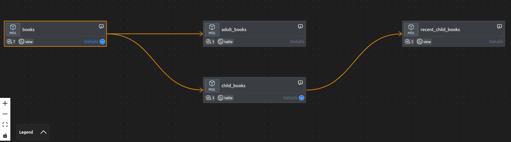

Для тестирования моделей выполните `dbt run` и убедитесь, что все модели успешно выполнены, на основе отображаемых сообщений:

```log
$ dbt run
hh:mm:ss  Running with dbt=1.11.11
hh:mm:ss  Registered adapter: sqlite=1.10.0
hh:mm:ss  Found 4 models, 7 data tests, 416 macros
hh:mm:ss  
hh:mm:ss  Concurrency: 1 threads (target='dev')
hh:mm:ss  
hh:mm:ss  1 of 4 START sql view model main.books ......................................... [RUN]
hh:mm:ss  1 of 4 OK created sql view model main.books .................................... [OK in 0.09s]
hh:mm:ss  2 of 4 START sql table model main.adult_books .................................. [RUN]
hh:mm:ss  2 of 4 OK created sql table model main.adult_books ............................. [OK in 0.07s]
hh:mm:ss  3 of 4 START sql table model main.child_books .................................. [RUN]
hh:mm:ss  3 of 4 OK created sql table model main.child_books ............................. [OK in 0.05s]
hh:mm:ss  4 of 4 START sql view model main.recent_child_books ............................ [RUN]
hh:mm:ss  4 of 4 OK created sql view model main.recent_child_books ....................... [OK in 0.07s]
hh:mm:ss  
hh:mm:ss  Finished running 2 table models, 2 view models in 0 hours 0 minutes and 0.44 seconds (0.44s).
hh:mm:ss  
hh:mm:ss  Completed successfully
hh:mm:ss  
hh:mm:ss  Done. PASS=4 WARN=0 ERROR=0 SKIP=0 NO-OP=0 TOTAL=4
```

где `hh:mm:ss` обозначает время начала задачи в часах, минутах и секундах.

Теперь давайте проверим, что все данные на месте. Для этого нам понадобится утилита для просмотра баз данных SQLite.
Например, подойдёт [DB Browser for SQLite](https://github.com/sqlitebrowser/sqlitebrowser).

Мы можем посмотреть на схему базы данных, чтобы убедиться, что она содержит две таблицы: `adult_books` и `child_books`, и два представления: `books` и `recent_child_books`:
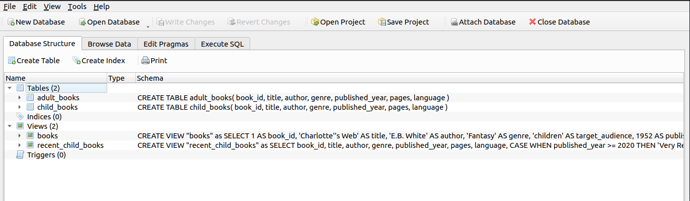

В представлении `books` содержится 17 строк:
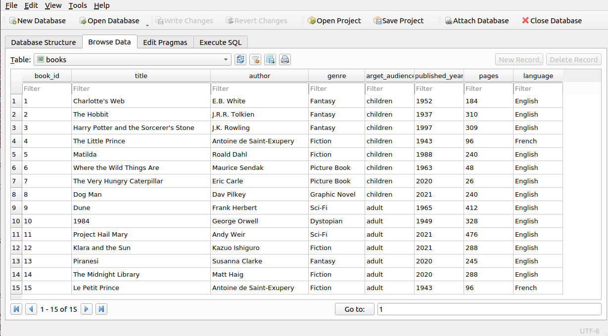

Финальное представление `recent_child_books` возвращает две строки:
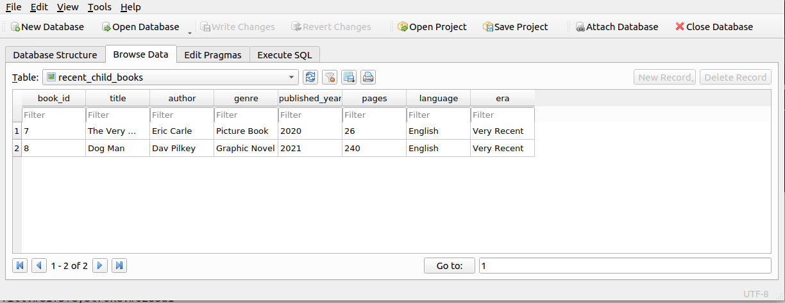

Промежуточные таблицы `adult_books` и `child_books` содержат 7 и 8 строк соответственно.

После заполнения данными вы можете запустить тесты, которые проверяют целостность данных.
В этом проекте используется только 7 тестов, хотя можно было бы добавить больше.
Четыре теста проверяют значения NOT NULL в ключевом столбце `book_id` в четырёх моделях:

| Модель | Тест |
| --- | --- |
| `books` | `not_null_books_book_id` |
| `adult_books` | `not_null_adult_books_book_id` |
| `child_books` | `not_null_child_books_book_id` |
| `recent_child_books` | `not_null_recent_child_books_book_id` |

Три дополнительных теста проверяют целостность данных в источнике `books`:

| Тест | Назначение |
| --- | --- |
| `not_null_books_target_audience` | проверяет значения `NOT NULL` в столбце `target_audience` |
| `accepted_values_books_target_audience__children__adult` | проверяет допустимые значения для столбца `target_audience` |
| `unique_books_book_id` | проверяет уникальность значений в ключевом столбце `book_id` |
 
Тесты запускаются с помощью команды `dbt test`, и результат выглядит следующим образом:

```log
$ dbt test
hh:mm:ss  Running with dbt=1.11.11
hh:mm:ss  Registered adapter: sqlite=1.10.0
hh:mm:ss  Found 4 models, 7 data tests, 416 macros
hh:mm:ss  
hh:mm:ss  Concurrency: 1 threads (target='dev')
hh:mm:ss  
hh:mm:ss  1 of 7 START test accepted_values_books_target_audience__children__adult ....... [RUN]
hh:mm:ss  1 of 7 PASS accepted_values_books_target_audience__children__adult ............. [PASS in 0.12s]
hh:mm:ss  2 of 7 START test not_null_adult_books_book_id ................................. [RUN]
hh:mm:ss  2 of 7 PASS not_null_adult_books_book_id ....................................... [PASS in 0.08s]
hh:mm:ss  3 of 7 START test not_null_books_book_id ....................................... [RUN]
hh:mm:ss  3 of 7 PASS not_null_books_book_id ............................................. [PASS in 0.03s]
hh:mm:ss  4 of 7 START test not_null_books_target_audience ............................... [RUN]
hh:mm:ss  4 of 7 PASS not_null_books_target_audience ..................................... [PASS in 0.06s]
hh:mm:ss  5 of 7 START test not_null_child_books_book_id ................................. [RUN]
hh:mm:ss  5 of 7 PASS not_null_child_books_book_id ....................................... [PASS in 0.05s]
hh:mm:ss  6 of 7 START test not_null_recent_child_books_book_id .......................... [RUN]
hh:mm:ss  6 of 7 PASS not_null_recent_child_books_book_id ................................ [PASS in 0.02s]
hh:mm:ss  7 of 7 START test unique_books_book_id ......................................... [RUN]
hh:mm:ss  7 of 7 PASS unique_books_book_id ............................................... [PASS in 0.06s]
hh:mm:ss  
hh:mm:ss  Finished running 7 data tests in 0 hours 0 minutes and 0.67 seconds (0.67s).
hh:mm:ss  
hh:mm:ss  Completed successfully
hh:mm:ss  
hh:mm:ss  Done. PASS=7 WARN=0 ERROR=0 SKIP=0 NO-OP=0 TOTAL=7
```

На этом завершается обзор dbt-проекта `books_library`. Он расположен на том же уровне каталога, что и папка Airflow `dags` в репозитории. Однако, если вы посмотрите на файл `profiles.yml` в репозитории, вы увидите, что он отличается от описанного здесь в отношении пути к базе данных.
Мы рассмотрим это в следующем разделе о нюансах.


---

[<-Назад к оглавлению](#оглавление)

## Технические нюансы: импорты и пути

В приведенном выше примере DAG были опущены импорты. Это сделано по понятной причине: если написать импорт вида `from X.Y import Z`, то Python должен успешно разрешить этот путь. 

Существует три основных варианта решения этой задачи:
* **Разместить библиотеку по путям, доступным в `sys.path`.** Этот вариант неудобен для деплоя и усложняет простое клонирование репозитория. Кроме того, размещение стороннего кода в подкаталогах папки `dags` заставит планировщик Airflow постоянно и неэффективно парсить эти файлы.
* **Использовать переменную окружения `PYTHONPATH`.** Способ также требует настройки окружения при деплое и может не работать, если Python запущен в изолированном или безопасном режиме (`isolated`/`secure mode`).
* **Динамически изменять `sys.path` прямо в коде перед импортом.** Из простых и автономных решений это наиболее практичный вариант.

Библиотеку и тесты удобнее всего разместить в корневом каталоге проекта, то есть на одном уровне с папкой `dags`: 
```mermaid
---
config:
  treeView:
    showIcons: true
---
treeView-beta
Airflow-root/  ## root Airflow folder
    src/    ## AflDbt library
    dags/      :::highlight ## Airflow DAGs folder
    tests/     ## AflDbt library tests
```
В таком случае сам код не будет зависеть от Airflow, однако для его импорта потребуется добавить корневой путь в `sys.path`. 

У этого подхода есть свой минус: поскольку планировщик Airflow циклически парсит DAG-файлы, динамическое вычисление путей в начале скрипта будет создавать небольшую регулярную нагрузку на процессор. Тем не менее, данное решение является компромиссным, так как позволяет избежать настройки дополнительного деплоя.

Поэтому в реальном коде есть дополнительные строчки вверху:
 
```python
from pathlib import Path
import sys
import shutil

# get the ../dags absolute path
projectRoot = Path(__file__).resolve().parent.parent

# append only if it's not in the sys.path
if projectRoot not in sys.path:
    sys.path.append(str(projectRoot))
```
Так как `pathlib` возвращает объект типа `Path`, то его надо привести к строке посредством функции `str()`, иначе код не будет правильно работать.

Второй пункт касается указания пути к `dbt` и dbt-проекту. Так как в репозитории dbt-проект расположен на одном уровне с папкой `dags`, то с помощью ранее вычисленной переменной `projectRoot` можно настроить конфигурацию динамически.

`BashOperator` запускает команды в отдельной сессии `bash`. Из-за этого процесс не сможет найти исполняемый файл `dbt` в своей переменной окружения `PATH`.
В нашем случае, как показано далее в разделе "Установка Python, настройка окружения, запуск юнит-тестов и проверка dbt-проекта", Airflow и dbt установлены в разных виртуальных окружениях.
Чтобы решить эту проблему, мы создаем виртуальные окружения на одном уровне с проектом AflDbt, который клонируется из репозитория. Тогда для вычисления пути к исполняемому файлу `dbt` нам надо взять родительский каталог от `projectRoot`, добавить к нему каталог виртуального окружения и добавить путь к `dbt` внутри виртуального окружения.
Полученный полный путь будет таким: `/home/user/MyProjects/dbtVe/bin/dbt`

Динамическое вычисление пути к dbt-проекту и команде `dbt` в коде выглядит так:
 ```python
# values for dbtData Configuration
dbtRoot = projectRoot / "dbt" / "books_library" 
dbtManifest = str(dbtRoot / "target" / "manifest.json")
dbtRoot = str(dbtRoot)

# Build the full path of the "dbt" executable
dbtCmd = projectRoot.parent / "dbtVe" / "bin" / "dbt"
logger.debug(f"The full path to dbt is: {dbtCmd}")

#  .... some code here .....

dbtData = {
 "DBT_PROJECT_DIR":str(dbtRoot),
 "DBT_COMMAND":dbtCmd,
 "DBT_MANIFEST_PATH":str(dbtManifest),
 "SKIP_DBT_TEST":"True"
}
```
Таким образом, если dbt вызывается через `BashOperator` во временном каталоге (например, `/tmp/SomeRandomFolder`), для него сформируется следующая команда:

```bash
/home/user/MyProjects/dbtVe/bin/dbt run --project-dir /home/user/MyProjects/AflDbt/dbt/books_library --profile /home/user/MyProjects/AflDbt/dbt/books_library someModel
```
Здесь `/home/user/MyProjects/AflDbt` — абсолютный путь к проекту в вашем окружении. Благодаря использованию полных путей команда успешно выполнится независимо от текущего рабочего каталога.

Третий пункт касается базы данных. Даже если запустить команду с абсолютными путями к проекту и профилю, для работы `dbt` этого всё равно недостаточно: он не сможет найти файл базы данных `books_library.db` при запуске из временного каталога (например, `/tmp/SomeRandomFolder`).

Решить эту проблему можно с помощью переменной окружения `AFLDBT_DBT_DB`, указав её в файле `profiles.yml` в качестве префикса к пути. Теперь конфигурация `profiles.yml` будет выглядеть следующим образом:
```yaml
books_library:
  target: dev
  outputs:
    dev:
      type: sqlite
      threads: 1
      database: 'books_library'
      schema: 'main'
      schema_directory: '.'
      schemas_and_paths:
        main: '{{ env_var("AFLDBT_DBT_DB", "") }}books_library.db'
```
При таком подходе сохраняется гибкость: если переменная окружения отсутствует, пути разрешаются по старой схеме, что позволяет без проблем отлаживать dbt-проект локально без Airflow. Если же запуск происходит внутри Airflow, мы просто передаем эту переменную в параметре `env` при создании `BashOperator`:
```python
    task = BashOperator(
        task_id=task_id,
        bash_command= execStr,  # e.g., "dbt run --project-dir ... -s s_task"
        dag=_dag,
        env={
            "AFLDBT_DBT_DB": f"{dbtRoot}/", # Trailing slash included
        },
        task_group=grp,
    )
```
В этом случае переменная окружения `AFLDBT_DBT_DB` примет значение `/home/user/MyProjects/AflDbt/dbt/books_library/` (включая замыкающий слэш). Тогда при вызове dbt путь к базе данных для схемы `main` в файле `profiles.yml` преобразуется в `/home/user/MyProjects/AflDbt/dbt/books_library/books_library.db`. В результате файл БД гарантированно найдется независимо от текущего рабочего каталога.


На этом разбор технических нюансов путей и конфигурации завершен. В следующем разделе мы рассмотрим организацию тестирования библиотеки.

---

[<-Назад к оглавлению](#оглавление)

## Юнит-тесты, утилита createMermaid.py и запуск DAG как Python-скрипта

Юнит-тесты предназначены для проверки работы библиотеки без использования внешних зависимостей от Airflow или dbt. Тестовые сценарии размещаются в каталоге `tests`, который находится на одном уровне с исходным кодом библиотеки в папке `src`.

```mermaid
---
config:
  treeView:
    showIcons: true
---
treeView-beta
Project-root/  ## root Airflow folder
    src/   ## AflDbt library
    dags/
    tests/  :::highlight ## AflDbt library tests
        01_AData/
        02_ATaskGroupProcessor/
        03_AGraphPathProcessor/
        04_AJsonProcessor/
        05_AMain/
        simpleJsonTest.json
        advancedJsonTest.json
        AMockOperator.py
    utils/
        createMermaid.py
```

Внутри каждого из подкаталогов (например, `01_AData`) находятся файлы для тестирования различной функциональности связанного класса (в данном случае — `AData`).
Порядок выполнения тестов отличается от процесса построения пайплайна трансформации и выстроен в обратной последовательности:
* `01_AData/` — сначала тестируется общий класс хранения данных. Проверяется, что при заданных данных функции обратного вызова по типам объектов (DAG, группы, задачи, последовательности) корректно передают данные в симулированные объекты Airflow.
* `02_ATaskGroupProcessor/` — после того, как проверены общие классы данных и преобразование в симулированные объекты Airflow, тестируются вспомогательные классы-помощники на предмет правильности и уникальности при создании задач и групп через их методы.
* `03_AGraphPathProcessor/` — проверка корректности парсинга путей графа в конечные данные. Процессор путей использует вспомогательные классы, которые уже были протестированы на предыдущем шаге.
* `04_AJsonProcessor/` — до этого момента тесты не использовали никаких внешних файлов и тестовые данные создавались непосредственно в тестах. 
После того как мы удостоверились, что они правильно обрабатываются, мы проверяем парсинг двух синтетических файлов JSON на корректность и правильное преобразование в финальные данные.
* `05_AMain/` — финальный интеграционный тест класса `AMain`. Этот класс объединяет все проверенные выше компоненты и непосредственно используется в Airflow DAG.

### Особенности реализации тестов

В архитектуре библиотеки **все поля являются публичными (public)**. Это осознанное решение, которое активно используется в юнит-тестах для быстрого и удобного наполнения объектов тестовыми данными напрямую, без использования сложных фабрик или сеттеров. Такой подход позволяет присваивать значения полям без лишних обёрток. Это удобно как для первичной проверки `AData`, так и для последующих классов.

Модуль `AMockOperator.py` содержит тестовые функции обратного вызова и глобальные переменные для отслеживания состояния финальных компонентов Airflow: `dag`, `taskGroup`, `operator` и `sequences`. Также в нём определён мок-класс `AMockOperator`, хранящий те же данные, которые обычно передаются в `BashOperator`. Однако, в отличие от оригинального `BashOperator`, используемого в библиотеке для вызова команд `dbt`, мок-класс ничего не запускает, так как в тестах мы лишь анализируем полученные значения.

Этот модуль находится в каталоге `tests/` и импортируется в юнит-тесты. 
Чтобы тесты не влияли друг на друга и не возникало побочных эффектов (side effects) из-за сохранения значений глобальных переменных между разными тестами, **в самом начале каждого теста** необходимо вызывать функцию очистки `ClearGlobals()`:

```python
import tests.AMockOperator as mo

def test_example():
    mo.ClearGlobals()  # Очистка глобального состояния перед запуском логики теста
    # ... код теста ...
```
При тестировании класса `AJsonProcessor` проверяется парсинг входных файлов. Используются два файла синтетических данных:
* **`simpleJsonTest.json`** — упрощенный сценарий. Содержит только объекты `model` в терминологии dbt; `test`-объекты в нем отсутствуют.
* **`advancedJsonTest.json`** — продвинутый сценарий. Включает полный набор данных для комплексной проверки парсера и позволяет проверить флаг фильтрации типа объекта.

### Запуск тестов

Тесты запускаются из **корня проекта**. Если запустить тесты через интерпретатор Python с указанием модуля `pytest`, то текущий каталог будет добавлен в `sys.path`, и вызов будет выглядеть так:
```bash
python -m pytest tests/
```
При запуске `pytest` напрямую текущий каталог не добавляется в `sys.path`, и его нужно добавить вручную через переменную окружения `PYTHONPATH`:
```bash
PYTHONPATH=. pytest tests/
```

### Утилита генерации граф-схем 

Данная утилита располагается в `utils/createMermaid.py`.
Скрипт `createMermaid.py` предназначен для генерации граф-схемы в формате текстовых flowchart-диаграмм **Mermaid**. В качестве входных данных используется файл JSON, такого же формата, как и файл `manifest.json` у dbt, передаваемый в качестве параметра.
Утилита импортирует главный класс `AMain` из модуля `src.AflDbt.AMain` и инициализирует его конфигурацией `dbtData`, составленной из входных параметров. В метод `AMain.Process()` передаются специализированные функции обратного вызова, которые вызываются после окончательной трансформации данных:
* **`createDagCallback`** — инициализирует заголовок диаграммы и задает тип графа (`flowchart LR`).
* **`createTaskGroupCallback`** — регистрирует группы диаграммы. Для недефолтных групп генерируется визуальный блок (`subgraph`) и применяется зеленая рамка. В словаре задач эта функция обратного вызова сразу создает ключ с именем группы задач и пустым значением. Тогда последующий вызов функции обратного вызова для задач этой группы лишь добавит туда значения соответствующих задач.
* **`createTaskCallback`** — создает автонумерованные узлы диаграммы внутри своих визуальных групп. Автонумерация сквозная, начиная с первого узла, используется для формирования идентификатора и его подписи, например `T2["(run) child_books"]`, где `T2` — автонумерованный идентификатор. Автоматически стилизует узлы в зависимости от типа задачи:
  * Задачи запуска модели `(run)` окрашиваются в **голубой** цвет.
  * Задачи запуска тестов `(test)` окрашиваются в **оранжевый** цвет.
* **`createTaskSequence`** — связывает узлы диаграммы стрелками (`-->`), выстраивая цепочки зависимостей.

Так как flowchart-диаграммы **Mermaid** являются текстовыми, то и выход программы текстовый: в зависимости от параметров, утилита собирает итоговую текстовую схему и выводит её в консоль или записывает в файл.

Скрипт принимает от 1 до 3 аргументов:

```bash
python utils/createMermaid.py [-t] <input-file> [output-file]
```

Входные аргументы означают следующее:
* **`-t`** *(опциональный флаг)* — включает тесты dbt в диаграмму. Если флаг не указан, то в диаграмме будут представлены только модели.
* **`<input-file>`** *(обязательный)* — путь к входному файлу JSON для парсинга.
* **`[output-file]`** *(опциональный)* — путь к текстовому файлу, куда будет записана сгенерированная **Mermaid**-диаграмма. Если параметр опущен, результат выводится прямо в `stdout` (консоль).

Примеры использования:

**1. Вывод диаграммы в консоль без тестов dbt для синтетического примера, используемого в юнит-тестах:**
```bash
python utils/createMermaid.py tests/simpleJsonTest.json
```
Выводом будет следующая диаграмма:
```mermaid
---
title: dbt_simple_test
---
flowchart LR
T1["(run) s_task"]
style T1 fill:#e1f5fe,stroke:#0288d1
T2["(run) b_task"]
style T2 fill:#e1f5fe,stroke:#0288d1
T3["(run) e_task"]
style T3 fill:#e1f5fe,stroke:#0288d1
        subgraph G1["c_task1"]
T4["(run) c_task1"]
style T4 fill:#e1f5fe,stroke:#0288d1
T5["(run) c_task2"]
style T5 fill:#e1f5fe,stroke:#0288d1
        end
style G1 fill:#e8f5e9,stroke:#388e3c
T1 --> T2
T2 --> T3
T1 --> T4
T4 --> T5
T5 --> T3
```

**2. Сохранение полной диаграммы вместе с тестами dbt в файл:**

```bash
python utils/createMermaid.py -t tests/advancedJsonTest.json output_graph.mmd
```
Текст файла output_graph.mmd будет содержать следующую диаграмму:
```mermaid
---
title: dbt_advanced_test with tests
---
flowchart LR
T1["(run) s_task"]
style T1 fill:#e1f5fe,stroke:#0288d1
T2["(run) b_task"]
style T2 fill:#e1f5fe,stroke:#0288d1
T3["(run) c_task1"]
style T3 fill:#e1f5fe,stroke:#0288d1
T4["(run) c_task2"]
style T4 fill:#e1f5fe,stroke:#0288d1
T5["(test) c_task1_test1"]
style T5 fill:#fff3e0,stroke:#f57c00
T6["(test) c_task1_test2"]
style T6 fill:#fff3e0,stroke:#f57c00
T7["(test) s_task_test"]
style T7 fill:#fff3e0,stroke:#f57c00
        subgraph G1["e_task"]
T8["(run) e_task"]
style T8 fill:#e1f5fe,stroke:#0288d1
T9["(test) e_task_test"]
style T9 fill:#fff3e0,stroke:#f57c00
        end
style G1 fill:#e8f5e9,stroke:#388e3c
T1 --> T2
T2 --> T8
T8 --> T9
T1 --> T3
T3 --> T4
T4 --> T8
T3 --> T5
T3 --> T6
T1 --> T7
```
Данная утилита помогает визуально оценить распределение задач по группам задач при переносе их в Airflow без необходимости его установки.

### Запуск DAG как Python-скрипта
Такое тестирование представляет собой запуск DAG как обычного Python-скрипта, т.е. выполнение в корневом каталоге проекта команды:

```bash
python dags/booksLibraryExample.py
```

Для такого механизма в скрипте необходимо реализовать функцию `__main__`, которая будет выполнять операции, аналогичные запуску DAG в Airflow.
Код данной процедуры выглядит так:

```python
if __name__ == "__main__":
    from airflow.utils import timezone
    from airflow.utils.state import State
    from airflow.timetables.simple import OnceTimetable

    # 1. Get current time
    now = timezone.utcnow()
    logger.debug(f"running DAG '{_dag.dag_id}' in isolated local mode...")

    # 2.HACK: Temporarily change the schedule from None to Once
    # This will cause BackfillJobRunner to see the start_date 
    _dag.timetable = OnceTimetable()

    # 3. Clear previous run if we have one
    _dag.clear(
        start_date=now,
        end_date=now,
        dag_run_state=State.QUEUED
    )

    # 4. Run local Airflow runner
    _dag.run(
        start_date=now,
        end_date=now,
        ignore_first_depends_on_past=True,
        verbose=True
    )
    logger.debug(f"running DAG '{_dag.dag_id}' ... completed")
```
На момент выполнения `__main__` код библиотеки, который создает Airflow объекты, уже отработал. Поэтому в контексте Python-скрипта уже есть объект DAG, группы задач, задачи и зависимости. Наша задача состоит только в том, чтобы запустить этот DAG вручную, используя `local Airflow runner`.
Этот процесс разбивается на четыре основных шага:

* Получение текущего времени, которое используется для очистки
* Временное изменение расписания (хак)
* Очистка истории начиная с текущего момента, если есть объекты в состоянии очереди (`QUEUED`)
* Запуск локального исполнения с детальным логом

Второй шаг является важным. В примере `booksLibraryExample.py` используется расписание ручного запуска.
Оно задается при создании DAG как `schedule=None` и позволяет для тестовых целей запускать DAG вручную, исключая любой автоматический запуск.
Но такой вид расписания не работает через `_dag.run`: запуск сразу завершится без выполнения задач.
Поэтому применяется хак: перед запуском вид расписания принудительно меняется на однократный автоматический запуск (`@once`) и в качестве стартового времени подставляется текущее, чтобы локальный планировщик сразу же его выполнил и далее никогда не запускал.

Внутри Airflow используются объекты `timetable` для расчета расписания, и параметр `schedule` оставлен для совместимости и транслируется в `timetable` при создании DAG. Поэтому изменение параметра `schedule="@once"` не изменит расписание на однократное: для этого надо менять непосредственно `timetable`, что и сделано во втором шаге.
Третий шаг сбрасывает все объекты в состоянии очереди, чтобы иметь возможность запустить.
Четвертый шаг вручную запускает DAG, размещая его в очереди на запуск. 
В четвертом шаге важен параметр `verbose=True`, так как он задает детальный вывод логов `local Airflow runner` и позволяет наблюдать процесс запуска в консоли.

Запуск DAG как Python-скрипта позволяет проверить корректность выполнения DAG без запуска других сервисов Airflow.


В следующем разделе мы перейдем к практической настройке локального окружения.

---

[<-Назад к оглавлению](#оглавление)

## Установка Python, настройка окружения, запуск юнит-тестов и проверка dbt-проекта

По соображениям безопасности категорически не рекомендуется изменять или заменять системный Python, так как от него зависит стабильная работа всей операционной системы. Вмешательство в предустановленную версию может нарушить ее корректную работу.
Поэтому для среды разработки мы будем использовать отдельную и более свежую версию Python, установленную в каталог `/opt`.

Версия Python для установки определяется требованиями **Airflow** и **dbt**.
В данном случае минимальные требования у обоих пакетов идентичны:
* для **dbt** (версии 1.11) требуется Python не ниже `3.10`.
* для **Airflow** (версии 2.11.2) также необходим Python не ниже `3.10`.
Оптимальным выбором будет установка версии Python более новой минорной ветки, например `3.11.16`.

Процесс установки и тестирования библиотеки состоит из следующих последовательных шагов:
1. Установка Python 3.11.16.
2. Создание изолированных виртуальных окружений на базе Python 3.11.16.
3. Клонирование репозитория с GitHub и запуск юнит-тестов.
4. Проверка работы библиотеки с помощью утилиты `createMermaid`.
5. Установка пакетов `dbt-core` (версии 1.11) и `dbt-sqlite`.
6. Проверка корректности dbt-проекта.
7. Установка Apache Airflow 2.11.2 для локального запуска.
8. Проверка тестового DAG-файла без запуска планировщика и веб-интерфейса.
9. Проверка работы DAG с запущенным планировщиком в командной строке.
10. Итоговая проверка работы DAG в веб-интерфейсе Airflow.

Данный раздел рассматривает шаги с 1 по 6, а шаги с 7 по 10 будут разобраны в следующей части.

### Установка Python 3.11.16 из исходников

Сборка Python выполняется из исходного кода. После сборки пакет устанавливается в каталог `/opt` через `altinstall`, чтобы изолировать его от системного Python. Ниже приведена последовательность действий для систем Debian/Ubuntu.

Сначала с правами `sudo` установим пакеты, необходимые для сборки:

```bash
sudo apt-get update && sudo apt-get install -y build-essential libssl-dev zlib1g-dev \
libncurses-dev libgdbm-dev libnss3-dev libsqlite3-dev libreadline-dev libffi-dev curl uuid-dev
```

Далее скачаем архив с официального сервера Python в директорию `/tmp` и распакуем его. Исходный код разных версий располагается в FTP-разделе сервера и имеет URL вида `https://www.python.org/ftp/python/VERSION/Python-VERSION.tgz`. В нашем случае `VERSION=3.11.16`. Для удобства сохраним этот номер в переменной окружения `P_VER`:


```bash
cd /tmp
P_VER=3.11.16
wget https://www.python.org/ftp/python/$P_VER/Python-$P_VER.tgz
tar -xf Python-$P_VER.tgz
cd Python-$P_VER
```

После этого запустим сценарий конфигурации, передав в параметре `--prefix` целевой путь для установки.
Два других флага активируют установку `pip` и включают оптимизацию производительности итогового бинарного файла:
```bash
./configure --prefix=/opt/python$P_VER --enable-optimizations --with-ensurepip=install
```

Следующим шагом соберём проект, задействовав все доступные ядра процессора:
```bash
make -j$(nproc)
```

Собранный пакет устанавливается в целевой каталог `/opt/` через `altinstall` под правами `sudo`.
Это гарантирует отсутствие конфликтов с системными путями:
```bash
sudo make altinstall
```

По окончании установки Python 3.11.16 будет располагаться в каталоге `/opt/python3.11.16`.
Убедимся в корректности установки, проверив версии `python` и `pip` с помощью параметра `--version`:
```bash
/opt/python3.11.16/bin/python3.11 --version
/opt/python3.11.16/bin/pip3.11 --version
``` 

Теперь каталог `/tmp` можно очистить от скачанного дистрибутива и временных файлов сборки:
```bash
sudo rm -rf Python-$P_VER.tgz Python-$P_VER
unset P_VER
``` 

На этом подготовка Python 3.11.16 завершена, и он готов к использованию.

### Создание изолированных виртуальных окружений на базе Python 3.11.16

Для изоляции зависимостей наших проектов мы создадим виртуальные окружения `venv` на базе только что установленного Python 3.11.16. 
Окружения будут находиться в домашней директории пользователя в каталоге `~/MyProjects`, который нужно предварительно создать:
```bash
mkdir -p ~/MyProjects
``` 

Предполагаемая структура каталогов будет выглядеть так:
```mermaid
---
config:
  treeView:
    showIcons: true
---
treeView-beta
~/  ## Home folder
    MyProjects/
        AflDbt/    ## AflDbt project with Apache Airflow - will be cloned from GitHub
        aflVe/  ## virtual Python environment for Airflow
        dbtVe/  ## virtual Python environment for dbt
```

Вместо каталога `MyProjects` можно использовать любой другой путь внутри домашней директории, однако все дальнейшие команды будут описываться применительно к структуре на диаграмме выше.

Для Airflow и dbt создаются отдельные виртуальные окружения, так как из-за требований к зависимым библиотекам эти продукты несовместимы в одном окружении:
* `protobuf`: для Airflow требуется версия `4.25.8`, а для dbt - от `6.0` до `7.0`
* `pathspec`: для Airflow требуется версия `1.0.4`, а для dbt - от `0.9` до `0.13`

Для создания двух виртуальных окружений перейдем в созданный каталог `MyProjects` и создадим их там как `aflVe` и `dbtVe` с помощью модуля `venv`:
```bash
cd ~/MyProjects

# create virtual environment for Airflow
/opt/python3.11.16/bin/python3.11 -m venv aflVe

# create virtual environment for dbt
/opt/python3.11.16/bin/python3.11 -m venv dbtVe
```

Дальнейший процесс рассмотрим на примере окружения `aflVe`, поскольку именно оно предназначено для запуска библиотеки AflDbt.
Для использования созданного окружения его необходимо активировать:
```bash
# current directory now is ~/MyProjects
source aflVe/bin/activate
```

Убедимся, что команды `python` и `pip` теперь ссылаются на наше новое окружение, а также обновим `pip` до актуальной версии:

```bash
# Check the path and version of python
which python
python --version

# Upgrade pip inside the aflVe venv
pip install --upgrade pip
```

Теперь изолированное окружение разработки для Airflow полностью готово к установке библиотеки. Виртуальное окружение для dbt будет рассмотрено ниже.

### Клонирование репозитория с GitHub и запуск юнит-тестов

На этом шаге мы скачаем исходный код библиотеки из удаленного репозитория GitHub в наш рабочий каталог `~/MyProjects` и проверим его работоспособность.
Перед началом работы убедитесь, что в системе установлен Git, а ваше виртуальное окружение `aflVe` активировано. 
Проверить наличие Git можно командой:
```bash
git --version
```
_Примечание: если команда возвращает ошибку, установите Git с помощью системного менеджера пакетов (например, `sudo apt install git`)._

Для тестирования проекта нам понадобится фреймворк `pytest`, а также модуль `pandas` для библиотеки. Установим их внутри виртуального окружения:
```bash
pip install pytest pandas
```

Склонируем проект AflDbt в каталог `~/MyProjects` и перейдем в его директорию:
```bash
# Navigate to MyProjects directory
cd ~/MyProjects

# Clone the project repository from GitHub
git clone https://github.com/<your_user>/AflDbt.git

# Navigate to the project directory
cd AflDbt
```

Теперь запустим юнит-тесты командой:
```bash
python -m pytest tests/
```
После успешного выполнения команда выведет отчет в терминал. Если все тесты отмечены как прошедшие (passed), это подтверждает корректность кода библиотеки в текущем окружении.


### Проверка работы библиотеки с помощью утилиты createMermaid

Для проверки корректности работы библиотеки AflDbt запустите две тестовые команды из каталога `~/MyProjects/AflDbt`, которые ранее упоминались в разделе "Юнит-тесты и утилита createMermaid.py":

**1. Вывод диаграммы в консоль без тестов dbt для синтетического примера, используемого в юнит-тестах:**
```bash
python utils/createMermaid.py tests/simpleJsonTest.json
```

**2. Вывод полной диаграммы в консоль вместе с тестами dbt для расширенного синтетического примера:**
```bash
python utils/createMermaid.py -t tests/advancedJsonTest.json
```
Обе команды должны отработать без ошибок. Если скопировать полученный из консоли текст и вставить его в любой редактор или онлайн-сервис для визуализации **Mermaid**, сгенерированные диаграммы должны в точности совпасть с примерами, приведенными в разделе "Юнит-тесты и утилита createMermaid.py".

### Установка пакетов dbt-core (версии 1.11) и dbt-sqlite

Для установки dbt нам необходимо сменить виртуальное окружение на `dbtVe`. Так как мы сейчас находимся в виртуальном окружении `aflVe`, сначала необходимо из него выйти:
```bash
# leave aflVe virtual environment
deactivate
```

Теперь активируем `dbtVe`:
```bash
# current directory now is ~/MyProjects/AflDbt, so use full path from home 
source ~/MyProjects/dbtVe/bin/activate
```

Убедимся, что команды `python` и `pip` теперь ссылаются на наше новое окружение, а также обновим `pip` до актуальной версии:
```bash
# Check the path and version of python
which python
python --version

# Upgrade pip inside the dbtVe venv
pip install --upgrade pip
```

Установим `dbt-core` и адаптер `dbt-sqlite` с помощью менеджера пакетов `pip`. Спецификация `dbt-core==1.11.*` гарантирует совместимость и установку стабильного минорного релиза:
```bash
pip install "dbt-core==1.11.*" dbt-sqlite
```

Чтобы убедиться, что утилиты установились корректно и адаптер sqlite успешно зарегистрирован в системе, выполните команду:
```bash
dbt --version
```

В выводе команды должны отображаться версии установленных пакетов. Убедитесь, что плагин sqlite присутствует в списке зарегистрированных адаптеров:
```text
Core:
  - installed: 1.11.x
Plugins:
  - sqlite: x.xx.x
```
> [!NOTE]
> В выводе команды также могут встречаться следующие строки:
>```text
> Core:
>  - latest:    1.xx.x  - Update available!
>  Your version of dbt-core is out of date!
>  You can find instructions for upgrading here:
>  https://docs.getdbt.com/docs/installation
>```
> Для библиотеки AflDbt наличие более поздней версии dbt не требуется. При необходимости вы можете обновить dbt, следуя инструкциям по указанному URL-адресу.

### Проверка корректности dbt-проекта

Для проверки корректности работы dbt-проекта `books_library` перейдите в его каталог и запустите две тестовые команды, которые ранее упоминались в разделе "Простой dbt-проект для проверки работоспособности библиотеки":

**Переход в каталог dbt-проекта:**
```bash
cd ~/MyProjects/AflDbt/dbt/books_library
```

**1. Запуск моделей:**
```bash
dbt run
```

**2. Запуск тестов:**
```bash
dbt test
```

Обе команды должны отработать без ошибок, а логи в консоли - соответствовать логам команд из раздела "Простой dbt-проект для проверки работоспособности библиотеки".
После окончания проверки выходим из виртуального окружения:
```bash
# leave dbtVe virtual environment
deactivate
```

В следующем разделе мы перейдем к практической настройке Apache Airflow.

---

[<-Назад к оглавлению](#оглавление)

## Установка Apache Airflow и итоговая проверка тестового DAG-файла в разных режимах

### Установка Apache Airflow 2.11.2 для локального запуска

Процесс установки Apache Airflow отличается от установки dbt. Для установки Airflow критически важна не только версия самого Airflow, но и версия Python, поскольку менеджер `pip` использует специальный текстовый файл ограничений (constraints). Он строго определяет допустимые версии пакетов, устанавливаемых в окружение в качестве транзитивных (косвенных) зависимостей. Так как библиотеки могут обновляться со временем и вызывать непредсказуемое поведение системы, в Airflow версии всех компонентов жестко фиксируются.

Файл ограничений хранится в репозитории проекта Airflow на GitHub, а ссылка на него зависит от версий Airflow и Python. Проект постоянно развивается, поэтому далеко не все комбинации окружения работают стабильно. В рамках проекта AflDbt на практике проверена и подтверждена совместимость Apache Airflow 2.11.2 с Python 3.11.16.
При установке Airflow принято использовать переменные окружения `AIRFLOW_VERSION` и `PYTHON_VERSION` для указания конкретных версий. Версию Airflow указывают полностью, включая номер патча (например, `2.11.2`), а версию Python - без микроверсии (например, `3.11`).

**Важный момент:** ИИ-ассистенты зачастую предлагают ошибочный шаблон для файла ограничений, например: `https://githubusercontent.com${AIRFLOW_VERSION}/constraints-${PYTHON_VERSION}.txt`. После подстановки переменных он превращается в несуществующий URL (например, `https://githubusercontent.com2.11.2/constraints-3.11.txt`), который ожидаемо не работает. Также не будет работать некорректный базовый URL `https://githubusercontent.com`. 
Настоятельно рекомендуется перед запуском `pip` проверять корректность сформированной ссылки, открыв её в браузере или отправив запрос через `curl`.

Корректная ссылка строится по следующему шаблону:
```text
https://raw.githubusercontent.com/apache/airflow/constraints-${AIRFLOW_VERSION}/constraints-${PYTHON_VERSION}.txt
```
Шаги по установке Airflow обязательно должны включать проверку этой ссылки перед запуском `pip`. Если переход по ней возвращает ошибку, необходимо обратиться к разделу установки в официальной документации Airflow для уточнения актуального шаблона.

**Важно:** установку Airflow необходимо выполнять в активированном виртуальном окружении `aflVe`.
Последовательность действий для установки выглядит следующим образом:
```bash
# 1. Activate virtual environment
source ~/MyProjects/aflVe/bin/activate

# 2. Set environment variables
AIRFLOW_VERSION=2.11.2
PYTHON_VERSION=3.11

# 3. Define constraint URL
CONSTRAINT_URL="https://raw.githubusercontent.com/apache/airflow/constraints-${AIRFLOW_VERSION}/constraints-${PYTHON_VERSION}.txt"

# 4. Print URL for verification (copy to browser if needed)
echo "$CONSTRAINT_URL"

# 5. Check URL availability (show first lines only)
curl -s "$CONSTRAINT_URL" | head

# 6. Install Airflow
pip install "apache-airflow==${AIRFLOW_VERSION}" --constraint "${CONSTRAINT_URL}"
```

Убедимся, что Airflow успешно установлен:
```bash
airflow version
```

Установка завершена, но чтобы пользоваться Airflow, необходимо выполнить его инициализацию. Этот процесс включает создание структуры папок, генерацию конфигурационных файлов и инициализацию метабазы. При локальной установке метабаза хранится по умолчанию в локальном файле SQLite с именем `airflow.db`, если не задан иной провайдер и база данных (например, на сервере PostgreSQL).
По умолчанию Airflow использует в качестве домашней директории `~/airflow`, где создаются как метабаза, так и каталог `dags` для хранения DAG-файлов. Это делает невозможным прямое использование нашего склонированного проекта.
Поэтому перед инициализацией необходимо экспортировать переменную окружения `AIRFLOW_HOME`, указав полный путь к нашему каталогу проекта `AflDbt`. Это позволит Airflow сразу ссылаться на каталог `dags` проекта и корректно использовать модули из библиотеки.

Также имеет смысл сразу отключить загрузку встроенных примеров DAG при инициализации метабазы, установив значение переменной окружения `AIRFLOW__CORE__LOAD_EXAMPLES=False`. 

Последовательность инициализации такова:
```bash
# 1. Set absolute path to project directory
export AIRFLOW_HOME=$(realpath ~/MyProjects/AflDbt)   

# 2. Disable loading of example DAGs
export AIRFLOW__CORE__LOAD_EXAMPLES=False

# 3. Initialize Airflow database
airflow db migrate
```

После инициализации рекомендуется отключить загрузку встроенных примеров DAG непосредственно в конфигурационном файле `airflow.cfg`. Это позволит в будущем не задавать переменную окружения `AIRFLOW__CORE__LOAD_EXAMPLES` при каждом запуске.
В конфигурационном файле этот параметр называется `load_examples`. Изменить его значение можно с помощью следующей команды:
```bash
sed -i 's/load_examples = True/load_examples = False/g' "$AIRFLOW_HOME/airflow.cfg"
```

Переменную `AIRFLOW_HOME` необходимо задавать при каждой работе с Airflow. Чтобы не экспортировать её вручную в терминале каждый раз, удобнее добавить эту команду в скрипт активации виртуального окружения (`activate`).
Для автоматического обновления скрипта `activate` (добавление экспорта при входе и очистка переменной при выходе) можно выполнить следующие команды:
```bash
# 1. Add export AIRFLOW_HOME on activation
echo 'export AIRFLOW_HOME=$(realpath ~/MyProjects/AflDbt)' >> ~/MyProjects/aflVe/bin/activate

# 2. Unset AIRFLOW_HOME when exiting virtual environment
sed -i '/^deactivate () {$/a\    unset AIRFLOW_HOME' ~/MyProjects/aflVe/bin/activate
```

При работе с Airflow 2.11.2 в логах могут появляться два типа предупреждений, которые рекомендуется сразу устранить, чтобы они не мешали восприятию основной информации. Первое предупреждение касается формата времени:
```log
/home/user/MyProjects/aflVe/lib/python3.11/site-packages/airflow/metrics/base_stats_logger.py:22 RemovedInAirflow3Warning: Timer and timing metrics publish in seconds were deprecated. It is enabled by default from Airflow 3 onwards. Enable timer_unit_consistency to publish all the timer and timing metrics in milliseconds.
```

Чтобы его устранить, необходимо установить значение параметра `timer_unit_consistency = True`:
```bash
sed -i 's/timer_unit_consistency = False/timer_unit_consistency = True/g' "$AIRFLOW_HOME/airflow.cfg"
```

Второе предупреждение касается библиотеки `graphviz`:
```log
/home/user/MyProjects/aflVe/lib/python3.11/site-packages/airflow/cli/commands/dag_command.py:48 UserWarning: Could not import graphviz. Rendering graph to the graphical format will not be possible.
```

Для его устранения необходимо установить эту библиотеку: сначала на уровне операционной системы, а затем как Python-модуль:
```bash
# 1. Install system library
sudo apt-get install graphviz

# 2. Install Python module
pip install graphviz
```

Установка и базовая настройка Airflow завершены. Можно приступать к запуску тестового DAG.

### Проверка тестового DAG-файла без запуска планировщика и веб-интерфейса

Тестовый DAG-файл `booksLibraryExample.py` реализован как исполняемый скрипт, что позволяет его запускать без запущенного планировщика и веб-интерфейса Airflow.
Для запуска в таком режиме достаточно выполнить этот скрипт из корневого каталога проекта `~/MyProjects/AflDbt`:
```bash
# 1. Navigate to project directory
cd ~/MyProjects/AflDbt

# 2. Run test DAG
python dags/booksLibraryExample.py
```

При этом Airflow выполняет DAG в локальном режиме (используя `SequentialExecutor`), эмулируя процесс запуска задач без фонового планировщика.

Лог выполнения будет иметь примерно следующий вид:
```log
[<some-timestamp>] {booksLibraryExample.py:134} INFO - create AMain class instance
[<some-timestamp>] {booksLibraryExample.py:138} INFO - running AMain.Process
[<some-timestamp>] {booksLibraryExample.py:146} INFO - running AMain.Process ... Done
[<some-timestamp>] {executor_loader.py:258} INFO - Loaded executor: SequentialExecutor
[<some-timestamp>] {taskinstance.py:2632} INFO - Dependencies all met for dep_context=None ti=<TaskInstance: dbt_books_library.run_books backfill__XXXX-XX-XXTXX:XX:XX.XXXXXX+XX:XX [scheduled]>
[<some-timestamp>] {base_executor.py:169} INFO - Adding to queue: ['airflow', 'tasks', 'run', 'dbt_books_library', 'run_books', 'backfill__XXXX-XX-XXTXX:XX:XX.XXXXXX+XX:XX', '--depends-on-past', 'ignore', '--local', '--pool', 'default_pool', '--subdir', 'DAGS_FOLDER/booksLibraryExample.py', '--cfg-path', '/tmp/tmpjzozqhap']
[.................................]
[<some-timestamp>] {dagrun.py:854} INFO - Marking run <DagRun dbt_books_library @ XXXX-XX-XX XX:XX:XX.XXXXXX+XX:XX: backfill__XXXX-XX-XXTXX:XX:XX.XXXXXX+XX:XX, state:running, queued_at: None. externally triggered: False> successful
[<some-timestamp>] {dagrun.py:905} INFO - DagRun Finished: dag_id=dbt_books_library, execution_date=XXXX-XX-XX XX:XX:XX.XXXXXX+XX:XX, run_id=backfill__XXXX-XX-XXTXX:XX:XX.XXXXXX+XX:XX, run_start_date=XXXX-XX-XX XX:XX:XX.XXXXXX+XX:XX, run_end_date=XXXX-XX-XX XX:XX:XX.XXXXXX+XX:XX, run_duration=28.793708, state=success, external_trigger=False, run_type=backfill, data_interval_start=XXXX-XX-XX XX:XX:XX.XXXXXX+XX:XX, data_interval_end=XXXX-XX-XX XX:XX:XX.XXXXXX+XX:XX, dag_hash=None
[<some-timestamp>] {backfill_job_runner.py:464} INFO - [backfill progress] | finished run 1 of 1 | tasks waiting: 0 | succeeded: 4 | running: 0 | failed: 0 | skipped: 0 | deadlocked: 0 | not ready: 0
[<some-timestamp>] {backfill_job_runner.py:1051} INFO - Backfill done for DAG <DAG: dbt_books_library>. Exiting.
```
где `XXXX-XX-XXTXX:XX:XX.XXXXXX+XX:XX` и `XXXX-XX-XX XX:XX:XX.XXXXXX+XX:XX` - это заглушки для временных меток в различных форматах, которые в реальности имеют вид, например, `2025-01-01T01:01:01.040000+00:00` или `2025-01-01 00:04:40.240000+00:00`.

Из лога видно, что DAG выполнился успешно: `DagRun Finished: dag_id=dbt_books_library` и `state=success`. Также успешно выполнились все задачи данного DAG: `[backfill progress] | finished run 1 of 1 | tasks waiting: 0 | succeeded: 4`.

Логи выполнения сохраняются в каталоге `logs` и имеют следующую структуру:
```mermaid
---
config:
  treeView:
    showIcons: true
---
treeView-beta
AflDbt/  ## Project root folder
    logs/  ## Airflow logs
        dag_id=dbt_books_library/    ## "dbt_books_library" DAG logs
            run_id=backfill__XXXX-XX-XXTXX:XX:XX.XXX+XXXX/  ## specific DAG execution logs
                task_id=run_books/  ## task "run_books" execution
                    attempt=1.log  ## task "run_books" attempt
                .../  ## other tasks
```


Например, файл `attempt=1.log` для задачи `run_books` содержит лог успешного вызова `dbt`:
```log
[XXXX-XX-XXTXX:XX:XX.XXX+XXXX] {subprocess.py:88} INFO - Running command: ['/usr/bin/bash', '-c', '/home/user/MyProjects/dbtVe/bin/dbt run --project-dir /home/user/MyProjects/AflDbt/dbt/books_library --profiles-dir /home/user/MyProjects/AflDbt/dbt/books_library -s books']
[XXXX-XX-XXTXX:XX:XX.XXX+XXXX] {subprocess.py:99} INFO - Output:
[XXXX-XX-XXTXX:XX:XX.XXX+XXXX] {subprocess.py:106} INFO - XX:XX:XX  Running with dbt=1.11.14
[XXXX-XX-XXTXX:XX:XX.XXX+XXXX] {subprocess.py:106} INFO - XX:XX:XX  Registered adapter: sqlite=1.10.0
[XXXX-XX-XXTXX:XX:XX.XXX+XXXX] {subprocess.py:106} INFO - XX:XX:XX  Found 4 models, 7 data tests, 416 macros
[XXXX-XX-XXTXX:XX:XX.XXX+XXXX] {subprocess.py:106} INFO - XX:XX:XX
[XXXX-XX-XXTXX:XX:XX.XXX+XXXX] {subprocess.py:106} INFO - XX:XX:XX  Concurrency: 1 threads (target='dev')
[XXXX-XX-XXTXX:XX:XX.XXX+XXXX] {subprocess.py:106} INFO - XX:XX:XX
[XXXX-XX-XXTXX:XX:XX.XXX+XXXX] {subprocess.py:106} INFO - XX:XX:XX  1 of 1 START sql view model main.books ......................................... [RUN]
[XXXX-XX-XXTXX:XX:XX.XXX+XXXX] {subprocess.py:106} INFO - XX:XX:XX  1 of 1 OK created sql view model main.books .................................... [OK in 0.05s]
[XXXX-XX-XXTXX:XX:XX.XXX+XXXX] {subprocess.py:106} INFO - XX:XX:XX
[XXXX-XX-XXTXX:XX:XX.XXX+XXXX] {subprocess.py:106} INFO - XX:XX:XX  Finished running 1 view model in 0 hours 0 minutes and 0.26 seconds (0.26s).
[XXXX-XX-XXTXX:XX:XX.XXX+XXXX] {subprocess.py:106} INFO - XX:XX:XX
[XXXX-XX-XXTXX:XX:XX.XXX+XXXX] {subprocess.py:106} INFO - XX:XX:XX  Completed successfully
[XXXX-XX-XXTXX:XX:XX.XXX+XXXX] {subprocess.py:106} INFO - XX:XX:XX
[XXXX-XX-XXTXX:XX:XX.XXX+XXXX] {subprocess.py:106} INFO - XX:XX:XX  Done. PASS=1 WARN=0 ERROR=0 SKIP=0 NO-OP=0 TOTAL=1
[XXXX-XX-XXTXX:XX:XX.XXX+XXXX] {subprocess.py:110} INFO - Command exited with return code 0
```
Проверка тестового DAG прямым запуском скрипта завершена.


### Проверка работы DAG через планировщик в командной строке

Следующим этапом мы проверим запуск тестового DAG уже с использованием планировщика, но без веб-интерфейса - в командной строке.
Для этого необходимо запустить планировщик, что проще всего сделать в качестве фоновой задачи:
```bash 
airflow scheduler &
```
Планировщик выводит логи в тот же терминал, поэтому следует дождаться завершения инициализации и появления паузы в выводе, чтобы выполнить последующие команды.

Перед тем как запускать DAG, необходимо убедиться, что он существует в базе метаданных Airflow:
```bash
airflow dags list
```
Вывод команды:
```log
[XXXX-XX-XXTXX:XX:XX.XXX+XXXX] {plugins.py:37} INFO - setup plugin alembic.autogenerate.schemas
[XXXX-XX-XXTXX:XX:XX.XXX+XXXX] {plugins.py:37} INFO - setup plugin alembic.autogenerate.tables
[XXXX-XX-XXTXX:XX:XX.XXX+XXXX] {plugins.py:37} INFO - setup plugin alembic.autogenerate.types
[XXXX-XX-XXTXX:XX:XX.XXX+XXXX] {plugins.py:37} INFO - setup plugin alembic.autogenerate.constraints
[XXXX-XX-XXTXX:XX:XX.XXX+XXXX] {plugins.py:37} INFO - setup plugin alembic.autogenerate.defaults
[XXXX-XX-XXTXX:XX:XX.XXX+XXXX] {plugins.py:37} INFO - setup plugin alembic.autogenerate.comments
dag_id            | fileloc                                                 | owners  | is_paused
==================+=========================================================+=========+==========
dbt_books_library | /home/user/MyProjects/AflDbt/dags/booksLibraryExample.py | airflow | None 
```

Как видно, DAG `dbt_books_library` существует в базе. Теперь его можно запустить:
```bash
airflow dags trigger dbt_books_library
```

Команда выведет примерно следующий результат:
```log
[YYYY-YY-YYTYY:YY:YY.YYY+YYYY] {__init__.py:43} INFO - Loaded API auth backend: airflow.api.auth.backend.session
 conf | dag_id          | dag_run_id                 | data_interval_start      | data_interval_end        | end_date | external_trigger | last_scheduling_decision | logical_date             | run_type | start_date | state  
======+=================+============================+==========================+==========================+==========+==================+==========================+==========================+==========+============+========
 {}   | dbt_books_library | manual__YYYY-YY-YYTYY:YY | YYYY-YY-YY YY:YY:YY+YY:Y | YYYY-YY-YY YY:YY:YY+YY:Y | None     | True             | None                     | YYYY-YY-YY YY:YY:YY+YY:Y | manual   | None       | queued
```

Никаких дальнейших действий при этом выполняться не будет: задачу `manual__YYYY-YY-YYTYY:YY:YY+YY:YY` просто поставили в очередь (`queued`).

Убедиться в этом можно следующей командой, которая показывает текущее состояние данного DAG:
```bash
airflow dags list-runs --dag-id dbt_books_library
```

Вывод этой команды:
```log
dag_id            | run_id                               | state   | execution_date                | start_date                    | end_date                       
==================+======================================+=========+===============================+===============================+================================
dbt_books_library | manual__YYYY-YY-YYTYY:YY:YY+YY:YY    | queued  | YYYY-YY-YYTYY:YY:YY+YY:YY     |                               |                                
dbt_books_library | backfill__XXXX-XX-XXTXX:XX:XX.XXXXXX | success | XXXX-XX-XXTXX:XX:XX.XXXXXX+XX | XXXX-XX-XXTXX:XX:XX.XXXXXX+XX | XXXX-XX-XXTXX:XX:XX.XXXXXX+XX
```

Чтобы выполнить задачу, необходимо снять DAG с паузы, так как он находится в состоянии `paused`:
```bash
airflow dags unpause dbt_books_library
```

После этого планировщик начнет исполнять DAG и выводить лог в терминал. В завершение будут выведены следующие строки:
```log
[YYYY-YY-YYTYY:YY:YY.YYY+YYYY] {dagrun.py:854} INFO - Marking run <DagRun dbt_books_library @ YYYY-YY-YY YY:YY:YY+YY:YY: manual__YYYY-YY-YYTYY:YY:YY+YY:YY, state:running, queued_at: YYYY-YY-YY YY:YY:YY.YYYYYY+YY:YY. externally triggered: True> successful
[YYYY-YY-YYTYY:YY:YY.YYY+YYYY] {dagrun.py:905} INFO - DagRun Finished: dag_id=dbt_books_library, execution_date=YYYY-YY-YY YY:YY:YY+YY:YY, run_id=manual__YYYY-YY-YYTYY:YY:YY+YY:YY, run_start_date=YYYY-YY-YY YY:YY:YY.YYYYYY+YY:YY, run_end_date=YYYY-YY-YY YY:YY:YY.YYYYYY+YY:YY, run_duration=28.076293, state=success, external_trigger=True, run_type=manual, data_interval_start=YYYY-YY-YY YY:YY:YY+YY:YY, data_interval_end=YYYY-YY-YY YY:YY:YY+YY:YY, dag_hash=59572beaebd8273ecf2aaed6fa51bae9
```

Тестовый DAG выполнился успешно.

В каталоге логов Airflow `logs/dag_id=dbt_books_library` появится дополнительный каталог `run_id=manual__YYYY-YY-YYTYY:YY:YY+YY:YY`, где будут храниться логи исполнения при запуске из командной строки.

Проверка тестового DAG таким методом завершена. 


### Итоговая проверка работы DAG в веб-интерфейсе Airflow

После тестирования в режиме скрипта и в командной строке проверка в веб-интерфейсе не представляет труда.
Но для того чтобы ей воспользоваться, сначала необходимо создать учётную запись для входа в веб-интерфейс.
Проще всего сразу создать учетную запись администратора для локального тестирования:
```bash
airflow users create --username admin --password admin --firstname Anonymous --lastname Admin --role Admin --email admin@example.org
``` 

При работе с веб-интерфейсом необходимо, чтобы был запущен планировщик, который уже выполняется в фоновом режиме. 
Веб-сервер Airflow можно запустить в этой же терминальной сессии. При этом данная сессия будет временно недоступна для других команд, но на время тестирования это некритично - управление будет осуществляться через веб-интерфейс.

Веб-сервер запускается командой:
```bash
airflow webserver
```
По окончании инициализации веб-интерфейс Airflow будет доступен по адресу `http://localhost:8080`. 
После входа отображается список зарегистрированных DAG:

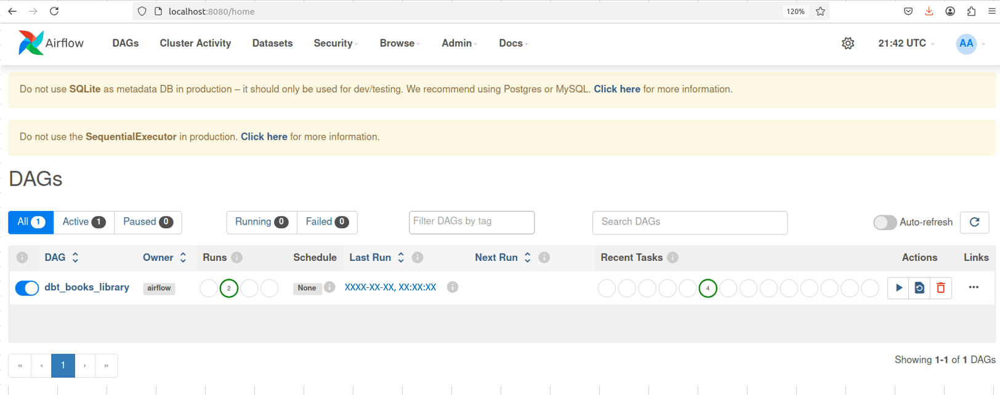
Как можно видеть, в списке только один DAG `dbt_books_library`, он активен, выполнялся два раза, и оба раза успешно.

Если открыть этот DAG, то можно увидеть и историю выполнения, и детали:

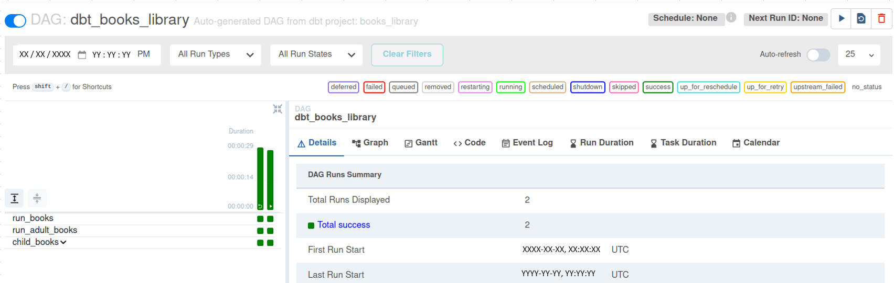

Как видно, было выполнено два успешных запуска. В правом верхнем углу показан статус расписания запусков: `Schedule: None` и `Next Run ID: None`. После второй записи расположен значок запуска DAG. Так как DAG предназначен для ручного запуска, то и расписание, и следующий запуск отсутствуют.

Если перейти на вкладку `Graph`, то можно увидеть сам граф для DAG:

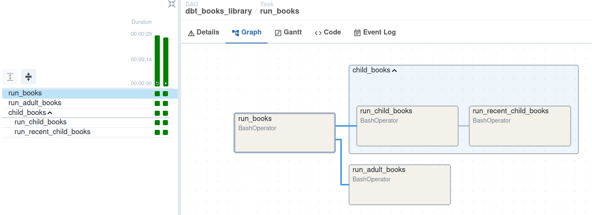

Граф отражает логику работы библиотеки: он строит последовательность задач dbt, две из которых объединены в группу.
Для запуска DAG необходимо нажать значок запуска в правом верхнем углу. После этого на вкладке `Graph` можно наблюдать последовательный запуск задач:

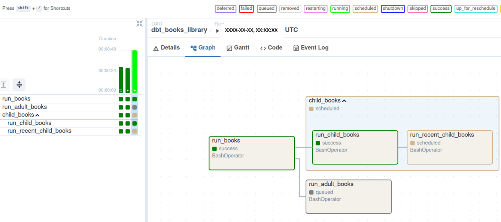

Так как в локальной установке по умолчанию используется `SequentialExecutor`, задачи будут выполняться по одной за раз. В конечном итоге выполнение должно успешно завершиться, и теперь в истории будет три успешных запуска. 
 
Итоговое тестирование DAG в веб-интерфейсе завершено.

Чтобы остановить веб-сервер в терминальной сессии, необходимо нажать `Ctrl-C` и дождаться его остановки.
После того как он остановится, в сессии снова можно выполнять команды. Чтобы остановить планировщик, необходимо сначала активировать фоновый процесс командой `fg`, а затем также нажать `Ctrl-C`.

Тестирование DAG во всех режимах завершено.
Успешное прохождение тестов во всех трёх режимах подтверждает корректность работы библиотеки AflDbt.
В следующем разделе рассмотрены потенциальные направления для её улучшения.


---

[<-Назад к оглавлению](#оглавление)

## Потенциальные направления развития

В данном разделе рассмотрены возможные направления дальнейшего развития библиотеки. Каждое из них решает определённое ограничение текущей версии и открывает новые возможности для пользователей. Реализация этих улучшений планируется в будущих версиях в порядке их приоритета.

1. **Перенос установки в Docker**

В более ранних главах детально расписано, как установить библиотеку в локальную среду разработки.
Однако такой путь довольно долгий, так как необходимо последовательно и аккуратно выполнять достаточно много шагов, чтобы собрать Python, установить dbt и Airflow, проверить их интеграцию. Кроме того, dbt и Airflow запускаются в отдельных виртуальных окружениях, которые надо не перепутать.
Для тестирования библиотеки конечному пользователю удобнее среда с простой установкой.
Именно такую среду предоставляет Docker, так как всю автоматизацию установки можно разместить в скрипте создания Docker-образа.
Поэтому следующим шагом в развитии библиотеки будет перенос всей автоматизации установки в Docker-образ.

2. **Кэширование структуры DAG**

Практика тестирования библиотеки показала, что Airflow может выполнять код генерации DAG несколько раз, и это является его стандартным поведением. Например, если тестировать скрипт `booksLibraryExample.py` без запуска планировщика, лог покажет выполнение кода DAG четыре раза соответственно фазам Airflow. Каждый такой запуск является ресурсоемким, так как выполняется чтение файла `manifest.json`, парсинг и деление моделей и тестов на задачи и группы задач. Такое частое выполнение одного и того же кода расходует ресурсы и требует времени. Если код DAG и dbt-проекта не меняется продолжительное время, то имеет смысл реализовать кэширование. При кэшировании парсинг и деление моделей будет производиться во время первого выполнения с записью непосредственной структуры DAG в кэш. При последующих вызовах перестройка кэша происходит только при изменении файлов. Между изменениями файлов данные конечных объектов Airflow считываются из кэша.

3. **Автоматическая компиляция dbt-проекта**

В репозитории библиотеки внутри dbt-проекта присутствует каталог 'target' и файл `manifest.json`, поэтому скрипт `booksLibraryExample.py` можно запускать даже не устанавливая dbt и отдельное окружение для него. Но как эта папка, так и этот скрипт являются генерируемыми и не являются обязательными для других проектов. При запуске dbt создает как папку, так и файл `manifest.json`. Поэтому в репозиториях других dbt-проектов эти объекты отсутствуют. Библиотека предполагает наличие такого файла, который в проекте библиотеки создается отдельной командой `dbt compile`. Целесообразно автоматически добавить в DAG эту команду в виде задачи, а также проверку файла `manifest.json` в виде сенсора. Это позволит избежать ошибок при запуске, если библиотека используется для других dbt-проектов, где нет этих сгенерированных файлов.

4. **Поддержка нескольких окружений dbt**

Файл dbt-проекта может содержать несколько окружений для различных сценариев использования, например, для отладочного окружения и для рабочего окружения. Также для разных окружений может отличаться состав моделей и тестов, равно как и их реализация. В текущей реализации библиотеки не предусмотрена фильтрация окружений, а тестовый dbt-проект содержит лишь окружение `dev`. Для гибкого использования библиотеки необходимо добавить возможность задания окружения, равно как и сделать автогенерацию названия DAG с учетом данного параметра, чтобы два скрипта, которые различаются только окружением, имели разные идентификаторы DAG в Airflow.

5. **Группировка моделей с их тестами**

Идентификация групп задач как цепочек, где у задачи по одному родителю и потомку, является хорошим начальным шагом для автоматического выявления групп. Ее плюс в том, что она позволяет обойтись сравнительно несложным кодом, который работает в простом случае запуска только моделей. Однако при запуске как моделей, так и тестов, такая группировка уже не отражает бизнес-логику деления на группы. Если у одной модели есть несколько тестов, то алгоритм не объединит их в одну группу. При этом тесты необходимы и в рабочем окружении для целостности данных. Поэтому дальнейшим развитием библиотеки будет возможность объединения в одну группу модели и связанных с ней тестов, что уже отражает бизнес-логику. В этом плане будущая версия будет представлять собой легковесный аналог Astronomer Cosmos, который уже можно использовать в рабочем окружении.
